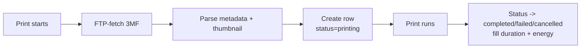

# Print Archiving

BamDude archives every print automatically — the 3MF file, an extracted thumbnail, parsed metadata, energy and timing data, and full provenance back to the library file or queue item that produced it. Archives are the system of record for what was actually printed: dedup, library usage stats, the queue dispatcher, and the printer-page cover all read from this table.

---

## :material-archive: How Archiving Works

When a print starts, BamDude pulls the 3MF off the printer's SD card via FTP, parses it, and creates a `print_archives` row that mirrors the run from start to finish:

If the FTP fetch fails the row is still created — see [3MF download recovery](#material-cloud-download-3mf-download-recovery) below. The same dispatcher creates exactly one archive per physical print and wires `PrintQueueItem.archive_id` to it inside the same transaction (post-b1: there's no longer a race between scheduler and dispatcher creating duplicate rows).

!!! warning "SD card required"
    The printer must have an SD card inserted — that's where BamDude fetches the 3MF from over FTP. Without one, only the metadata reported over MQTT can be recorded; thumbnails and 3D preview are unavailable.

---

## :material-database-outline: What Gets Archived

Each archive row carries the file, the parsed metadata, the run state, and full provenance back to whatever produced it.

=== "File + thumbnail"

    | Field | Description |
    |-------|-------------|
    | `file_path` | 3MF copy at `data/archive/<printer_id>/<timestamp>_<name>/<filename>.3mf`. Empty string means the 3MF couldn't be fetched (fallback row) or was cleaned by retention. |
    | `file_size` | Bytes on disk. |
    | `thumbnail_path` | Extracted PNG from the slicer. Stays even after the 3MF is cleaned. |
    | `source_3mf_path` | Original project 3MF when uploaded from the slicer (separate from the dispatched copy). |

=== "Slicer metadata"

    | Field | Description |
    |-------|-------------|
    | `print_name` | Slicer-set print name. |
    | `filament_type`, `filament_color` | Primary filament for the print. |
    | `filament_used_grams` | Total grams the slicer estimated. |
    | `layer_height`, `total_layers` | Layer geometry. |
    | `nozzle_diameter`, `nozzle_temperature`, `bed_temperature` | Hotend / bed setpoints. |
    | `print_time_seconds` | Slicer's estimate; the actual duration lives in `started_at` / `completed_at`. |
    | `sliced_for_model` | Printer model the 3MF was sliced for, extracted from project metadata. |
    | `makerworld_url`, `designer` | Auto-extracted from the 3MF when present. |

=== "Run state"

    | Field | Description |
    |-------|-------------|
    | `status` | `printing`, `completed`, `failed`, `cancelled`, `stopped`, or `archived`. See [status badges](#material-tag-text-archive-status-badges). |
    | `started_at`, `completed_at` | Wall-clock bounds of the run (NULL until they happen). |
    | `failure_reason` | Short cause code (e.g. `firmware_error`). |
    | `error_message` | Verbose diagnostic from the dispatcher / scheduler — shown on hover over the badge. |
    | `energy_start_kwh`, `energy_kwh`, `energy_cost` | Per-print energy from the printer's smart plug. `energy_start_kwh` is captured at print start so the delta survives backend restarts mid-print. |

=== "Provenance"

    | Field | Description |
    |-------|-------------|
    | `printer_id` | Which printer produced it. |
    | `library_file_id` | The `library_files` row this archive was dispatched from. NULL for external prints (printer-screen, cloud, manual SD-card start). |
    | `project_id` | Optional project the archive was assigned to. |
    | `created_by_id` | User who triggered the print. |
    | `subtask_id` | Printer-assigned subtask identifier observed in MQTT push_status — used as a fast match key by `on_print_start`. |
    | `queue_id` | The `printer_queues` row the archive belongs to (every archive has one — external prints fall back to the printer's default queue so stats queries see them). |
    | `batch_id` | UUID shared across all queue items dispatched together; survives queue cleanup so "how many of batch X completed?" still works after the live queue rows are gone. |

=== "Chain-of-custody"

    | Field | Description |
    |-------|-------------|
    | `content_hash` | SHA256 of the bytes actually stored in the archive directory. |
    | `source_content_hash` | SHA256 of the **unpatched** source. NULL when this archive *is* the source (no patches applied). |
    | `applied_patches` | JSON list of patch identifiers the dispatch pipeline applied before upload, e.g. `["mesh_mode_fast_check_off"]`. Informational; reprint-reapply semantics aren't wired yet. |

=== "Skip-objects metadata"

    Stored inside `extra_data` (JSON):

    | Key | Description |
    |-----|-------------|
    | `printable_objects` | `{ id: name }` dict from the 3MF — populated for both the modal and `M623` skip-objects calls. |
    | `gcode_label_objects` | Whether the slicer wrote per-object identifiers into the gcode. Bambu Studio doesn't emit this field, so missing → `True` (BS default). OrcaSlicer writes it explicitly. *Added in 0.4.1.* |
    | `exclude_object` | Whether the slicer enabled object exclusion in the print profile. *Added in 0.4.1.* |

    The skip-objects button in the printer view requires **both** `gcode_label_objects` and `exclude_object` to be true — otherwise sending `M623` would fail at the firmware (the gcode lacks the per-object markers).

    !!! tip "OrcaSlicer users"
        OrcaSlicer ships with both flags **off** by default. Enable **Print Settings → Others → Label objects** *and* **Exclude objects** *before* slicing. Re-slicing is required — you can't toggle these on an already-sliced 3MF. Bambu Studio users don't need to do anything; the defaults are already correct there.

---

## :material-tag-text: Archive Status Badges

The Archives page renders a small status pill on each card. The common case (a finished print) shows nothing — the badge appears only when something interesting is going on.

| Badge | Status | Meaning |
|-------|--------|---------|
| :material-loading: blue (pulsing) | `printing` | The print is running on the printer right now. Click → jumps to the printer page. |
| (none) | `completed` | The print finished successfully. No badge — keeps the grid clean. |
| :material-alert-circle: red | `failed` | The print started but ended in firmware-error state. Hover the badge to see the full `error_message` from the dispatcher. |
| :material-cancel: red | `cancelled` / `stopped` | The print was aborted — manual cancel from the printer, queue cancellation, or `IDLE` after `RUNNING` (treated as a user abort). Same red styling as `failed`. |
| :material-archive-outline: grey | `archived` | The 3MF was registered (typically via dispatch dedup) but the print never actually ran. No `completed_at` / `failed_at`. Rare — usually only seen when an upload was deduped against an existing file. |

---

## :material-filter-variant: Printed / Not Printed filters

The Archives page header carries two single-click chips — **Printed** and **Not Printed** — that quickly slice the list by whether a file has any successful print history yet:

| Chip | Shows | Useful for |
|---|---|---|
| **Printed** | Archives whose `library_file_id` is referenced by at least one `completed` archive (i.e. you've actually run this file successfully at least once). | Reprint candidates — you've already validated the slice. |
| **Not Printed** | The opposite — files with no `completed` archive yet. | The "what's still pending" pile from a multi-day batch, or library imports you haven't gotten around to printing. |

The chips are mutually exclusive (toggle one off to enable the other) and stack with the freeform search box + status filters above them. Not Printed pairs naturally with the [Library Trash auto-purge](library-trash.md) **Include never-printed** toggle — flip Not Printed on first to see what you're about to purge.

---

## :material-content-copy: Deduplication & Chain-of-Custody

BamDude deduplicates archives by their **source** content hash, not just the bytes on disk.

The reason: the dispatch pipeline can patch a 3MF before upload — for example, commenting out `M970`/`M970.3` vibration-probe commands when the per-print "mesh-mode fast check" toggle is off. The patched file has a different `content_hash` than the original, so a naive hash dedup would treat every patched variant as a new design.

`source_content_hash` solves this:

- When BamDude dispatches a patched print, it stores the SHA256 of the **unpatched** source in `source_content_hash` and the SHA256 of the bytes that landed on the SD in `content_hash`.
- Dedup queries use `COALESCE(source_content_hash, content_hash)` — patched variants collapse against their original; external prints with no source still dedup by raw content hash (their behaviour is unchanged).
- Reprinting from an existing archive copies the file again into a fresh archive directory — new `content_hash`, but the same `source_content_hash`, so reprint history stays linked to the original design.
- External prints (started on the printer screen / cloud / manual SD start) get a one-SELECT lookup at archive creation: if any prior archive on this printer matches by `content_hash` or `source_content_hash`, the chain is inherited.

The Archives page exposes a "duplicates" filter that groups rows by this effective hash. Stat queries and library-file print counts use the same `COALESCE` rule.

!!! info "Migration m009"
    `source_content_hash` and `applied_patches` were added in m009. Old rows stay NULL — `COALESCE` falls back to `content_hash` so behaviour for pre-migration archives is unchanged.

---

## :material-folder-multiple-outline: Library File Linking

When you print from the file manager, the resulting archive carries `library_file_id` pointing at the source library row. The library row, in turn, carries running stats:

- **`print_count`** — number of *completed* prints from this file. Failed, cancelled and aborted runs don't count.
- **`last_printed_at`** — timestamp of the latest completed print.

These are live-updated when a print finishes and were retroactively backfilled from the archive history on first boot of the m014 migration (oldest matching library row wins when multiple files share a hash, so reimports don't steal attribution).

In the file manager, sort by **most printed** or **least recently printed** to find the obvious candidates to prune from your library.

!!! note "External prints aren't linked"
    Prints started directly on the printer screen, from Bambu Cloud, or from a manual SD-card start have `library_file_id = NULL`. The chain-of-custody hash still dedups them, but they don't bump library stats — those stats reflect "prints dispatched through BamDude", not "prints that happened to use this design".

---

## :material-cloud-download: 3MF Download Recovery

When a print starts, BamDude tries to FTP-fetch the 3MF from the printer's SD card so it can parse the metadata, extract the thumbnail, and stash a copy. This can fail — the printer is slow, the network glitches, the file has already been moved on the SD card, the path doesn't match. When it does, BamDude creates a **fallback archive** with `file_path = ""` and `extra_data["no_3mf_available"] = True`, and fills the row in retroactively.

There are four recovery triggers — no periodic polling, so short prints aren't affected:

1. **Startup sweep** — on server start, every `status='printing' AND file_path=''` archive is retried once. Runs as `asyncio.create_task` so the FastAPI lifespan isn't blocked.
2. **Printer reconnect** — `PrinterManager.connect_printer` fires `retry_printer_archives(printer_id)` after a successful connection.
3. **`on_print_complete` last-chance** — right before SD cleanup runs at print end, BamDude tries one more download. The file is still on SD and the printer is no longer busy writing — highest-probability success window.
4. **Manual** — `POST /api/v1/archives/{id}/retry-download`. The frontend exposes a "Retry 3MF download" menu item on the archive card, visible only when `file_path` is empty.

Concurrent triggers don't race: a per-archive `asyncio.Lock` returns `"in_progress"` immediately if another retry is already running. Five distinct return statuses (`recovered`, `already_has_file`, `in_progress`, `failed`, `error`) map to clean toasts in the UI.

While the row is a fallback:

- **Thumbnails and 3D preview won't render** — the 3MF doesn't exist locally yet.
- **Skip-objects modal stays hidden** — the object list is unknown until the file lands. As soon as recovery completes, the loaded object list is pushed into the printer's MQTT state so the modal works for the rest of the print, not just from the next restart.
- **MQTT-reported metadata still gets recorded** — filament use, layer counts, energy, timing all flow in even without the 3MF.

When recovery succeeds, `ArchiveService.attach_3mf_to_archive()` fills the existing row in place: copies the file to a fresh archive dir, reparses the 3MF, extracts the thumbnail, fills `content_hash` / `print_name` / all metadata fields, backfills `cost` / `quantity` / `swap_compatible`, and clears the `no_3mf_available` flag.

---

## :material-broom: 3MF Auto-Cleanup *(0.4.1)*

The archive directory is the largest single chunk of disk BamDude owns — every print copies its 3MF in. The auto-cleanup feature lets you set a retention window: 3MF files belonging to designs that haven't been printed for N days are deleted, but the archive rows themselves stay so the history (thumbnails, costs, notes, energy data, project links) is preserved.

### Configuring it

**Settings → Print → Archive Settings → "Auto-cleanup of stored 3MF files"**

- **Toggle** — disabled by default.
- **Retention input** — days, minimum 1, default 30.
- **Live preview** — shows what would be cleaned right now: `X archives in Y groups, Z MB`.
- **Last / next run status** — when the daily sweep last ran and when it'll run next.
- **Run cleanup now** — button with confirmation, honours the same skip rules as the daily sweep.

### How it decides what to delete

Eligibility is evaluated **per design**, not per archive row. A "design" is a group of archives sharing the same `COALESCE(source_content_hash, content_hash)`.

- **The cutoff is the newest print across the whole group.** If you reprinted an old design 3 days ago, every archive copy of that design — even rows from months back — is kept. The intent is "old designs you've moved on from", not "old physical files".
- **Skip rules — if any of these fire, the *whole group* is skipped:**
    - Any archive in the group is currently `status='printing'`.
    - An active queue item (pending / printing / paused) references any archive in the group.
    - The originating `library_files` row still exists with a matching hash. The library is your deliberate source of truth — no need to wipe an archive copy when it's still on the source path.

### What happens during cleanup

For each eligible design group:

- The `.3mf` file is removed.
- Per-plate `.gcode.md5` sidecars are removed.
- The per-archive directory is removed if it ends up empty.
- **Every archive row in the group has its `file_path` blanked** to `""` together — consistent UI, no half-cleared groups.
- **The `thumbnail_path` and the row itself stay** — history is preserved.

Re-printing a cleaned archive shows "3MF unavailable" in the same way as a fallback archive that never had a file. Re-upload from your library or slicer to print it again.

### Runs

- Daily sweep at server-local midnight.
- The toggle is consulted on every tick so flipping it on/off takes effect without a restart.

| Endpoint | Permission |
|----------|------------|
| `GET /archives/cleanup/status` | `archives:read` |
| `GET /archives/cleanup/preview` | `archives:read` |
| `POST /archives/cleanup/run` | `archives:delete_all` |

---

## :material-cube-scan: 3D Model Preview

View models directly in the browser via Three.js:

- **Rotate** — click and drag.
- **Zoom** — scroll wheel.
- **Pan** — right-click and drag.
- **Plate selector** — for multi-plate 3MF files.

The preview reads from the local archive copy — if the 3MF isn't on disk (fallback or cleaned), the preview is unavailable until the file is recovered.

---

## :material-card-text: Archive Cards & Actions

Each card shows the thumbnail, filename, printer, duration, status badge, filament, tags, and project badge. The project badge is clickable — it jumps to the project's detail page (the click doesn't bubble up to open the archive modal).

| Button | Description |
|--------|-------------|
| **Reprint** | Print immediately on a connected printer. Creates a new archive row but keeps the same `source_content_hash`, so reprint history stays linked. |
| **Schedule** | Add to the print queue. |
| :material-cube-outline: | Open the 3D preview. |
| :material-download: | Download the 3MF file. Disabled if `file_path` is empty. |
| :material-pencil: | Edit archive details (tags, notes, project, cost, photos). |
| :material-cloud-download: | Retry 3MF download. Only visible when `file_path = ""`. |

---

## :material-view-grid: View Modes

- **Grid** — large thumbnails for visual browsing.
- **List** — compact table for data-focused browsing.
- **Calendar** — browse archives by date.

---

## :material-tag: Tags & Filtering

Organize archives with custom tags. Filter by printer, tags, material, color, file type, favorites, and the duplicates view (which uses `COALESCE(source_content_hash, content_hash)`). Sort by date, name, or size. Tag management is under the gear icon next to the tag filter.

!!! tip "Batch operations"
    Enter selection mode to tag, assign projects, or compare multiple archives at once.

!!! tip "Quick search"
    Press ++slash++ to jump to the search box from anywhere on the page.

---

## :material-link-variant: See Also

- [Print Queue](print-queue.md) — how queue items become archives, batch tracking, and the post-m019 archive ↔ queue stats refactor.
- [File Manager](file-manager.md) — the library side of the link, including per-file `print_count` and `last_printed_at`.
- [Swap Mode](swap-mode.md) — swap macro events and `execute_swap_macros` flags carried in `extra_data`.

---

> Originally based on [Bambuddy](https://github.com/maziggy/bambuddy) documentation; substantially rewritten for BamDude 0.4.x.
