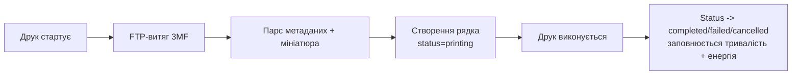

# Архівування друку

BamDude автоматично архівує кожен друк -- файл 3MF, витягнуту мініатюру, розпарсені метадані, дані про енергію та таймінг, і повне походження аж до файлу бібліотеки чи елемента черги, який його породив. Архіви -- це "система запису" того, що було реально надруковано: дедуп, статистика використання файлів бібліотеки, диспатчер черги та обкладинка на сторінці принтера -- усі вони читають з цієї таблиці.

---

## :material-archive: Як працює архівування

Коли друк стартує, BamDude витягує 3MF з SD-картки принтера через FTP, парсить його та створює рядок `print_archives`, який віддзеркалює запуск від початку до кінця:

Якщо FTP-витяг не вдається, рядок усе одно створюється -- див. [Відновлення завантаження 3MF](#material-cloud-download-vidnovlennya-zavantazhennya-3mf) нижче. Той самий диспатчер створює рівно один архів на фізичний друк і прив'язує `PrintQueueItem.archive_id` до нього в межах однієї транзакції (post-b1: більше нема гонок між планувальником та диспатчером, які створювали б рядки-дублікати).

!!! warning "Потрібна SD-картка"
    У принтері має бути встановлена SD-картка -- саме звідти BamDude витягує 3MF через FTP. Без неї можна записати лише метадані, що повідомляються через MQTT; мініатюри й 3D-перегляд недоступні.

---

## :material-database-outline: Що архівується

Кожен рядок архіву несе файл, розпарсені метадані, стан запуску та повне походження аж до того, що його породило.

=== "Файл + мініатюра"

    | Поле | Опис |
    |-------|-------------|
    | `file_path` | Копія 3MF за `data/archive/<printer_id>/<timestamp>_<name>/<filename>.3mf`. Порожній рядок означає, що 3MF не вдалося витягнути (fallback-рядок) або його почистила політика зберігання. |
    | `file_size` | Байти на диску. |
    | `thumbnail_path` | Витягнуте PNG зі слайсера. Лишається навіть після того, як 3MF почистило. |
    | `source_3mf_path` | Оригінальне проєктне 3MF при завантаженні зі слайсера (окреме від диспатченої копії). |

=== "Метадані слайсера"

    | Поле | Опис |
    |-------|-------------|
    | `print_name` | Ім'я друку, задане слайсером. |
    | `filament_type`, `filament_color` | Основний філамент друку. |
    | `filament_used_grams` | Загальна кількість грамів за оцінкою слайсера. |
    | `layer_height`, `total_layers` | Геометрія шарів. |
    | `nozzle_diameter`, `nozzle_temperature`, `bed_temperature` | Уставки хотенду / столу. |
    | `print_time_seconds` | Оцінка слайсера; реальна тривалість живе у `started_at` / `completed_at`. |
    | `sliced_for_model` | Модель принтера, під яку було нарізано 3MF, витягається з метаданих проєкту. |
    | `makerworld_url`, `designer` | Авто-витягуються з 3MF, коли присутні. |

=== "Стан запуску"

    | Поле | Опис |
    |-------|-------------|
    | `status` | `printing`, `completed`, `failed`, `cancelled`, `stopped` або `archived`. Див. [бейджі статусу](#material-tag-text-bejdzhi-statusu-arkhivu). |
    | `started_at`, `completed_at` | Wall-clock межі запуску (NULL, доки не настануть). |
    | `failure_reason` | Короткий код причини (напр. `firmware_error`). |
    | `error_message` | Докладна діагностика від диспатчера / планувальника -- показується при наведенні на бейдж. |
    | `energy_start_kwh`, `energy_kwh`, `energy_cost` | Енергія на друк зі смарт-розетки принтера. `energy_start_kwh` фіксується на старті друку, щоб дельта пережила перезапуск бекенду посеред друку. |

=== "Походження"

    | Поле | Опис |
    |-------|-------------|
    | `printer_id` | Який принтер його породив. |
    | `library_file_id` | Рядок `library_files`, з якого диспатчили цей архів. NULL для зовнішніх друків (з екрану принтера, з хмари, ручний старт зі SD). |
    | `project_id` | Опційний проєкт, до якого приписано архів. |
    | `created_by_id` | Користувач, який ініціював друк. |
    | `subtask_id` | Ідентифікатор subtask, призначений принтером, спостережений у MQTT push_status -- використовується як швидкий ключ зіставлення в `on_print_start`. |
    | `queue_id` | Рядок `printer_queues`, до якого належить архів (кожен архів має один -- зовнішні друки відкочуються на дефолтну чергу принтера, щоб запити статистики їх бачили). |
    | `batch_id` | UUID, спільний для всіх елементів черги, диспатчених разом; виживає очистку черги, тож "скільки з партії X завершилось?" і далі працює після того, як живі рядки черги зникли. |

=== "Ланцюжок походження"

    | Поле | Опис |
    |-------|-------------|
    | `content_hash` | SHA256 байтів, які реально лежать у директорії архіву. |
    | `source_content_hash` | SHA256 chain-root (непатченого) джерела. **Завжди заповнено** з 0.4.2: коли chain-предка немає, цей архів стає chain-root і колонка засіюється його ж `content_hash`. Патчені варіації library-файлу успадковують це з library-рядка. Міграція **m039** бекфілить legacy-NULL до тієї самої інваріанти. |
    | `applied_patches` | JSON-список ідентифікаторів патчів, які пайплайн диспатчу застосував перед завантаженням, напр. `["mesh_mode_fast_check_off"]`. Інформативно — ніколи не використовується для висновків про стан файлу на диску. |

=== "Метадані skip-objects"

    Зберігається всередині `extra_data` (JSON):

    | Ключ | Опис |
    |-----|-------------|
    | `printable_objects` | Словник `{ id: name }` з 3MF -- заповнюється і для модалки, і для викликів `M623` skip-objects. |
    | `gcode_label_objects` | Чи слайсер записав ідентифікатори по об'єктах у gcode. Bambu Studio не емітить це поле, тож відсутність → `True` (дефолт BS). OrcaSlicer пише його явно. *Додано в 0.4.1.* |
    | `exclude_object` | Чи слайсер увімкнув виключення об'єктів у профілі друку. *Додано в 0.4.1.* |

    Кнопка skip-objects у в'юшці принтера потребує, щоб **обидва** `gcode_label_objects` та `exclude_object` були true -- інакше відправка `M623` впаде на прошивці (gcode не має маркерів по об'єктах).

    !!! tip "Користувачам OrcaSlicer"
        OrcaSlicer постачається з обома прапорцями **off** за замовчуванням. Увімкніть **Print Settings → Others → Label objects** *і* **Exclude objects** *перед* нарізанням. Передрізання обов'язкове -- ці прапорці не можна перемкнути на вже нарізаному 3MF. Користувачам Bambu Studio робити нічого не треба; дефолти там уже коректні.

---

## :material-tag-text: Бейджі статусу архіву

Сторінка Архівів рендерить маленьку пігулку статусу на кожній картці. Звичний випадок (завершений друк) не показує нічого -- бейдж з'являється лише тоді, коли відбувається щось цікаве.

| Бейдж | Статус | Значення |
|-------|--------|---------|
| :material-loading: синій (пульсує) | `printing` | Друк зараз виконується на принтері. Клік → перехід на сторінку принтера. |
| (немає) | `completed` | Друк завершився успішно. Без бейджа -- щоб сітка лишалась чистою. |
| :material-alert-circle: червоний | `failed` | Друк стартував, але закінчився у стані firmware-error. Наведіть на бейдж, щоб побачити повний `error_message` від диспатчера. |
| :material-cancel: червоний | `cancelled` / `stopped` | Друк перервано -- ручний cancel з принтера, скасування в черзі або `IDLE` після `RUNNING` (трактується як user abort). Той самий червоний стиль, що й у `failed`. |
| :material-archive-outline: сірий | `archived` | 3MF зареєстровано (зазвичай через дедуп при диспатчі), але друк фактично ніколи не запускався. Без `completed_at` / `failed_at`. Рідко -- зазвичай тільки коли завантаження дедупнули проти наявного файлу. |

---

## :material-filter-variant: Фільтри Друкувалось / Не друкувалось

Заголовок Archives-сторінки несе два single-click чіпи — **Printed** і **Not Printed** — що швидко ріжуть список за наявністю успішної історії друку:

| Чіп | Показує | Корисно для |
|---|---|---|
| **Printed** | Архіви, чий `library_file_id` має хоча б один `completed`-архів (тобто файл хоч раз успішно надрукований). | Кандидати на reprint — ти вже валідував слайс. |
| **Not Printed** | Протилежне — файли без жодного `completed`-архіву. | "Що ще лишилося" з multi-day батча, або library-імпорти, до яких руки не дійшли. |

Чіпи взаємовиключні (off один — увімкнеться інший) і стекуються з freeform-search box і status-фільтрами зверху. Not Printed природньо паруються з тоглером **Include never-printed** в [Library Trash auto-purge](library-trash.uk.md) — спочатку Not Printed on, щоб бачити, що auto-purge ось-ось забере.

---

## :material-content-copy: Дедуплікація та ланцюжок походження

BamDude дедуплікує архіви за **source** content-хешем, а не просто за байтами на диску.

Причина: пайплайн диспатчу може пропатчити 3MF перед завантаженням -- наприклад, закоментувати команди `M970`/`M970.3` (vibration-probe), коли тогл "mesh-mode fast check" для друку вимкнений. Пропатчений файл має інший `content_hash`, ніж оригінал, тож наївний хеш-дедуп трактував би кожну патчену варіацію як новий дизайн.

`source_content_hash` це вирішує:

- Коли BamDude диспатчить пропатчений друк, він зберігає SHA256 **непатченого** джерела в `source_content_hash`, а SHA256 байтів, що приземлились на SD, -- у `content_hash`.
- On-disk файл за `file_path` -- **завжди** непатчений оригінал. Патчені байти живуть тільки в `/tmp/bamdude_patch_*` на час FTP-завантаження і прибираються диспатчером; `archive/` ніколи не тримає патчену варіацію. Саме це дозволяє reprint'у запускати патчер заново на кожне завдання й перемикати `mesh_mode_fast_check` / gcode-injection в обидва боки -- регексп `M970` у патчера матчить тільки uncommented-рядки і не зміг би зняти раніше зашитий патч, якби on-disk джерело було post-patch.
- Запити дедупу використовують `effective_hash = COALESCE(source_content_hash, content_hash)`. З 0.4.2 кожен новий архів заповнює `source_content_hash` (chain-root або self-seed), тож `effective_hash` для нових рядків читає `source_content_hash` напряму; `COALESCE` лишається як defence-in-depth.
- Reprint з наявного архіву копіює непатчений файл у свіжу директорію архіву -- новий `content_hash`, якщо новий запуск патчиться інакше, але той самий `source_content_hash`, тож історія reprint-ів лишається прив'язаною до оригінального дизайну.
- Зовнішні друки (стартовані з екрану принтера / з хмари / ручний старт зі SD) отримують один SELECT-запит при створенні архіву: якщо будь-який попередній архів на **будь-якому** принтері збігається за `content_hash` або `source_content_hash`, ланцюжок успадковується (cross-printer з 0.4.2 — раніше було per-printer).

Сторінка Архівів виставляє фільтр "duplicates", який групує рядки за цим ефективним хешем. Бейдж "оригінальний друк", лінк `original_archive_id`, список дублікатів у detail-ендпоінті, і лічильники `print_count` для файлів бібліотеки -- усі прив'язуються на `source_content_hash`, з `content_hash` лише як defence-fallback для legacy-NULL рядків. Наслідок: непатчений запуск на принтері A + запуск з вимкненим mesh-mode на принтері B того самого library-файлу групуються в одному бейджі **і** ділять один on-disk файл (див. нижче).

### Cross-printer file-on-disk дедуп *(0.4.2)*

Коли BamDude архівує друк, чий `effective_hash` збігається з наявним архівом на **будь-якому** принтері, новий рядок архіву ре-юзає on-disk шлях замість писати ще одну копію. Збіг -- по chain-root хешу (`COALESCE(source_content_hash, content_hash)`): кожен рядок, що ділить непатчене походження, ділить один on-disk файл, незалежно від того, які патчі застосував кожен окремий диспатч. Ефект: друк того ж library-файлу на N принтерах із M різними комбінаціями патчів зберігає **одну** копію на диску + N×M рядків архіву. `delete_archive` ref-каунтує спільні `file_path` і прибирає байти лише коли видаляється останній посилаючий рядок. Той самий дедуп працює і в `attach_3mf_to_archive` (background download-retry) -- fallback-архів, чий 3MF приходить пізніше, приєднається до наявного ланцюжка замість того, щоб писати на диск (патчені) байти, скачані з принтера, коли непатчена копія вже існує.

Якщо ви апгрейдитесь з pre-0.4.2 встановлення, де в `archive/` могли лишитися патчені копії з прошлої семантики, запустіть `python scripts/prune_orphan_archive_files.py` (за замовчуванням dry-run, `--apply` для видалення) -- скрипт реконсилює директорію проти поточних DB-references.

!!! info "Міграції m009 + m039"
    `source_content_hash` та `applied_patches` додані в m009. Міграція **m039** (0.4.2) бекфілить `source_content_hash = content_hash` для legacy-NULL рядків, щоб always-populated інваріанта трималась через апгрейд.

---

## :material-folder-multiple-outline: Прив'язка до файлів бібліотеки

Коли ви друкуєте з файлового менеджера, отриманий архів несе `library_file_id`, що вказує на джерельний рядок бібліотеки. Сам рядок бібліотеки натомість несе поточну статистику:

- **`print_count`** -- кількість *завершених* друків з цього файлу. Невдалі, скасовані та перервані запуски не рахуються.
- **`last_printed_at`** -- мітка часу останнього завершеного друку.

Вони оновлюються наживо, коли друк завершується, і були ретроактивно бекфілнуті з історії архівів при першому завантаженні міграції m014 (найстаріший збіжний рядок бібліотеки виграє, коли кілька файлів ділять один хеш, тож реімпорти не крадуть атрибуцію).

У файловому менеджері сортуйте за **most printed** або **least recently printed**, щоб знайти очевидних кандидатів на прибирання з бібліотеки.

!!! note "Зовнішні друки не прив'язуються"
    Друки, стартовані прямо з екрану принтера, з Bambu Cloud або з ручного старту зі SD, мають `library_file_id = NULL`. Хеш ланцюжка походження все одно їх дедупає, але вони не інкрементують статистику бібліотеки -- ця статистика відображає "друки, диспатчені через BamDude", а не "друки, які випадково використали цей дизайн".

---

## :material-cloud-download: Відновлення завантаження 3MF

Коли друк стартує, BamDude намагається FTP-витягнути 3MF із SD-картки принтера, щоб розпарсити метадані, витягнути мініатюру та зберегти копію. Це може не вдатися -- принтер повільний, мережа смикається, файл уже переміщено на SD, шлях не збігається. Коли так стається, BamDude створює **fallback-архів** з `file_path = ""` та `extra_data["no_3mf_available"] = True`, і заповнює рядок ретроактивно.

Є чотири тригери відновлення -- періодичного полінгу немає, тож короткі друки не страждають:

1. **Підмітання при старті** -- при запуску сервера кожен архів зі `status='printing' AND file_path=''` повторюється раз. Запускається як `asyncio.create_task`, тож lifespan FastAPI не блокується.
2. **Реконект принтера** -- `PrinterManager.connect_printer` вистрелює `retry_printer_archives(printer_id)` після успішного підключення.
3. **Останній шанс у `on_print_complete`** -- прямо перед очисткою SD на завершенні друку BamDude робить ще одну спробу завантаження. Файл ще на SD, а принтер уже не зайнятий записом -- вікно з найвищою імовірністю успіху.
4. **Вручну** -- `POST /api/v1/archives/{id}/retry-download`. Фронтенд виставляє пункт меню "Повторити завантаження 3MF" на картці архіву, видимий лише коли `file_path` порожній.

Конкурентні тригери не змагаються: per-archive `asyncio.Lock` миттєво повертає `"in_progress"`, якщо інший retry вже виконується. П'ять окремих статусів повернення (`recovered`, `already_has_file`, `in_progress`, `failed`, `error`) мапляться в чисті тости в UI.

Поки рядок є fallback-архівом:

- **Мініатюри та 3D-перегляд не рендеряться** -- 3MF локально ще нема.
- **Модалка skip-objects лишається прихованою** -- список об'єктів невідомий, доки файл не приземлиться. Щойно відновлення завершиться, завантажений список об'єктів пушиться в стан принтера через MQTT, тож модалка працює до кінця цього друку, а не лише з наступного перезапуску.
- **Метадані, повідомлені через MQTT, усе одно записуються** -- витрата філаменту, лічильники шарів, енергія, таймінг -- усе тече, навіть без 3MF.

Коли відновлення вдається, `ArchiveService.attach_3mf_to_archive()` заповнює існуючий рядок на місці: копіює файл у свіжу директорію архіву, переразпарсує 3MF, витягає мініатюру, заповнює `content_hash` / `print_name` / усі поля метаданих, бекфілить `cost` / `quantity` / `swap_compatible` та чистить прапорець `no_3mf_available`.

---

## :material-broom: Авточистка 3MF *(0.4.1, drift-режим у 0.4.2)*

Директорія архіву -- найбільший одиничний шматок диска, що належить BamDude: кожен друк копіює туди свій 3MF. Фіча авточистки дозволяє задати вікно зберігання: файли 3MF, які належать дизайнам, що не друкувалися N днів, видаляються, але самі рядки архіву лишаються, тож історія (мініатюри, ціни, нотатки, дані по енергії, посилання на проєкти) зберігається.

### Налаштування

**Параметри → Друк → Файловий менеджер → "Авточистка збережених 3MF-файлів"**

- **Тогл** -- вимкнено за замовчуванням. Гейтує лише авто-тік; ручні запуски (нижче) працюють незалежно від тогла.
- **Поле зберігання** -- дні, мінімум 1, дефолт 30.
- **Live preview** -- показує, що почистилось би прямо зараз: `X архівів у Y групах, Z MB`.
- **Картки Останній / Наступний запуск** -- винесені в спільний компонент `<LastNextRunCards>`, переюзаний бібліотекою auto-purge. Показує "очищено 5 архівів, звільнено 240 MB, 4 години тому" + "за ~20 годин", тож адмінам не треба гриміти логи. Після рестарту сервера in-memory `archives_cleared` губиться; картка показує "лічильник втрачено при перезапуску — див. логи" замість оманливого нуля (persistent timestamp `archive_3mf_cleanup_last_run` виживає, тільки лічильник зникає).

### Ручний запуск -- кнопка в заголовку Архівів *(0.4.2)*

У заголовку сторінки Архівів є кнопка **Очистити 3MF**, що відкриває ту саму очистку з per-run override:

- **Поле днів** -- pre-seeded зі збереженого retention-порогу, з one-click "скинути до {{days}}" коли ти його перетягнув. Діапазон 1–3650.
- **Live preview** -- перераховується щоразу, як змінюєш дні (debounced).
- **Працює і коли auto-режим вимкнено** -- тогл у Settings гейтує лише авто-тік. Ручний діалог і API-ендпоінти за ним поважають retention-поріг незалежно. Коли auto off -- модалка показує маленьку amber-підказку "Авто-режим вимкнено — спрацюють лише ручні запуски", але кнопка Run лишається активною.
- **Ручні запуски скидають авто-цикл** -- успішний ручний запуск штампує `archive_3mf_cleanup_last_run`, тож наступний авто-тік не пере-сканує через хвилину.

### Як вирішується, що видаляти

Прийнятність обчислюється **per design**, а не per archive. "Дизайн" -- це група архівів, що ділять один `effective_hash = COALESCE(source_content_hash, content_hash)`.

- **Cutoff -- це найновіша активність по всій групі.** Якщо ви передрукували старий дизайн 3 дні тому, кожна архівна копія цього дизайну -- навіть рядки з місяців тому -- лишається. Намір -- "старі дизайни, від яких ви відмовились", а не "старі фізичні файли".
- **Правила пропуску -- якщо хоч одне з цих спрацьовує, *вся група* пропускається:**
    - Будь-який архів у групі зараз `status='printing'`.
    - Активний елемент черги (pending / printing / paused) посилається на будь-який архів у групі.
    - Початковий рядок `library_files` все ще існує зі збіжним хешем. Бібліотека -- це ваше свідоме джерело правди, нема сенсу витирати архівну копію, коли вона все ще на джерельному шляху. Skip-set будується з always-populated `source_content_hash` (canonical chain-root), тож патчений архів-варіант коректно мапиться на library-рядок, що його породив.

### Оптимізація plan-фази *(0.4.2)*

Plan-фаза тепер спочатку робить SQL-side `GROUP BY effective_hash HAVING MAX(activity_ts) < cutoff` і лише для прострочених bucket-ів вантажить повні рядки. Здорові інсталяції (більшість груп ще hot) пропускають важкий row-load повністю -- помітна перемога на інсталяціях з 10k+ архівів, де старий шлях "вантажимо все, групуємо в Python" був помітним hot-spot під час щоденного sweep'у.

### Що відбувається під час очистки

Для кожної прийнятної групи дизайнів:

- Файл `.3mf` видаляється.
- Сайдкар-файли `.gcode.md5` по плитах видаляються.
- Per-archive директорія видаляється, якщо лишається порожньою.
- **Кожен рядок архіву в групі отримує бланкований `file_path`** на `""` разом -- консистентний UI, без напівпочищених груп.
- **`thumbnail_path` та сам рядок лишаються** -- історія зберігається.

Передрук почищеного архіву показує "3MF недоступний" так само, як fallback-архів, який ніколи не мав файлу. Перезавантажте з вашої бібліотеки або зі слайсера, щоб надрукувати знову.

### Розклад *(drift-режим з 0.4.2)*

| Аспект | Поведінка |
|--------|-----------|
| Частота тіку | Кожні 15 хв. Дешево -- лише читає налаштування + persisted last-run timestamp. |
| Вікно auto-запуску | Запуск, коли `now - archive_3mf_cleanup_last_run >= 24 г`. 24г-перевірка має guard `last is not None` -- перший запуск після ввімкнення тогла стартує одразу (last-run ще немає). |
| Затримка першого запуску | Loop спочатку спить `TICK_INTERVAL_SECONDS` (15 хв) **перед** перевіркою, тож перший авто-запуск настає ~15 хв після ввімкнення тогла (або ~15 хв після старту сервера, якщо тогл уже був увімкнений). Натисни "Run now" в Settings або в модалці Архівів, щоб спрацювало миттєво -- ручний запуск штампує той самий timestamp і стартує 24г drift-цикл. |
| Ефект ручного запуску | Успішний ручний запуск штампує той самий timestamp, тож зсуває наступний авто-тік на 24 г замість стекування. |
| Ефект тогла | Звіряється кожен тік -- вмикання/вимикання діє без рестарту. Тогл гейтує лише авто-тік; ручні запуски завжди працюють. |
| Часова зона | Не залежить від server-local часу (попередній "midnight cron" якорився на OS-clock). |

Library auto-purge йде по тому ж патерну (15 хв тік, 24 г drift, ручні скидають). Див. [Library Trash](library-trash.uk.md) щодо аналогічних карток Last/Next.

| Ендпоінт | Дозвіл |
|----------|------------|
| `GET /archives/cleanup/status` | `archives:read` |
| `GET /archives/cleanup/preview?days=N` | `archives:read` |
| `POST /archives/cleanup/run?days=N` | `archives:delete_all` |

Опційний query-параметр `?days=N` (1–3650, clamped) дозволяє ручній модалці перекрити збережений retention без persist'у.

!!! note "Що змінилося в 0.4.2"
    Upstream-портований per-row archive auto-purge (який щодня переносив старі archive-рядки в корзину на окремому 365-денному таймері) **видалено** в 0.4.2 -- див. [trash-доку](library-trash.uk.md) щодо обґрунтування. 3MF-cleanup, описаний вище, -- єдиний auto-механізм, що тепер торкається archive-storage; ручне delete → trash → restore → empty-trash без змін для "хочу видалити цей рядок"-сценарію.

---

## :material-cube-scan: 3D-перегляд моделі

Переглядайте моделі прямо в браузері за допомогою Three.js:

- **Обертання** -- натисніть і перетягніть.
- **Масштабування** -- колесо миші.
- **Панорамування** -- права кнопка миші та перетягування.
- **Вайрфрейм друкарського об'єму** -- напівпрозорий бокс, що відповідає реальному столу принтера; читається з `printer_settings` у 3MF, тож архів A1-mini рендериться навколо бокса 180×180, а не захардкоженого 256³.

Для мульти-плейт-друку архів запам'ятовує, яка саме плита 3MF була надрукована — 3D-перегляд, G-code-перегляд, мініатюра і per-plate slicer-метадані (час друку, вага філаменту, шари, printable-об'єкти) всі стосуються саме тієї плити. **Селектора плит на архіві нема** — архів це запис одного конкретного друку, не браузер. Міграція **m038** заповнює `plate_index` на історичних рядках і перепарсить 3MF там, де `plate_index > 1`, щоб старі мульти-плейт-архіви теж стали коректні.

Превʼю читає з локальної копії архіву -- якщо 3MF немає на диску (fallback або почищений), превʼю недоступне, доки файл не відновлять.

---

## :material-card-text: Картки архіву та дії

Кожна картка показує мініатюру, ім'я файлу, принтер, тривалість, бейдж статусу, філамент, теги та бейдж проєкту. Бейдж проєкту клікабельний -- стрибає на сторінку деталей проєкту (клік не пробулькує до відкриття модалки архіву).

| Кнопка | Опис |
|--------|------|
| **Reprint** | Друкувати негайно на підключеному принтері. Створює новий рядок архіву, але зберігає той самий `source_content_hash`, тож історія reprint-ів лишається прив'язаною. |
| **Schedule** | Додати до черги друку. |
| :material-cube-outline: | Відкрити 3D-перегляд. |
| :material-download: | Завантажити файл 3MF. Вимкнено, якщо `file_path` порожній. |
| :material-pencil: | Редагувати деталі архіву (теги, нотатки, проєкт, ціна, фото). |
| :material-cloud-download: | Повторити завантаження 3MF. Видимо лише коли `file_path = ""`. |

---

## :material-view-grid: Режими перегляду

- **Сітка** -- великі мініатюри для візуального перегляду.
- **Список** -- компактна таблиця для перегляду даних.
- **Календар** -- перегляд архівів за датою.

---

## :material-tag: Теги та фільтрація

Організовуйте архіви за допомогою власних тегів. Фільтруйте за принтером, тегами, матеріалом, кольором, типом файлу, обраним та в'юшкою дублікатів (яка використовує `COALESCE(source_content_hash, content_hash)`). Сортуйте за датою, ім'ям або розміром. Керування тегами під шестірнею поруч із фільтром тегів.

!!! tip "Пакетні операції"
    Увійдіть у режим вибору, щоб позначити тегами, призначити проєкти або порівняти кілька архівів одночасно.

!!! tip "Швидкий пошук"
    Натисніть ++slash++, щоб перейти до поля пошуку з будь-якого місця.

---

## :material-link-variant: Дивіться також

- [Черга друку](print-queue.md) -- як елементи черги стають архівами, відстеження партій та post-m019 рефакторинг статистики archive ↔ queue.
- [Файловий менеджер](file-manager.md) -- бібліотечна сторона прив'язки, включно з per-file `print_count` та `last_printed_at`.
- [Swap Mode](swap-mode.md) -- події swap-макросів та прапорці `execute_swap_macros`, що несуться в `extra_data`.

---

> Спочатку базується на документації [Bambuddy](https://github.com/maziggy/bambuddy); суттєво переписано для BamDude 0.4.x.
