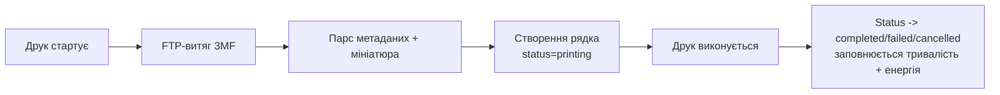

# Архівування друку

BamDude автоматично архівує кожен друк -- файл 3MF, витягнуту мініатюру, розпарсені метадані, дані про енергію та таймінг, і повне походження аж до файлу бібліотеки чи елемента черги, який його породив. Архіви -- це "система запису" того, що було реально надруковано: дедуп, статистика використання файлів бібліотеки, диспатчер черги та обкладинка на сторінці принтера -- усі вони читають з цієї таблиці.

---

## :material-archive: Як працює архівування

Коли друк стартує, BamDude витягує 3MF з SD-картки принтера через FTP, парсить його та створює рядок `print_archives`, який віддзеркалює запуск від початку до кінця:

```mermaid
graph LR
    A[Друк стартує] --> B[FTP-витяг 3MF]
    B --> C[Парс метаданих + мініатюра]
    C --> D[Створення рядка<br/>status=printing]
    D --> E[Друк виконується]
    E --> F[Status -> completed/failed/cancelled<br/>заповнюється тривалість + енергія]
```

Якщо FTP-витяг не вдається, рядок усе одно створюється -- див. [Відновлення завантаження 3MF](#відновлення-завантаження-3mf) нижче. Той самий диспатчер створює рівно один архів на фізичний друк і прив'язує `PrintQueueItem.archive_id` до нього в межах однієї транзакції (post-b1: більше нема гонок між планувальником та диспатчером, які створювали б рядки-дублікати).

!!! warning "3MF має бути там, куди BamDude дістане"
    BamDude витягує його з SD-картки принтера через FTP, тож на більшості принтерів картка має бути встановлена. Без неї можна записати лише метадані, що повідомляються через MQTT; мініатюри й 3D-перегляд недоступні.

    На **X2D, P2S і сімействі H2** файл також витягується з вбудованого сховища принтера, коли на картці нічого немає — включно з друками, запущеними з екрана самого принтера, які інакше лишили б архів без нічого.

!!! note "TLS-квірк прошивки X2D / P2S (обробляється автоматично)"
    Деякі прошивки спотикаються об дефолтний TLS 1.3 сучасного Python на FTPS-каналі — X2D повністю фейлить implicit-FTPS handshake, P2S ловить баг session-reuse — через що їхні картки архіву лишались порожніми (без філаменту / шарів / MakerWorld-лінка / мініатюри). BamDude тепер обмежує FTPS-сесію до TLS 1.2 для цих моделей, тож завантаження 3MF на старті друку з'єднується і архів наповнюється. Налаштувань не треба.

---

## :material-database-outline: Що архівується

Кожен рядок архіву несе файл, розпарсені метадані, стан запуску та повне походження аж до того, що його породило.

=== "Файл + мініатюра"

    | Поле | Опис |
    |-------|-------------|
    | `file_path` | Копія 3MF за `data/archive/<printer_id>/<timestamp>_<name>/<filename>.3mf`. Порожній рядок означає, що 3MF не вдалося витягнути (fallback-рядок) або його почистила політика зберігання. |
    | `file_size` | Байти на диску. |
    | `thumbnail_path` | Витягнуте PNG зі слайсера. Лишається навіть після того, як 3MF почистило. Для 3MF, нарізаних через Docker-сайдкар слайсера — який пропускає desktop-only рендер plate-PNG — BamDude генерує відсутні мініатюри плит на сервері (ізометричний рендер вбудованої моделі кольору Bambu-green, 512 px + 128 px), тож картка архіву не порожня. |
    | `source_3mf_path` | Оригінальне проєктне 3MF при завантаженні зі слайсера (окреме від диспатченої копії). |

=== "Метадані слайсера"

    | Поле | Опис |
    |-------|-------------|
    | `print_name` | Ім'я друку, задане слайсером. |
    | `filament_type`, `filament_color` | Основний філамент(и) друку. **Колір** береться з котушки інвенторі, завантаженої на слот AMS (по-слотово), з відкатом на колір зі слайсера для слотів без заасайненої котушки. |
    | `filament_used_grams` | Загальна кількість грамів за оцінкою слайсера. |
    | `layer_height`, `total_layers` | Геометрія шарів. |
    | `nozzle_diameter`, `nozzle_temperature`, `bed_temperature` | Уставки хотенду / столу. |
    | `print_time_seconds` | Оцінка слайсера. |
    | `actual_time_seconds`, `time_accuracy` | Реальна тривалість (`completed_at − started_at`) і точність оцінки (%), записуються для завершених друків і бекфіляться по історії. |
    | `sliced_for_model` | Модель принтера, під яку було нарізано 3MF, витягається з метаданих проєкту. |
    | `makerworld_url`, `designer` | Авто-витягуються з 3MF, коли присутні. |

=== "Стан запуску"

    | Поле | Опис |
    |-------|-------------|
    | `status` | `printing`, `completed`, `failed`, `cancelled`, `stopped` або `archived`. Див. [бейджі статусу](#бейджі-статусу-архіву). |
    | `started_at`, `completed_at` | Wall-clock межі запуску (NULL, доки не настануть). |
    | `failure_reason` | Короткий код причини (напр. `firmware_error`). |
    | `error_message` | Докладна діагностика від диспатчера / планувальника -- показується при наведенні на бейдж. |
    | `energy_start_kwh`, `energy_kwh`, `energy_cost` | Енергія на друк зі смарт-розетки принтера. `energy_start_kwh` фіксується на старті друку, щоб дельта пережила перезапуск бекенду посеред друку. |

=== "Походження"

    | Поле | Опис |
    |-------|-------------|
    | `printer_id` | Який принтер його породив. |
    | `library_file_id` | Рядок `library_files`, з якого диспатчили цей архів. NULL для зовнішніх друків (з екрану принтера, з хмари, ручний старт зі SD). |
    | `project_id` | Опційний проєкт, до якого приписано архів. |
    | `created_by_id` | Користувач, який ініціював друк. |
    | `subtask_id` | Ідентифікатор subtask, призначений принтером, спостережений у MQTT push_status -- використовується як швидкий ключ зіставлення в `on_print_start`. |
    | `queue_id` | Рядок `printer_queues`, до якого належить архів (кожен архів має один -- зовнішні друки відкочуються на дефолтну чергу принтера, щоб запити статистики їх бачили). |
    | `batch_id` | UUID, спільний для всіх елементів черги, диспатчених разом; виживає очистку черги, тож "скільки з партії X завершилось?" і далі працює після того, як живі рядки черги зникли. |

=== "Ланцюжок походження"

    | Поле | Опис |
    |-------|-------------|
    | `content_hash` | SHA256 байтів, які реально лежать у директорії архіву. |
    | `source_content_hash` | SHA256 chain-root (непатченого) джерела. **Завжди заповнено** з 0.4.2: коли chain-предка немає, цей архів стає chain-root і колонка засіюється його ж `content_hash`. Патчені варіації library-файлу успадковують це з library-рядка. Міграція **m039** бекфілить legacy-NULL до тієї самої інваріанти. |
    | `applied_patches` | JSON-список ідентифікаторів патчів, які пайплайн диспатчу застосував перед завантаженням, напр. `["mesh_mode_fast_check_off"]`. Інформативно — ніколи не використовується для висновків про стан файлу на диску. |

=== "Метадані skip-objects"

    Зберігається всередині `extra_data` (JSON):

    | Ключ | Опис |
    |-----|-------------|
    | `printable_objects` | Словник `{ id: name }` з 3MF -- заповнюється і для модалки, і для викликів `M623` skip-objects. |
    | `gcode_label_objects` | Чи слайсер записав ідентифікатори по об'єктах у gcode. Bambu Studio не емітить це поле, тож відсутність → `True` (дефолт BS). OrcaSlicer пише його явно. *Додано в 0.4.1.* |
    | `exclude_object` | Чи слайсер увімкнув виключення об'єктів у профілі друку. *Додано в 0.4.1.* |

    Кнопка skip-objects у в'юшці принтера потребує, щоб **обидва** `gcode_label_objects` та `exclude_object` були true -- інакше відправка `M623` впаде на прошивці (gcode не має маркерів по об'єктах).

    !!! tip "Користувачам OrcaSlicer"
        OrcaSlicer постачається з обома прапорцями **off** за замовчуванням. Увімкніть **Print Settings → Others → Label objects** *і* **Exclude objects** *перед* нарізанням. Передрізання обов'язкове -- ці прапорці не можна перемкнути на вже нарізаному 3MF. Користувачам Bambu Studio робити нічого не треба; дефолти там уже коректні.

---

## :material-tag-text: Бейджі статусу архіву

Сторінка Архівів рендерить маленьку пігулку статусу на кожній картці. Звичний випадок (завершений друк) не показує нічого -- бейдж з'являється лише тоді, коли відбувається щось цікаве.

| Бейдж | Статус | Значення |
|-------|--------|---------|
| :material-loading: синій (пульсує) | `printing` | Друк зараз виконується на принтері. Клік → перехід на сторінку принтера. |
| (немає) | `completed` | Друк завершився успішно. Без бейджа -- щоб сітка лишалась чистою. |
| :material-alert-circle: червоний | `failed` | Друк стартував, але закінчився у стані firmware-error. Наведіть на бейдж, щоб побачити повний `error_message` від диспатчера. |
| :material-cancel: червоний | `cancelled` / `stopped` | Друк перервано -- ручний cancel з принтера, скасування в черзі або `IDLE` після `RUNNING` (трактується як user abort). Той самий червоний стиль, що й у `failed`. |
| :material-archive-outline: сірий | `archived` | 3MF зареєстровано (зазвичай через дедуп при диспатчі), але друк фактично ніколи не запускався. Без `completed_at` / `failed_at`. Рідко -- зазвичай тільки коли завантаження дедупнули проти наявного файлу. |

---

## :material-filter-variant: Фільтри Друкувалось / Не друкувалось

Заголовок Archives-сторінки несе два single-click чіпи — **Printed** і **Not Printed** — що швидко ріжуть список за наявністю успішної історії друку:

| Чіп | Показує | Корисно для |
|---|---|---|
| **Printed** | Архіви, чий `library_file_id` має хоча б один `completed`-архів (тобто файл хоч раз успішно надрукований). | Кандидати на reprint — ти вже валідував слайс. |
| **Not Printed** | Протилежне — файли без жодного `completed`-архіву. | "Що ще лишилося" з multi-day батча, або library-імпорти, до яких руки не дійшли. |

Чіпи взаємовиключні (off один — увімкнеться інший) і стекуються з freeform-search box і status-фільтрами зверху. Not Printed природньо паруються з тоглером **Include never-printed** в [Library Trash auto-purge](library-trash.uk.md) — спочатку Not Printed on, щоб бачити, що auto-purge ось-ось забере.

---

## :material-content-copy: Дедуплікація та ланцюжок походження

BamDude дедуплікує архіви за **source** content-хешем, а не просто за байтами на диску.

Причина: пайплайн диспатчу може пропатчити 3MF перед завантаженням -- наприклад, закоментувати команди `M970`/`M970.3` (vibration-probe), коли тогл "mesh-mode fast check" для друку вимкнений. Пропатчений файл має інший `content_hash`, ніж оригінал, тож наївний хеш-дедуп трактував би кожну патчену варіацію як новий дизайн.

`source_content_hash` це вирішує:

- Коли BamDude диспатчить пропатчений друк, він зберігає SHA256 **непатченого** джерела в `source_content_hash`, а SHA256 байтів, що приземлились на SD, -- у `content_hash`.
- On-disk файл за `file_path` -- **завжди** непатчений оригінал. Патчені байти живуть тільки в `/tmp/bamdude_patch_*` на час FTP-завантаження і прибираються диспатчером; `archive/` ніколи не тримає патчену варіацію. Саме це дозволяє reprint'у запускати патчер заново на кожне завдання й перемикати `mesh_mode_fast_check` / gcode-injection в обидва боки -- регексп `M970` у патчера матчить тільки uncommented-рядки і не зміг би зняти раніше зашитий патч, якби on-disk джерело було post-patch.
- Запити дедупу використовують `effective_hash = COALESCE(source_content_hash, content_hash)`. З 0.4.2 кожен новий архів заповнює `source_content_hash` (chain-root або self-seed), тож `effective_hash` для нових рядків читає `source_content_hash` напряму; `COALESCE` лишається як defence-in-depth.
- Reprint з наявного архіву копіює непатчений файл у свіжу директорію архіву -- новий `content_hash`, якщо новий запуск патчиться інакше, але той самий `source_content_hash`, тож історія reprint-ів лишається прив'язаною до оригінального дизайну.
- Зовнішні друки (стартовані з екрану принтера / з хмари / ручний старт зі SD) отримують один SELECT-запит при створенні архіву: якщо будь-який попередній архів на **будь-якому** принтері збігається за `content_hash` або `source_content_hash`, ланцюжок успадковується (cross-printer з 0.4.2 — раніше було per-printer).

Сторінка Архівів виставляє фільтр "duplicates", який групує рядки за цим ефективним хешем. Бейдж "оригінальний друк", лінк `original_archive_id`, список дублікатів у detail-ендпоінті, і лічильники `print_count` для файлів бібліотеки -- усі прив'язуються на `source_content_hash`, з `content_hash` лише як defence-fallback для legacy-NULL рядків. Наслідок: непатчений запуск на принтері A + запуск з вимкненим mesh-mode на принтері B того самого library-файлу групуються в одному бейджі **і** ділять один on-disk файл (див. нижче).

### Cross-printer file-on-disk дедуп *(0.4.2)*

Коли BamDude архівує друк, чий `effective_hash` збігається з наявним архівом на **будь-якому** принтері, новий рядок архіву ре-юзає on-disk шлях замість писати ще одну копію. Збіг -- по chain-root хешу (`COALESCE(source_content_hash, content_hash)`): кожен рядок, що ділить непатчене походження, ділить один on-disk файл, незалежно від того, які патчі застосував кожен окремий диспатч. Ефект: друк того ж library-файлу на N принтерах із M різними комбінаціями патчів зберігає **одну** копію на диску + N×M рядків архіву. `delete_archive` ref-каунтує спільні `file_path` і прибирає байти лише коли видаляється останній посилаючий рядок. Той самий дедуп працює і в `attach_3mf_to_archive` (background download-retry) -- fallback-архів, чий 3MF приходить пізніше, приєднається до наявного ланцюжка замість того, щоб писати на диск (патчені) байти, скачані з принтера, коли непатчена копія вже існує.

Якщо ви апгрейдитесь з pre-0.4.2 встановлення, де в `archive/` могли лишитися патчені копії з прошлої семантики, запустіть `python scripts/prune_orphan_archive_files.py` (за замовчуванням dry-run, `--apply` для видалення) -- скрипт реконсилює директорію проти поточних DB-references.

!!! info "Міграції m009 + m039"
    `source_content_hash` та `applied_patches` додані в m009. Міграція **m039** (0.4.2) бекфілить `source_content_hash = content_hash` для legacy-NULL рядків, щоб always-populated інваріанта трималась через апгрейд.

---

## :material-content-save-move: Зберегти надрукований файл назад у бібліотеку

3MF архіву можна скопіювати в бібліотеку з меню самого архіву — обираєте теку, і файл потрапляє туди прочитаним так само, як при завантаженні: з метаданими, тамбнейлом, поплитними даними й бейджами, а не безіменним файлом.

⚠️ **Зберегти той самий друк двічі не створює другої копії.** Бібліотека впізнає однаковий вміст і віддає ту копію, що вже є, — і каже про це, а не вдає, ніби щось записала.

⚠️ **Архів може не мати файлу для копіювання.** Друк, запущений з екрана самого принтера, чий 3MF не вдалося витягнути, має справжній рядок архіву й порожній файл — дія це пояснює, а не тихо збоїть. Те саме стосується передруку й відкриття в слайсері.

Зовнішні теки лише для читання в списку не показуються: бібліотека відмовляється в них писати, а пропонувати вибір, який не спрацює, гірше, ніж не пропонувати.

---

## :material-folder-multiple-outline: Прив'язка до файлів бібліотеки

Коли ви друкуєте з файлового менеджера, отриманий архів несе `library_file_id`, що вказує на джерельний рядок бібліотеки. Сам рядок бібліотеки натомість несе поточну статистику:

- **`print_count`** -- кількість *завершених* друків з цього файлу. Невдалі, скасовані та перервані запуски не рахуються.
- **`last_printed_at`** -- мітка часу останнього завершеного друку.

Вони оновлюються наживо, коли друк завершується, і були ретроактивно бекфілнуті з історії архівів при першому завантаженні міграції m014 (найстаріший збіжний рядок бібліотеки виграє, коли кілька файлів ділять один хеш, тож реімпорти не крадуть атрибуцію).

У файловому менеджері сортуйте за **most printed** або **least recently printed**, щоб знайти очевидних кандидатів на прибирання з бібліотеки.

!!! note "Зовнішні друки не прив'язуються"
    Друки, стартовані прямо з екрану принтера, з Bambu Cloud або з ручного старту зі SD, мають `library_file_id = NULL`. Хеш ланцюжка походження все одно їх дедупає, але вони не інкрементують статистику бібліотеки -- ця статистика відображає "друки, диспатчені через BamDude", а не "друки, які випадково використали цей дизайн".

---

## :material-cloud-download: Відновлення завантаження 3MF

Коли друк стартує, BamDude намагається FTP-витягнути 3MF із SD-картки принтера, щоб розпарсити метадані, витягнути мініатюру та зберегти копію. Це може не вдатися -- принтер повільний, мережа смикається, файл уже переміщено на SD, шлях не збігається. Коли так стається, BamDude створює **fallback-архів** з `file_path = ""` та `extra_data["no_3mf_available"] = True`, і заповнює рядок ретроактивно.

Є чотири тригери відновлення -- періодичного полінгу немає, тож короткі друки не страждають:

1. **Підмітання при старті** -- при запуску сервера кожен архів зі `status='printing' AND file_path=''` повторюється раз. Запускається як `asyncio.create_task`, тож lifespan FastAPI не блокується.
2. **Реконект принтера** -- `PrinterManager.connect_printer` вистрелює `retry_printer_archives(printer_id)` після успішного підключення.
3. **Останній шанс у `on_print_complete`** -- прямо перед очисткою SD на завершенні друку BamDude робить ще одну спробу завантаження. Файл ще на SD, а принтер уже не зайнятий записом -- вікно з найвищою імовірністю успіху.
4. **Вручну** -- `POST /api/v1/archives/{id}/retry-download`. Фронтенд виставляє пункт меню "Повторити завантаження 3MF" на картці архіву, видимий лише коли `file_path` порожній.

Конкурентні тригери не змагаються: per-archive `asyncio.Lock` миттєво повертає `"in_progress"`, якщо інший retry вже виконується. П'ять окремих статусів повернення (`recovered`, `already_has_file`, `in_progress`, `failed`, `error`) мапляться в чисті тости в UI.

Поки рядок є fallback-архівом:

- **Мініатюри та 3D-перегляд не рендеряться** -- 3MF локально ще нема.
- **Модалка skip-objects лишається прихованою** -- список об'єктів невідомий, доки файл не приземлиться. Щойно відновлення завершиться, завантажений список об'єктів пушиться в стан принтера через MQTT, тож модалка працює до кінця цього друку, а не лише з наступного перезапуску.
- **Метадані, повідомлені через MQTT, усе одно записуються** -- витрата філаменту, лічильники шарів, енергія, таймінг -- усе тече, навіть без 3MF.

Коли відновлення вдається, `ArchiveService.attach_3mf_to_archive()` заповнює існуючий рядок на місці: копіює файл у свіжу директорію архіву, переразпарсує 3MF, витягає мініатюру, заповнює `content_hash` / `print_name` / усі поля метаданих, бекфілить `cost` / `quantity` / `swap_compatible` та чистить прапорець `no_3mf_available`.

!!! tip "Банер на сторінці Архівів — \"друки заархівовані без мініатюр\""
    Коли недавній друк приземлився через no-3MF fallback, сторінка Архівів показує одноразовий закриваний банер із поясненням, як це полагодити. Звична причина — вимкнене **"Store sent files on external storage"** у слайсері, тож на SD-картку принтера ніколи не потрапляє `.gcode.3mf`, і BamDude нема чого FTP-витягувати (звідси й немає мініатюри та 3D-прев'ю). Це slicer-only варіант цього налаштування, який принтер ніколи не повідомляє через MQTT, тож connection diagnostic його не бачить — банер це єдине місце, де BamDude може його підсвітити. Увімкни це налаштування у слайсері, і майбутні друки будуть архівуватись із повними мініатюрами; банер більше не з'явиться після того, як ти його закрив.

---

## :material-broom: Авточистка 3MF *(0.4.1, drift-режим у 0.4.2)*

Директорія архіву -- найбільший одиничний шматок диска, що належить BamDude: кожен друк копіює туди свій 3MF. Фіча авточистки дозволяє задати вікно зберігання: файли 3MF, які належать дизайнам, що не друкувалися N днів, видаляються, але самі рядки архіву лишаються, тож історія (мініатюри, ціни, нотатки, дані по енергії, посилання на проєкти) зберігається.

### Налаштування

**Параметри → Друк → Файловий менеджер → "Авточистка збережених 3MF-файлів"**

- **Тогл** -- вимкнено за замовчуванням. Гейтує лише авто-тік; ручні запуски (нижче) працюють незалежно від тогла.
- **Поле зберігання** -- дні, мінімум 1, дефолт 30.
- **Live preview** -- показує, що почистилось би прямо зараз: `X архівів у Y групах, Z MB`.
- **Картки Останній / Наступний запуск** -- винесені в спільний компонент `<LastNextRunCards>`, переюзаний бібліотекою auto-purge. Показує "очищено 5 архівів, звільнено 240 MB, 4 години тому" + "за ~20 годин", тож адмінам не треба гриміти логи. Після рестарту сервера in-memory `archives_cleared` губиться; картка показує "лічильник втрачено при перезапуску — див. логи" замість оманливого нуля (persistent timestamp `archive_3mf_cleanup_last_run` виживає, тільки лічильник зникає).

### Ручний запуск -- кнопка в заголовку Архівів *(0.4.2)*

У заголовку сторінки Архівів є кнопка **Очистити 3MF**, що відкриває ту саму очистку з per-run override:

- **Поле днів** -- pre-seeded зі збереженого retention-порогу, з one-click "скинути до {{days}}" коли ти його перетягнув. Діапазон 1–3650.
- **Live preview** -- перераховується щоразу, як змінюєш дні (debounced).
- **Працює і коли auto-режим вимкнено** -- тогл у Settings гейтує лише авто-тік. Ручний діалог і API-ендпоінти за ним поважають retention-поріг незалежно. Коли auto off -- модалка показує маленьку amber-підказку "Авто-режим вимкнено — спрацюють лише ручні запуски", але кнопка Run лишається активною.
- **Ручні запуски скидають авто-цикл** -- успішний ручний запуск штампує `archive_3mf_cleanup_last_run`, тож наступний авто-тік не пере-сканує через хвилину.

### Як вирішується, що видаляти

Прийнятність обчислюється **per design**, а не per archive. "Дизайн" -- це група архівів, що ділять один `effective_hash = COALESCE(source_content_hash, content_hash)`.

- **Cutoff -- це найновіша активність по всій групі.** Якщо ви передрукували старий дизайн 3 дні тому, кожна архівна копія цього дизайну -- навіть рядки з місяців тому -- лишається. Намір -- "старі дизайни, від яких ви відмовились", а не "старі фізичні файли".
- **Правила пропуску -- якщо хоч одне з цих спрацьовує, *вся група* пропускається:**
    - Будь-який архів у групі зараз `status='printing'`.
    - Активний елемент черги (pending / printing / paused) посилається на будь-який архів у групі.
    - Початковий рядок `library_files` все ще існує зі збіжним хешем. Бібліотека -- це ваше свідоме джерело правди, нема сенсу витирати архівну копію, коли вона все ще на джерельному шляху. Skip-set будується з always-populated `source_content_hash` (canonical chain-root), тож патчений архів-варіант коректно мапиться на library-рядок, що його породив.

### Оптимізація plan-фази *(0.4.2)*

Plan-фаза тепер спочатку робить SQL-side `GROUP BY effective_hash HAVING MAX(activity_ts) < cutoff` і лише для прострочених bucket-ів вантажить повні рядки. Здорові інсталяції (більшість груп ще hot) пропускають важкий row-load повністю -- помітна перемога на інсталяціях з 10k+ архівів, де старий шлях "вантажимо все, групуємо в Python" був помітним hot-spot під час щоденного sweep'у.

### Що відбувається під час очистки

Для кожної прийнятної групи дизайнів:

- Файл `.3mf` видаляється.
- Сайдкар-файли `.gcode.md5` по плитах видаляються.
- Per-archive директорія видаляється, якщо лишається порожньою.
- **Кожен рядок архіву в групі отримує бланкований `file_path`** на `""` разом -- консистентний UI, без напівпочищених груп.
- **`thumbnail_path` та сам рядок лишаються** -- історія зберігається.

Передрук почищеного архіву показує "3MF недоступний" так само, як fallback-архів, який ніколи не мав файлу. Перезавантажте з вашої бібліотеки або зі слайсера, щоб надрукувати знову.

### Розклад *(drift-режим з 0.4.2)*

| Аспект | Поведінка |
|--------|-----------|
| Частота тіку | Кожні 15 хв. Дешево -- лише читає налаштування + persisted last-run timestamp. |
| Вікно auto-запуску | Запуск, коли `now - archive_3mf_cleanup_last_run >= 24 г`. 24г-перевірка має guard `last is not None` -- перший запуск після ввімкнення тогла стартує одразу (last-run ще немає). |
| Затримка першого запуску | Loop спочатку спить `TICK_INTERVAL_SECONDS` (15 хв) **перед** перевіркою, тож перший авто-запуск настає ~15 хв після ввімкнення тогла (або ~15 хв після старту сервера, якщо тогл уже був увімкнений). Натисни "Run now" в Settings або в модалці Архівів, щоб спрацювало миттєво -- ручний запуск штампує той самий timestamp і стартує 24г drift-цикл. |
| Ефект ручного запуску | Успішний ручний запуск штампує той самий timestamp, тож зсуває наступний авто-тік на 24 г замість стекування. |
| Ефект тогла | Звіряється кожен тік -- вмикання/вимикання діє без рестарту. Тогл гейтує лише авто-тік; ручні запуски завжди працюють. |
| Часова зона | Не залежить від server-local часу (попередній "midnight cron" якорився на OS-clock). |

Library auto-purge йде по тому ж патерну (15 хв тік, 24 г drift, ручні скидають). Див. [Library Trash](library-trash.uk.md) щодо аналогічних карток Last/Next.

| Ендпоінт | Дозвіл |
|----------|------------|
| `GET /archives/cleanup/status` | `archives:read` |
| `GET /archives/cleanup/preview?days=N` | `archives:read` |
| `POST /archives/cleanup/run?days=N` | `archives:delete_all` |

Опційний query-параметр `?days=N` (1–3650, clamped) дозволяє ручній модалці перекрити збережений retention без persist'у.

!!! note "Що змінилося в 0.4.2"
    Upstream-портований per-row archive auto-purge (який щодня переносив старі archive-рядки в корзину на окремому 365-денному таймері) **видалено** в 0.4.2 -- див. [trash-доку](library-trash.uk.md) щодо обґрунтування. 3MF-cleanup, описаний вище, -- єдиний auto-механізм, що тепер торкається archive-storage; ручне delete → trash → restore → empty-trash без змін для "хочу видалити цей рядок"-сценарію.

---

## :material-cube-scan: 3D + G-code перегляд

Відкривається з будь-якої картки архіву — клік на бейджі шарів у нижньому-правому куті, або right-click → **3D Preview**. List-view виставляє ту саму дію через menu рядка. Одна модалка хостить обидва перегляди як таби, шерить плейт-панель та bed-volume wireframe — щоб око порівнювало те що намальовано з тим що написано.

### Таб 3D-моделі

Three.js-сцена з повноцінним Phong shading:

- **Обертання** — натисніть і перетягніть.
- **Масштабування** — колесо миші.
- **Панорамування** — права кнопка миші та перетягування.
- **Wireframe друкарського об'єму** — напівпрозорий бокс, що відповідає реальному столу принтера; читається з `printer_settings` у 3MF, тож архів A1-mini рендериться навколо бокса 180×180, а не захардкоженого 256³.
- **Wireframe / X-ray-перемикач** — фліпає кожен меш у сцені з solid на wireframe, щоб бачити тонкі стінки, support-структури і non-manifold-ребра. Persists між відкриттями модалки через `localStorage`.
- **Підтримувані формати:** `.stl`, `.3mf`, `.obj` (OBJ через стоковий `OBJLoader` Three.js, поряд із STL і нашим власним 3MF-парсером).
- **Theme-synced background** — світла тема SPA рендерить сцену на світло-сірому, темна — на off-black; canvas більше не пробиває чорний прямокутник крізь світлу модалку.

Для мульти-плейт-друку архів запам'ятовує, яка саме плита 3MF була надрукована — 3D-перегляд, G-code-перегляд, мініатюра і per-plate slicer-метадані (час друку, вага філаменту, шари, printable-об'єкти) всі стосуються саме тієї плити. **Селектора плит на архіві нема** — архів це запис одного конкретного друку, не браузер. Міграція **m038** заповнює `plate_index` на історичних рядках і перепарсить 3MF там, де `plate_index > 1`, щоб старі мульти-плейт-архіви теж стали коректні.

### Таб G-code

Малює реальний нарізаний toolpath шар-за-шаром (те, що принтер фізично екструдував) через `gcode-preview` (WebGL).

- **Двохрукоятковий layer slider** — окремі **Start** і **End** діапазони, тож можна зрізати і верх і низ (дефолт = весь діапазон). Корисно для перегляду внутрішнього infill / певних діапазонів шарів. Chevron-кнопки крокують шар-за-шаром.
- **Play / pause + вибір швидкості** — анімує екструзію вздовж toolpath на швидкостях **1× / 2× / 4× / 8×**. Зупиняється в кінці; повторне натиснення play рестартує з `Start`.
- **Травел-перемикач** — show / hide G0 (non-extrusion) moves для діагностики stringing / oozing. Persisted у `localStorage`.
- **Export PNG** — зберігає поточний вигляд (з поточним Start / End range, поточним станом травелів) як PNG з ім'ям типу `<archive>_layers_42-198.png`. Корисно для тікетів та проектних нотаток.
- **Streaming progress bar** — для великих мульти-плейт gcode-ів (>20 МБ) loading-state показує живі `4.2 / 12.5 MB` замість крутіння спінера, потім окремий стейт "Parsing G-code…" коли байти приземлились.
- **Theme sync** — те ж саме, що в 3D-табі.
- **Bed wireframe** авто-детектиться з моделі принтера, під яку нарізали архів (H2D → 350×320×325 мм, X1C/P1S → 256³, A1 → 256³, A1-mini → 180³, тощо). Без конфігу.

Для source-only архівів (project-3MF, експортованих з BambuStudio без нарізання) модалка автоматично ховає G-code-таб — toolpath-у нема для рендеру. Таб 3D-моделі усе одно працює, бо рендерить геометрію, а не toolpath.

URL вʼюера несе посилання на архів, тож refresh сторінки лишає тебе в shell і коректно перерендерює viewer. Прев'ю читає з локальної копії архіву — якщо 3MF немає на диску (fallback або почищений), прев'ю недоступне, доки файл не відновлять.

---

## :material-printer-3d: Reprint з AMS-mapping

Кнопка **Reprint** на картці архіву відкриває модалку порівняння філаментів, що мапить required-філаменти зі слайсера на AMS-слоти, наразі завантажені на цільовому принтері.

### Що показує модалка

| Required (з 3MF) | → | Loaded (в AMS) | Статус |
|---|---|---|---|
| PLA Red (25 г) | → | PLA Red (AMS-A слот 1) | :material-check:{ style="color: #4caf50" } |
| PETG Black (10 г) | → | PETG White (AMS-B слот 2) | :material-alert:{ style="color: #ff9800" } інший колір |
| PLA Blue (5 г) | → | TPU (зовнішній) | :material-close:{ style="color: #f44336" } інший тип |

### Статус-індикатори

| Іконка | Значення |
|---|---|
| :material-check:{ style="color: #4caf50" } | Тип і колір збігаються (точно або fuzzy hex tolerance) |
| :material-alert:{ style="color: #ff9800" } | Той самий тип, інший колір |
| :material-close:{ style="color: #f44336" } | Інший тип філаменту або порожній слот |

### Auto-matcher + manual override

- **Auto-match** запускається першим: BamDude парує кожен required-філамент з найкращим AMS-слотом за типом + кольором, з fuzzy hex tolerance, тож трохи зрушений RGB (batch-shift) усе одно резолвиться як збіг.
- **Manual override на слот** — клік на dropdown будь-якого рядка, щоб вибрати інший AMS-слот. Manually-overridden слоти отримують **синє кільце**-індикатор, тож на одному погляді видно, які рядки ти чіпав.
- **Лейбли слотів** включають AMS-юніт + номер слота (напр. `AMS-B Slot 3`) і поважають будь-які [Custom AMS Labels](ams.uk.md#custom-ams-лейбли), що ти налаштував.
- **Імена кольорів** беруться з [`color_catalog`](inventory.uk.md#каталог-кольорів) (виробник Bambu Lab виграє для спільного hex; HSL fallback для невідомого hex).
- **Re-read AMS** кнопка зверху модалки тягне свіжий AMS-стан з принтера, якщо ти перетаскав котушку, поки модалка була відкрита.
- **Multi-plate архіви** показують plate-grid селектор спочатку — лише філаменти, використані обраною плитою, відображаються для маппінгу; це запобігає cross-plate mis-mapping, що інакше тягнув би всі філаменти всіх плит в один список.

### Print options

Модалка виставляє ту саму таблицю опцій, що й new-print і queue-модалки — див. [Print Queue](print-queue.uk.md). Хайлайти:

| Опція | Default | Опис |
|---|---|---|
| **Bed Levelling** | Enabled | Auto-level перед друком |
| **Flow Calibration** | Disabled | Калібровка flow екструзії |
| **Mesh-mode fast check** | Inherit з налаштувань принтера | Коли off — gcode-патчер BamDude коментує `M970`/`M970.3` vibration-probe — див. [chain-of-custody](#дедуплікація-та-ланцюжок-походження) |
| **First Layer Inspection** | Disabled | AI-інспекція першого шару |
| **Timelapse** | Disabled | Записати timelapse-відео |
| **Писати на** | Внутрішнє сховище | Який носій зберігає запис. Показується лише на принтері, що має і вбудоване сховище, і справну SD-картку |
| **G-code injection** | Per-job | Інʼєктувати власний G-code (див. [G-code Injection](gcode-injection.uk.md)) |

!!! tip "File-type бейдж"
    Картки показують **GCODE** (зелений) або **SOURCE** (помаранчевий) бейдж. Лише GCODE-файли несуть AMS-mapping data — SOURCE-архіви це slicer project-файли без embed print-settings, тож кнопка Reprint на них просить спочатку завантажити їх у слайсер.

---

## :material-image-multiple: Прикріплення фото

Прикріплюй картинки до архіву — корисно для документування failures, показу готових деталей чи парування друку з фото проєкту.

- **Auto-snapshot з камери на print complete** — toggle **Settings → General → Capture snapshot on print complete**. Коли on — BamDude хапає кадр з камери принтера в момент завершення і прикріплює до архіву. Коли для цього друку **записувався timelapse** (бо ти увімкнув його в send-діалозі — BamDude ніколи не форсує timelapse), finish-фото береться з останнього кадру timelapse: воно ловить момент після паркування сопла, але до опускання столу, який live-захват камери пропустив би. Зовнішні камери зберігають власне кадрування.
- **Ручне завантаження** — drag-and-drop image-файлів на сторінку деталей архіву, або кнопкою **+ Add Photo** у photo-strip. Підтримується кілька фото на архів.
- **Документування failures** — фото failed-друку добре парується з полями `failure_reason` + `error_message` архіву, тож post-mortem весь в одному місці.

---

## :material-movie-edit: Timelapse Editor

BamDude автоматично прикріплює timelapse принтера до відповідного архіву і дає тобі тримити, перетаймити та накласти музику в браузері без виходу з shell.

### Built-in capture

| Формат | Принтери | Обробка |
|---|---|---|
| **MP4** | X1, X1C, X1E, A1, A1 mini, H2D | Прикріплюється напряму |
| **AVI** | P1S, P1P | Зберігається миттєво + конвертиться у MP4 у фоні через ffmpeg (`-threads 1`, `nice -n 19`) — крутиться на низькому пріоритеті, тож твій Pi не давиться |

Timelapse доступний у viewer-і архіву одразу як друк закінчиться; AVI-перекодування йде безшумно у фоні.

### Де шукається запис

Спершу SD-картка. Коли на картці нічого немає — а саме туди записи й не потрапляють на принтері з **вбудованим сховищем** без вставленої картки — BamDude дивиться у внутрішній каталог таймлапсів принтера і завантажує звідти, де файл насправді лежить. Так роблять і автоматичний скан після друку, і кнопка **Знайти таймлапс**.

На обох носіях принтер до того ж повідомляє повний шлях запису, який щойно дописав, — і автоматичний скан бере **саме той** файл на ім'я, а не припускає, що новий запис рівно один. Приймається він усе одно лише тоді, коли з'явився після початку цього друку: інакше відео, зняте з екрана самого принтера посеред друку, принтер чесно назвав би останнім, і воно причепилося б не до того завдання.

Цей каталог називає друк, якому належить кожен запис, тож відео чіпляється до потрібного архіву напряму. На картці такої інформації немає, тому SD-шлях і далі зіставляє за часом та іменем файлу і може перепитати, коли двоє однаково підходять.

!!! note "Які принтери тримають таймлапси всередині"
    Не той самий набір, що тримає всередині моделі — машина може вміти одне й не вміти інше, тож BamDude перевіряє ці дві здатності окремо і просить лише той каталог, про який принтер сам сказав.

### Прибирання записів із принтера

**Settings → General → «Прибирати таймлапси з принтера після збереження».** Вимкнено за замовчуванням. Коли увімкнено, запис видаляється з принтера, щойно його прикріплено до архіву — із SD-картки або з вбудованого сховища, звідки його й прочитали.

Лише після того, як копію збережено. Якщо прикріплення не вдалось або принтер недоступний, запис лишається на місці.

!!! warning "Чому це не ввімкнено за замовчуванням"
    Наявність копії в BamDude — не те саме, що «файл більше нікому не потрібен на машині»: його ще можна подивитись з екрана самого принтера або забрати на картці.

### Контроли редактора

Відкрий архів з timelapse → клік на мініатюру timelapse → **Edit** у заголовку viewer-а.

| Контрол | Опис |
|---|---|
| **Trim handles** (два) | Перетягуй два маркери на timeline, щоб задати start / end збереженого сегмента |
| **Speed selector** | 0.25× → 4× швидкість відтворення |
| **Music dropdown** | Завантаж MP3 / WAV / M4A / AAC / OGG і налаштуй гучність; preview синхронний з відео-плейбеком |
| **Preview Play** | Програє лише trimmed-діапазон з накладеним music-overlay |
| **Save** | Перекодовує через ffmpeg на server-side і замінює оригінальний timelapse едитованою версією |

### Ручний upload + remove

Для LAN-only принтерів або коли auto-attach підхопив не той timelapse:

| Дія | Коли видима | Опис |
|---|---|---|
| **Upload Timelapse** | Timelapse не прикріплено | Drag-drop або вибери `.mp4`, `.avi` чи `.mkv` — AVI/MKV авто-конвертяться у MP4 у фоні |
| **Remove Timelapse** | Timelapse прикріплено | Відкріплює файл і чистить посилання (файл видаляється з диску) |

---

## :material-cloud-upload: Завантаження source 3MF

Для друків, стартованих поза BamDude — кнопка **Send to Printer** слайсера, Bambu Cloud або ручний SD-старт — архів створюється без асоційованого source-3MF (тягнеться лише копія з принтера). Сторінка деталей виставляє кнопку **Upload Source**, що дозволяє прикріпити оригінальний 3MF post-hoc:

1. Відкрий сторінку деталей архіву.
2. Клік **Upload Source 3MF** у action-bar.
3. Вибери оригінальний файл з директорії експорту слайсера.

Після завантаження файл лежить у `source_3mf_path` (окремо від диспатченої копії), і:

- **3D model + G-code preview стають доступні** для архіву.
- **Reprint** працює через стандартну AMS-mapping модалку — source-3MF несе slicer-список філаментів.
- Chain-of-custody архіву не зачіпається — `content_hash` досі віддзеркалює те, що приземлилось на SD.

---

## :material-cube-outline: Файли дизайну Fusion 360

Можна прикріпити оригінальне `.f3d`-джерело дизайну поруч з архівом, тож print + design-історія живуть разом.

| Дія | Коли видима | Опис |
|---|---|---|
| **Upload F3D** | F3D не прикріплено | Вибери `.f3d`-файл з пристрою — лежить на диску поруч з архівом |
| **Replace F3D** | F3D існує | Поміняй наявний файл на новішу ревізію |
| **Download F3D** | F3D існує | Стягни прикріплений файл на пристрій |
| **Remove F3D** | F3D існує | Видали attachment (файл видаляється з диску) |

Архіви з F3D показують маленький cyan-бейдж на картці (поруч із source-3MF бейджем, якщо той теж прикріплений). Клік на бейдж — завантаження файлу. Контекст-меню також виставляє пункт **Open in Fusion 360** — наразі плейсхолдер, що передає файл OS на default `.f3d`-асоціацію.

---

## :material-tag: UI керування тегами

Теги живуть у власній settings-сторінці, тож ренейми, видалення і bulk-edit-и не потребують копання в окремих архівах.

**Архіви → іконка-шестірня поруч із dropdown-фільтром тегів.**

| Дія | Опис |
|---|---|
| :material-magnify: **Search** | Фільтрувати список тегів за іменем |
| :material-sort: **Sort** | Сортувати за кількістю використань або за алфавітом |
| :material-pencil: **Rename** | Оновити імʼя тега у **кожному** архіві, що його використовує (одна bulk-операція) |
| :material-delete: **Delete** | Видалити тег з усіх архівів |
| :material-palette: **Colour pick** | Призначити колір тегу — поширюється на рендеринг чіпа в картках і фільтрах |

!!! tip "Bulk rename"
    Ренейм тега переписує tag-list кожного архіву в одній транзакції — добре для виправлення друкарських помилок (`abs `→`abs`) або злиття схожих тегів (`gift_box` + `giftbox` → `gift-box`).

---

## :material-account: Авторство дизайнера + зовнішні посилання

Архіви з MakerWorld несуть імʼя дизайнера + лінк автоматично — див. [MakerWorld](makerworld.uk.md). Для всього іншого (Printables, Thingiverse, кастомні дизайни) можна додати метадані вручну:

1. Відкрий сторінку деталей архіву.
2. Клік :material-pencil: **Edit Details**.
3. Заповни **Designer** (display name) і **External Link** (будь-який URL).

Картка виставляє дизайнера + globe-кнопку:

| Джерело | Поведінка globe-кнопки |
|---|---|
| **External Link заданий** | Відкриває кастомний URL |
| **MakerWorld auto-detected** | Відкриває auto-витягнутий MakerWorld-URL |
| **Ні те, ні інше** | Globe-кнопка вимкнена |

Авторство дизайнера шукається через search-бокс архівів, тож "усі друки `<designer>`" це один запит.

---

## :material-card-text: Картки архіву та дії

Кожна картка показує мініатюру, ім'я файлу, рядок принтер / модель, тривалість, бейдж статусу, філамент, теги та бейдж проєкту. Бейдж проєкту клікабельний -- стрибає на сторінку деталей проєкту (клік не пробулькує до відкриття модалки архіву).

Рядок принтер / модель тепер **уніформний по походженню**: архіви, прив'язані до реального принтера BamDude, рендерили `H2D-1 GCODE …`, а slicer-only-uploads — `Sliced for X1C GCODE …` — дві різні форми в одному рядку. Префікс `Sliced for ` прибрано, тож обидва тепер читаються як `<name-or-model> [bed-icon] GCODE <hash>` і скануються однаково незалежно від того, прийшов архів з живого принтера чи з upload-у в обхід.

**Іконка build-plate** стоїть біля назви принтера/моделі і відображає плиту, під яку нарізали 3MF (Cool / Cool SuperTack / Engineering / High Temp / Textured PEI / Smooth PEI). У hover-тултіпі повна назва плити — щоб не відкривати source 3MF у слайсері просто щоб подивитися bed setting перед reprint-ом. Іконка тягнеться з `curr_bed_type` у `slice_info.config` 3MF-у (per-plate, authoritative) з fallback на `project_settings.config` для старіших форм 3MF; архіви, створені до цієї фічі, іконку не показують, поки ти не натиснеш per-archive **Rescan**, який переparse-ає 3MF на диску.

| Кнопка | Опис |
|--------|------|
| **Reprint** | Друкувати негайно на підключеному принтері. Створює новий рядок архіву, але зберігає той самий `source_content_hash`, тож історія reprint-ів лишається прив'язаною. |
| **Schedule** | Додати до черги друку. |
| :material-cube-outline: | Відкрити 3D-перегляд. |
| :material-download: | Завантажити файл 3MF. Вимкнено, якщо `file_path` порожній. |
| :material-pencil: | Редагувати деталі архіву (теги, нотатки, проєкт, ціна, фото). |
| :material-cloud-download: | Повторити завантаження 3MF. Видимо лише коли `file_path = ""`. |

!!! tip "Текстові підписи на кнопках ховаються при вузьких картках"
    Підписи Reprint / Schedule / Slice з'являються лише при viewport ≥ 1280 px, де responsive-сітка (`md:2 lg:3 xl:4`) дає карткам реальну горизонтальну ширину. Нижче — кнопки рендеряться icon-only, а існуючий `title=` працює як hover-тултіп — фікс попереднього обрізання `"Re..."` / `"Sc..."` на вузьких viewport-ах.

---

## :material-view-grid: Режими перегляду

- **Сітка** -- великі мініатюри для візуального перегляду.
- **Список** -- компактна таблиця для перегляду даних; один рядок на архів із sortable-колонками і inline edit / delete.
- **Календар** -- month-grid в'юшка архівів за датою. Кожна клітинка дня показує count-бейдж + кольорове кодування (success / failure / mixed). Клік на день фільтрує grid-в'юшку до друків того дня.

### Cross-view highlighting

Hover над архівом у **List** або **Calendar** в'юшці — і відповідна клітинка / рядок підсвічується в іншій; клік стрибає напряму. Клік на архів у календарі також авто-перемикає на grid-в'юшку, скролить до обраної картки і підсвічує її жовтою рамкою на 5 секунд — корисно для пошуку конкретного друку через в'юшки.

---

## :material-tag: Теги та фільтрація

Організовуйте архіви за допомогою власних тегів. Фільтруйте за принтером, тегами, матеріалом, кольором, типом файлу, обраним та в'юшкою дублікатів (яка використовує `COALESCE(source_content_hash, content_hash)`). Керування тегами під шестірнею поруч із фільтром тегів.

### Сортування

У режимі **Список** клікніть заголовок колонки — **Назва**, **Принтер**, **Дата** або **Розмір**. Повторний клік розвертає. Кожна колонка відкривається тим кінцем, який дивляться першим: найновіший друк, найбільший файл, назви A-Z.

Сортування за принтером бере ім'я, яке видно в колонці, тож друк із принтера, що ви його вже видалили, лишається на своєму місці в порядку, а не зникає й не збивається в один кінець.

**За часом друку сортування немає.** Архів ніколи не вмів упорядковувати за ним, а заголовок, що виглядає клікабельним і нічого не робить, гірший за звичайний.

У режимі **Сітка** заголовків нема, тож там лишився випадний список сортування поруч із фільтром кольорів.

### Посторінковий перегляд

Скільки архівів на сторінку, на якій ви сторінці і скільки їх усього — один контрол **у кінці списку**, той самий, що в таблиці котушок.

Він лишається, коли все влізло на одну сторінку: стрілки зникають, селектор розміру ні. Інакше «24 з 24» був би глухим кутом — жодного контролу, щоб попросити більше.

Зміна розміру сторінки повертає на першу: лишитись на 3-й сторінці перебудованого списку означає опинитись там, куди не просились, а на коротшому списку — за його межами.

### Чіпи фільтрів

| Чіп | Поведінка |
|---|---|
| **Принтер** | Single-select; default "Всі принтери". |
| **Колір** | Multi-select. Default-семантика — **OR** — пікни *Red* + *Blue*, щоб бачити архіви, що використали Red **або** Blue. Чіп-стрічка виставляє **AND/OR toggle** — переключи на AND, коли треба архіви, що використали *Red* **і** *Blue* разом (multi-color друки). |
| **Матеріал** | Multi-select OR (PLA + PETG → будь-який). |
| **Вид друку** | Single-select: **Усі друки** / **Калібровочні друки** / **Робочі друки**. Ключ — `is_calibration` прапор, який майстер Filament Calibration ставить на кожен тестовий друк, який диспетчиризує (з 0.4.5). Старий GCODE / SOURCE / ALL поділ втратив сенс після того, як архів став print-history-only у 0.4.2. |
| **Обране** | Toggle: показати лише архіви, позначені серцем. |
| **Date range** | Two-input picker: показує архіви, чий `started_at` потрапляє в діапазон. Парується з calendar-в'юшкою. |
| **Status** | Multi-select status-фільтр — printing / completed / failed / cancelled / archived. |
| **Дублікати** | Toggle: групує рядки за `effective_hash`, тож multi-printer reprint-и колапсуються в одну картку з count-бейджем. |

!!! tip "Пакетні операції"
    Увійдіть у режим вибору, щоб позначити тегами, призначити проєкти або порівняти кілька архівів одночасно.

!!! tip "Швидкий пошук"
    Натисніть ++slash++, щоб перейти до поля пошуку з будь-якого місця.

---

## :material-link-variant: Дивіться також

- [Черга друку](print-queue.md) -- як елементи черги стають архівами, відстеження партій та post-m019 рефакторинг статистики archive ↔ queue.
- [Файловий менеджер](file-manager.md) -- бібліотечна сторона прив'язки, включно з per-file `print_count` та `last_printed_at`.
- [Swap Mode](swap-mode.md) -- події swap-макросів та прапорці `execute_swap_macros`, що несуться в `extra_data`.

---

> Спочатку базується на документації [Bambuddy](https://github.com/maziggy/bambuddy); суттєво переписано для BamDude 0.4.x.
