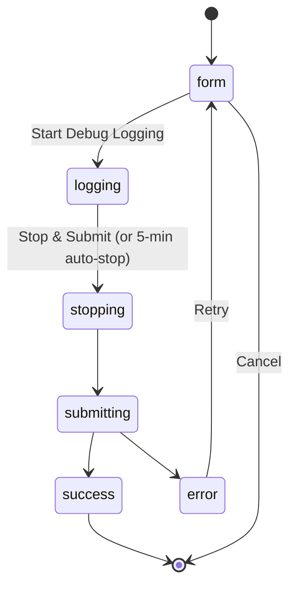

# In-app Bug Report

Every page in BamDude carries a floating red **Bug** button at the bottom-right corner. Click it to file a bug report against [`kainpl/bamdude`](https://github.com/kainpl/bamdude/issues) without leaving the UI — BamDude collects sanitized debug logs + a screenshot + a structured support snapshot, posts them to the bamdude.top relay, and returns the freshly-created GitHub issue number on success.

Shipped in BamDude **0.4.4**. Adapted from upstream [Bambuddy `058f74a7` + `dc4d77b9` + `57092822`](https://github.com/maziggy/bambuddy/commit/058f74a7).

!!! info "Why a relay?"
    BamDude itself never holds a GitHub PAT. The PAT is on the bamdude.top side, where the relay creates the issue against the upstream repo on your behalf. That asymmetry is the whole point — shipping a PAT in the BamDude image would mean every self-hoster gets one, with no way to revoke selectively.

## :material-bug: The flow

The bubble is a small floating action button — `Bug` icon, red circle, `bottom-right`. It does not block any page content. Clicking opens a slide-in panel that walks through five states:

### :material-form-textbox: Step 1 — Form

Three inputs:

- **Description** *(required)* — what went wrong. Plain text, free-form.
- **Email** *(optional)* — your email. If you fill this in, it gets included in a collapsed section of the GitHub issue body so the maintainer can follow up directly. Otherwise, GitHub-issue replies don't reach you.
- **Screenshot** *(optional)* — paste from clipboard, drag-and-drop, or click to file-pick. The image is canvas-compressed to 1920px max dimension at JPEG quality 0.7 *before* upload, so even a 4K screenshot ends up well under 1 MB.

A `
` block below the inputs shows exactly what data the report includes — and what it never includes (printer names, serials, IPs, access codes, passwords, IPs, emails, API keys, tokens, webhook URLs, hostnames, usernames). Read it before submitting if privacy is a concern.

### :material-record-rec: Step 2 — Logging

Click **Start Debug Logging** and BamDude:

1. Flips the global debug-log level to DEBUG (recording the previous value as `was_debug` for restoration).
2. Sends a fresh status push to every connected printer over MQTT, so the logs catch a current snapshot of every printer's state right at the start.
3. Renders a 3-step progress indicator + a `MM:SS` mono lap timer.

Now reproduce the bug in another tab. Detailed logs are captured continuously. The session **auto-stops at 5 minutes** as a safety cap — you can also click **Stop & Submit** earlier when you've reproduced what you need.

### :material-stop-circle: Step 3 — Stop & Submit

Hitting Stop:

1. Pulls the last 200 sanitized log lines (printer names / serials / IPs / access codes / cloud emails / usernames are redacted on the server before they leave your install).
2. Restores the previous log level (so DEBUG mode doesn't stick around if you didn't have it on).
3. Hands the sanitized logs + form fields + screenshot off to `POST /bug-report/submit`, which calls the configured relay.

### :material-check-circle: Step 4 — Success

The relay creates a GitHub issue and returns the issue number + URL. The panel shows a Thank-You + a clickable `View Issue #N` link. Done — you can close the panel and keep working.

### :material-alert-circle: Step 5 — Error

If the relay is unreachable, returns 5xx, or rejects the payload, the panel surfaces a generic error message with a **Retry** button (which goes back to the form so you can adjust description/screenshot and try again). Every failed attempt is also logged in BamDude's `bug_reports` audit table for diagnosis.

## :material-shield-lock: What's sanitized

The `support_info` payload is built server-side by `_collect_support_info()` and `_get_recent_sanitized_logs()` — both intentionally narrow:

| Included | Never included |
|----------|----------------|
| App version | Printer names |
| OS / architecture / Python version | Serial numbers |
| Database row counts (only counts, not data) | IP addresses |
| Printer models, nozzle counts, firmware versions | Access codes |
| Connectivity status booleans | Passwords |
| Integration status (Spoolman, MQTT, Home Assistant) | Email addresses |
| Non-sensitive settings (e.g. log retention, theme) | API keys / tokens |
| Network interface count (no IPs) | Webhook URLs |
| Docker details (memory limit, network mode hint) | Hostnames |
| Dependency versions | Usernames |

Sensitive strings are pulled from the live database at sanitization time and replaced with placeholders like `[PRINTER]`, `[SERIAL]`, `[IP]`, `[ACCESS_CODE]`, `[USER]`, `[EMAIL]` in the logs. The replacement happens in BamDude before the payload leaves your install — neither the relay nor GitHub ever sees the originals.

## :material-counter: Rate limiting

Two layers:

- **Client-side, per BamDude install** — 5 reports per hour. The counter is in-memory and resets on backend restart.
- **Relay-side, per IP** — 10 reports per hour by default (configurable on the relay). Behind Cloudflare, the relay reads the original IP from `CF-Connecting-IP`, so it's per real client even if many BamDude installs share an outbound NAT.

If you hit the limit, the panel shows a **Rate limit exceeded** message; wait an hour and try again.

## :material-cog: Configuration

One environment variable on the BamDude side:

| Variable | Default | What it does |
|----------|---------|--------------|
| `BUG_REPORT_RELAY_URL` | `https://bamdude.top/api/bug-report` | Where the bubble POSTs submissions. Set to empty string to disable the bubble entirely. Override to point at your own relay if you self-host one. |

No other config — gating is via permissions: `start-logging` requires `settings:update`, `stop-logging` and `submit` require `settings:read`. Both default Operator and Admin groups have these.

## :material-book-open-variant: Self-hosting the relay

If you don't want to use the public bamdude.top relay (offline farm, air-gapped LAN, distrust of a third party), you can run your own. The relay is a ~150 LOC Fastify service that's open source under the [`kainpl/bamdude.top`](https://github.com/kainpl/bamdude.top/tree/main/relay) repository. The `relay/README.md` walks through:

- Issue body shape (what gets sent to GitHub).
- Schema validation.
- Rate-limit knobs.
- Screenshot upload directory + nginx routing.
- systemd unit + hardening (NoNewPrivileges, ProtectSystem=strict, etc.).
- How to generate a fine-grained GitHub PAT scoped to a single repo's Issues only.

To use your own relay, set `BUG_REPORT_RELAY_URL=https://your-relay.example.com/api/bug-report` on the BamDude side and redeploy. The bubble will post there instead.

## :material-database-cog: Audit table

Every submission attempt — successful or failed — writes one row to the `bug_reports` table:

| Column | Notes |
|--------|-------|
| `id` | PK. |
| `description` | What the operator typed. |
| `reporter_email` | Optional. |
| `github_issue_number` / `github_issue_url` | Set on success. |
| `status` | `submitted` or `failed`. |
| `error_message` | Set on `failed` — relay error code, network exception, etc. |
| `email_sent` | True when the GitHub issue was created (the `email_sent` column name is a legacy from upstream — currently always tracks issue-creation success, not literal email delivery). |
| `created_at` | UTC timestamp. |

Useful for diagnosis when an operator says "I submitted a bug report and got an error" — query the table by `created_at` desc + `status='failed'` to see the captured error message.

## :material-help-circle: Troubleshooting

**Bubble doesn't appear**

- Check that `BUG_REPORT_RELAY_URL` is set (default fires at runtime; the bubble won't render if the env var is explicitly empty).
- The bubble lives inside `<Layout>` so it needs the user to be on a regular authenticated page. The setup-required gate (`/setup`) and login pages don't render Layout.

**Submission fails with "Bug report relay is not available"**

- Relay-side issue. Either bamdude.top is down, your network can't reach it, or the relay is rate-limiting your IP. Check via `curl -fsS https://bamdude.top/api/bug-report/health` — should return `{ok:true,repo:"kainpl/bamdude"}`.
- If you're behind a strict outbound proxy, allow `bamdude.top:443`.

**Submission fails with "Rate limit exceeded"**

- Hit the per-instance 5/hour limit. Wait an hour, or restart the backend (the limit is in-memory and resets on restart — useful for testing).

**Issue created but maintainer never replies**

- Add your email to the next report. Without a contact channel, the issue is anonymous and follow-ups can only happen on the GitHub issue itself.

---

> The relay implementation lives at [`kainpl/bamdude.top` → `relay/`](https://github.com/kainpl/bamdude.top/tree/main/relay).
