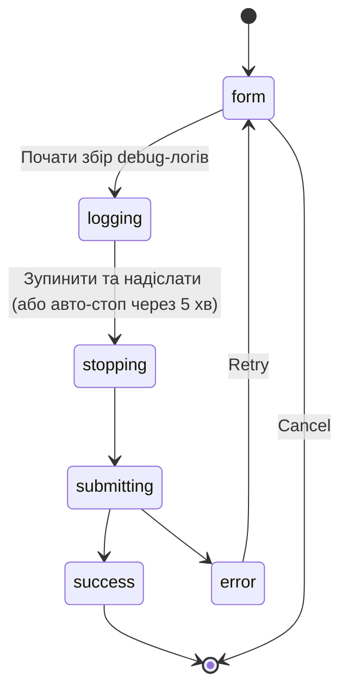

# Звіт про баг із UI

Кожна сторінка в BamDude несе плаваючу червону кнопку **Bug** в правому нижньому куті. Клацання відкриває панель, через яку можна подати звіт у [`kainpl/bamdude`](https://github.com/kainpl/bamdude/issues) не залишаючи UI — BamDude збирає санітизовані debug-логи + скріншот + структурований support-snapshot, постить на bamdude.top-релей, і повертає номер свіжо-створеного GitHub-issue.

Шипається в BamDude **0.4.4**. Адаптовано з upstream [Bambuddy `058f74a7` + `dc4d77b9` + `57092822`](https://github.com/maziggy/bambuddy/commit/058f74a7).

!!! info "Чому через релей?"
    BamDude сам ніколи не тримає GitHub PAT. PAT — на стороні bamdude.top, де релей створює issue в апстрімовому репо від вашого імені. Ця асиметрія і є точкою — шипити PAT в Docker-образ означало б, що кожен self-hoster отримує копію без можливості селективного відкликання.

## :material-bug: Як це працює

Bubble — маленька floating action button: іконка `Bug`, червоне коло, `bottom-right`. Не блокує контент сторінки. Клацання відкриває висувну панель з 5 станами:

### :material-form-textbox: Крок 1 — Форма

Три поля:

- **Опис** *(обов'язково)* — що пішло не так. Вільний текст.
- **Email** *(опційно)* — ваш email. Якщо вкажете, він піде у згорнутому блоці GitHub-issue body, щоб maintainer міг зв'язатися напряму. Без email відповіді на GitHub-issue вас не досягають.
- **Скріншот** *(опційно)* — вставка з буфера, drag-and-drop, або клік щоб вибрати файл. Зображення canvas-стискається до 1920px по найбільшій стороні + JPEG quality 0.7 *перед* uploadом — навіть 4K-скріншот вкладається в <1 МБ.

`
` блок під полями показує точно які дані в звіті, і які — ніколи (імена принтерів, серійні номери, IP, access-коди, паролі, email, API-ключі, токени, webhook-URL, hostnames, імена користувачів). Прочитайте перед надсиланням, якщо приватність важлива.

### :material-record-rec: Крок 2 — Логування

Клацання **Почати збір debug-логів** і BamDude:

1. Перемикає глобальний debug-log level на DEBUG (зберігаючи попереднє значення в `was_debug` для відновлення).
2. Шле свіжий status push на кожен підключений принтер через MQTT — щоб у логах був поточний снепшот стану принтерів від самого старту.
3. Рендерить 3-крокевий progress indicator + `MM:SS` mono lap-таймер.

Тепер відтворіть баг у іншій вкладці. Детальні логи захоплюються неперервно. Сесія **авто-зупиняється через 5 хвилин** як safety-cap — або клацніть **Зупинити та надіслати** раніше, коли вже відтворили потрібне.

### :material-stop-circle: Крок 3 — Зупинити та надіслати

Стоп робить:

1. Тягне останні 200 санітизованих рядків логу (імена принтерів / серійники / IP / access-коди / cloud emails / імена користувачів зачищаються на сервері перед тим, як це покине ваш інстал).
2. Повертає попередній log level (щоб DEBUG не лишався увімкнутим, якщо до цього він був OFF).
3. Передає санітизовані логи + поля форми + скріншот у `POST /bug-report/submit`, який кличе налаштований релей.

### :material-check-circle: Крок 4 — Success

Релей створює GitHub-issue і повертає номер + URL. Панель показує Thank-You + клікабельне `View Issue #N` посилання. Все — можна закрити панель і працювати далі.

### :material-alert-circle: Крок 5 — Error

Якщо релей недоступний, повернув 5xx, або відкинув payload — панель показує загальне error-повідомлення + кнопку **Retry** (повертає на форму, щоб поправити опис/скріншот і спробувати знов). Кожна невдала спроба також пишеться в audit-таблицю `bug_reports` для діагностики.

## :material-shield-lock: Що санітизується

`support_info` payload будується server-side через `_collect_support_info()` і `_get_recent_sanitized_logs()` — обидва навмисне вузькі:

| Включено | Ніколи не включено |
|----------|---------------------|
| Версія застосунку | Імена принтерів |
| ОС / архітектура / версія Python | Серійні номери |
| Лічильники рядків БД (тільки лічильники) | IP-адреси |
| Моделі принтерів, кількість сопел, версії прошивки | Access-коди |
| Булеві з'єднання | Паролі |
| Статус інтеграцій (Spoolman, MQTT, Home Assistant) | Email-адреси |
| Нечутливі налаштування (log retention, тема) | API-ключі / токени |
| Кількість мережевих інтерфейсів (без IP) | Webhook URL |
| Деталі Docker (memory limit, network mode hint) | Hostnames |
| Версії залежностей | Імена користувачів |

Чутливі рядки тягнуться з живої БД у момент санітизації і замінюються плейсхолдерами `[PRINTER]`, `[SERIAL]`, `[IP]`, `[ACCESS_CODE]`, `[USER]`, `[EMAIL]` у логах. Заміна відбувається в BamDude *перед* виходом payloadу — ні релей, ні GitHub ніколи не бачать оригіналів.

Одна редакція працює інакше: якщо ти логінишся через LDAP, Distinguished Name-и стають `[DN]`. DN — per-user і приходить із твого каталогу, тож у БД нема за чим його шукати — він упізнається **за формою** і прибирається всюди, де трапиться. Це важливо, бо провідний `CN=` — це справжнє ім'я користувача. Те саме правило діє для [support bundle](system-info.uk.md#sanitisation).

## :material-counter: Rate limiting

Два рівні:

- **Client-side, на BamDude-інстал** — 5 звітів за годину. Лічильник в пам'яті, скидається при рестарті бекенду.
- **На стороні релея, на IP** — 10 звітів за годину за замовчуванням (конфігурується на релеї). За Cloudflare релей читає реальну IP з `CF-Connecting-IP`, тож обмеження по справжньому клієнту, навіть якщо багато BamDude-інсталів ділять один outbound NAT.

Якщо упреться в ліміт — панель показує **Rate limit exceeded**; почекайте годину і повторіть.

## :material-cog: Конфігурація

Одна змінна оточення на стороні BamDude:

| Змінна | Дефолт | Що робить |
|--------|--------|-----------|
| `BUG_REPORT_RELAY_URL` | `https://bamdude.top/api/bug-report` | Куди bubble постить звіти. Поставте пустий рядок щоб повністю прибрати кнопку. Перевизначте на адресу свого релея якщо self-host. |

Жодної іншої конфігурації — gating через permissions: `start-logging` потребує `settings:update`, `stop-logging` і `submit` — `settings:read`. Дефолтні групи Operator + Admin мають обидва.

## :material-book-open-variant: Self-host релея

Якщо публічний релей bamdude.top не підходить (offline-ферма, air-gapped LAN, недовіра до third-party) — можна підняти власний. Релей — ~150 LOC Fastify-сервіс, open source у репо [`kainpl/bamdude.top`](https://github.com/kainpl/bamdude.top/tree/main/relay). `relay/README.md` веде через:

- Форму issue body (що шлеться в GitHub).
- Schema-валідацію.
- Knobs rate-limit'у.
- Папку для скріншотів + nginx-routing.
- systemd unit + hardening (NoNewPrivileges, ProtectSystem=strict тощо).
- Як згенерувати fine-grained GitHub PAT скопований лише на Issues одного репо.

Щоб використати свій релей — поставте `BUG_REPORT_RELAY_URL=https://your-relay.example.com/api/bug-report` на стороні BamDude і передеплойте. Bubble буде постити туди.

## :material-database-cog: Audit-таблиця

Кожна спроба надсилання — успішна чи провальна — пише один рядок у `bug_reports`:

| Колонка | Нотатки |
|---------|---------|
| `id` | PK. |
| `description` | Що оператор написав. |
| `reporter_email` | Опційно. |
| `github_issue_number` / `github_issue_url` | Виставляється на успіх. |
| `status` | `submitted` або `failed`. |
| `error_message` | Виставляється на `failed` — код помилки релея, мережевий exception тощо. |
| `email_sent` | True коли GitHub-issue створене (назва колонки `email_sent` — legacy з upstream; зараз трекає створення issue, не літеральну доставку email). |
| `created_at` | UTC timestamp. |

Корисно для діагностики коли оператор каже "я надіслав звіт і отримав помилку" — query таблиці по `created_at desc + status='failed'` покаже захоплене повідомлення.

## :material-help-circle: Траблшутинг

**Bubble не з'являється**

- Перевірте що `BUG_REPORT_RELAY_URL` встановлений (дефолт стріляє в runtime; bubble не рендериться якщо змінна явно пуста).
- Bubble живе всередині `<Layout>` — потрібен користувач на звичайній authenticated-сторінці. Setup-required gate (`/setup`) і login-сторінки Layout не рендерять.

**Надсилання валиться з "Bug report relay is not available"**

- Проблема на стороні релея. Або bamdude.top лежить, або ваша мережа його не дотягується, або релей вас rate-limit'ить. Перевірка: `curl -fsS https://bamdude.top/api/bug-report/health` — має повернути `{ok:true,repo:"kainpl/bamdude"}`.
- За жорстким outbound-проксі — дозвольте `bamdude.top:443`.

**Надсилання валиться з "Rate limit exceeded"**

- Уперлися в per-instance ліміт 5/год. Зачекайте годину, або рестарт бекенду (лічильник у пам'яті, на старті чистий — корисно для тестування).

**Issue створене, але maintainer не відповідає**

- Додайте email у наступний звіт. Без контактного каналу issue анонімне і follow-up можна зробити лише через GitHub-issue безпосередньо.

---

> Реалізація релея: [`kainpl/bamdude.top` → `relay/`](https://github.com/kainpl/bamdude.top/tree/main/relay).
