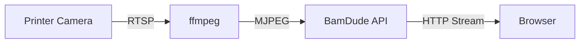

# Camera Streaming

Monitor your prints visually with live camera streaming directly from your Bambu Lab printer.

---

## :material-video: Live Streaming

BamDude provides MJPEG video streaming from your printer's built-in camera, or from an external network camera.

### Opening the Camera

1. Click the :material-camera: camera icon on any printer card
2. Choose between embedded overlay or separate window (configurable in Settings)
3. Stream starts automatically

### Stream Controls

| Button | Action |
|:------:|--------|
| **Live** | Real-time MJPEG video stream |
| **Snapshot** | Single still image (lower bandwidth) |
| :material-refresh: | Restart the stream |
| :material-fullscreen: | Enter fullscreen mode |

---

## :material-webcam: External Cameras

Connect external network cameras to replace the built-in printer camera.

| Type | Example |
|------|---------|
| **MJPEG** | `http://192.168.1.50/mjpeg` |
| **RTSP** | `rtsp://192.168.1.50:554/stream` |
| **Snapshot** | `http://192.168.1.50/snapshot.jpg` |
| **USB (V4L2)** | `/dev/video0` |

Configure in **Settings** > **General** > **Camera**.

---

## :material-magnify: Zoom & Pan

| Method | Action |
|--------|--------|
| **Mouse wheel** | Zoom in/out (100% - 400%) |
| **Click and drag** | Pan when zoomed |
| **Pinch gesture** | Touch device zoom |

---

## :material-cog: Technical Details

| Requirement | Details |
|-------------|---------|
| **ffmpeg** | Must be installed (included in Docker image) |
| **Camera enabled** | Must be enabled in printer settings |
| **Developer Mode** | Required for camera access |

---

## :material-video-box: OBS Overlay

BamDude includes a streaming overlay at `/overlay/{printer_id}` combining camera feed with real-time print status. No login required.

Customize with query parameters: `?size=large&fps=30&show=progress,eta,filename`

---

## :material-key-variant: Stream Token Gate

Camera endpoints (live stream, snapshot, cover thumbnail, plate-detection reference) are not Bearer-token-friendly -- a `` tag can't attach an `Authorization` header. BamDude routes these through a short-lived query-param token instead:

1. The frontend hits `POST /api/v1/printers/camera/stream-token` to mint a token tied to the current user (TTL 60 min).
2. The token is appended as `?token=...` to every camera URL via `withStreamToken()` in the API client.
3. Already-rendered DOM nodes (e.g. an `` mounted before the token arrived) are retrofitted by `rewriteMediaSrcWithToken()`.
4. The token is keyed by `user.id` in React-Query so login/logout invalidates the cache.

Tokens are stored in `auth_ephemeral_tokens` so they survive backend restarts and work behind multi-worker deploys. Operators don't need to do anything -- this is invisible plumbing -- but the implication is that copying a camera URL out of the browser only works for the lifetime of the embedded token.

---

## :material-image-frame: Cover Thumbnails

`GET /api/v1/printers/{id}/cover` returns the thumbnail of whatever the printer is *currently* printing. It is served exclusively from the local archive directory -- BamDude never initiates an FTP download from this endpoint. While a print is active and the archive's 3MF hasn't been backfilled yet (e.g. a printer-side print where the FTP recovery loop hasn't caught up), the endpoint returns 404 and the UI falls back to a generic placeholder. Once `archive_download_retry` lands the 3MF, the endpoint starts returning the real PNG without any client action.

---

## :material-application: Embedded vs Window Mode

The camera viewer has two modes, configurable per-user in **Settings > Camera**:

- **Embedded** (default) -- The viewer overlays directly on top of the printer card. Multiple printers can have their cameras open at once and each viewer tracks its own size/position via local state. The page header's status bar continues to drive the rest of the UI.
- **Window** -- The viewer launches in a separate browser window (or PWA window). Useful for parking a single camera on a second monitor.

Embedded is the right default for live monitoring; window mode is for setups where the camera lives on a different screen from the printer dashboard.

---

## :material-lightbulb: Tips

!!! tip "Multiple Cameras"
    In embedded mode, open multiple camera viewers simultaneously -- each remembers its own position and size.

!!! tip "Bandwidth Conservation"
    Close camera windows when not actively watching to save server resources.

> Originally based on [Bambuddy](https://github.com/maziggy/bambuddy) documentation.
