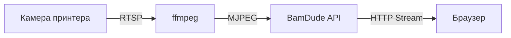

# Трансляція камери

Візуально спостерігайте за друком через живу трансляцію камери безпосередньо з вашого принтера Bambu Lab.

---

## :material-video: Жива трансляція

BamDude забезпечує MJPEG-відеотрансляцію з вбудованої камери принтера або зовнішньої мережевої камери.

### Відкриття камери

1. Натисніть іконку :material-camera: камери на картці принтера
2. Оберіть між оверлей-режимом або окремим вікном (налаштовується в Параметрах)
3. Трансляція починається автоматично

### Елементи керування

| Кнопка | Дія |
|:------:|-----|
| **Live** | Відеотрансляція MJPEG у реальному часі |
| **Snapshot** | Одне статичне зображення (менше навантаження) |
| :material-refresh: | Перезапустити трансляцію |
| :material-fullscreen: | Повноекранний режим |

---

## :material-webcam: Зовнішні камери

Підключайте зовнішні мережеві камери замість вбудованої камери принтера.

| Тип | Приклад |
|-----|---------|
| **MJPEG** | `http://192.168.1.50/mjpeg` |
| **RTSP** | `rtsp://192.168.1.50:554/stream` |
| **Snapshot** | `http://192.168.1.50/snapshot.jpg` |
| **USB (V4L2)** | `/dev/video0` |

Налаштовується в **Settings** > **General** > **Camera**.

---

## :material-magnify: Масштабування та панорамування

| Метод | Дія |
|-------|-----|
| **Коліщатко миші** | Збільшення/зменшення (100% - 400%) |
| **Клік і перетягування** | Панорамування при збільшенні |
| **Жест щипка** | Масштабування на сенсорному пристрої |

---

## :material-cog: Технічні деталі

| Вимога | Деталі |
|--------|--------|
| **ffmpeg** | Має бути встановлений (включений у Docker-образ) |
| **Камера увімкнена** | Має бути увімкнена в налаштуваннях принтера |
| **Режим розробника** | Необхідний для доступу до камери |

---

## :material-video-box: OBS-оверлей

BamDude включає оверлей для стрімів за адресою `/overlay/{printer_id}`, що поєднує відео з камери зі статусом друку в реальному часі. Авторизація не потрібна.

Налаштування через параметри запиту: `?size=large&fps=30&show=progress,eta,filename`

---

## :material-key-variant: Stream-токен як шлюз

Camera-ендпоінти (live-стрім, snapshot, cover-мініатюра, plate-detection reference) не дружать з Bearer-токеном -- тег `` не може причепити заголовок `Authorization`. BamDude натомість пропускає їх через короткоживучий query-param токен:

1. Фронт стукає в `POST /api/v1/printers/camera/stream-token`, щоб отримати токен, прив'язаний до поточного користувача (TTL 60 хв).
2. Токен дописується як `?token=...` до кожного camera-URL через `withStreamToken()` в API-клієнті.
3. Уже відрендерені DOM-вузли (наприклад, ``, змонтований до приходу токена) ретрофітяться через `rewriteMediaSrcWithToken()`.
4. Токен у React-Query кешується по `user.id`, тож логін/логаут інвалідує кеш.

Токени зберігаються в `auth_ephemeral_tokens`, тож переживають перезапуски бекенда і працюють під багатоворкерними деплоями. Операторам нічого робити не треба -- це невидима сантехніка -- але наслідок такий: copy-paste camera-URL з браузера працює лише на час життя вшитого токена.

### Довготривалі токени для Home Assistant / Frigate / kiosk

Токен на 60 хв з UI-сторони не годиться для kiosk-дашборду на стіні, camera-entity в Home Assistant чи Frigate-фронту, що ре-фетчить той самий URL місяцями. BamDude вміє mint'ити **довготривалі stream-токени** під ці кейси:

1. **Settings → Camera → Long-lived tokens → + New token**.
2. Обери принтер(и) (один токен може авторизувати кілька камер), expiry (місяці / роки / never), і опційний label (наприклад, `frigate-living-room`).
3. Сторінка покаже токен **один раз** — копіюй у конфіг HA / Frigate / kiosk. Більше не покаже.
4. Токен дає лише camera-ендпоінти (`/stream`, `/snapshot`, `/cover`) на обрані принтери — жодного іншого API.

| Властивість | Деталь |
|---|---|
| Storage | Та сама `auth_ephemeral_tokens` таблиця, з `token_type='camera_longlived'`, тож звичайний 60-хв sweeper їх не чіпає. |
| Revocation | Видалити рядок з таблиці long-lived tokens — діє з наступного запиту. Кеш-шару немає. |
| Audit | Кожен токен записує last-used-at + last-used-IP, тож видно чи kiosk його реально споживає. Stale-токени (no use 30+ днів) отримують жовтий warning-чіп. |
| Liimit | Soft cap 50 active-токенів на інсталяцію — підняти лише через DB-доступ (`auth_ephemeral_tokens` спеціально low-friction by design). |

Форма URL: `/api/v1/printers/{id}/stream?token={long_lived_token}` — той самий query-param контракт що й короткоживучий, тож HA-camera platform / Frigate `mjpeg_streams` / `` у kiosk-дашборді працюють без додаткової сантехніки.

---

## :material-image-frame: Cover-мініатюри

`GET /api/v1/printers/{id}/cover` повертає мініатюру того, що принтер *зараз* друкує. Видається виключно з локального каталогу архівів -- BamDude ніколи не ініціює FTP-завантаження з цього ендпоінта. Поки друк активний і 3MF архіву ще не догнаний (наприклад, друк, запущений з екрана принтера, де FTP-recovery-цикл ще не наздогнав), ендпоінт повертає 404, а UI показує загальний плейсхолдер. Щойно `archive_download_retry` витягне 3MF, ендпоінт почне віддавати реальний PNG без жодних дій з боку клієнта.

---

## :material-application: Оверлей-режим vs віконний режим

Переглядач камери має два режими, налаштовуються per-user у **Settings > Camera**:

- **Embedded** (за замовчуванням) -- переглядач накладається прямо поверх картки принтера. Кілька принтерів можуть мати камери відкритими одночасно, і кожен переглядач тримає власний розмір/позицію через локальний стан. Status bar у заголовку сторінки продовжує керувати рештою UI.
- **Window** -- переглядач запускається в окремому вікні браузера (або PWA-вікні). Корисно, щоб припаркувати одну камеру на другому моніторі.

Embedded -- правильний дефолт для живого моніторингу; віконний режим -- для сетапів, де камера живе на окремому екрані від дашборду принтерів.

---

## :material-lightbulb: Поради

!!! tip "Кілька камер"
    В оверлей-режимі відкривайте кілька переглядачів камер одночасно -- кожен запам'ятовує свою позицію та розмір.

!!! tip "Економія трафіку"
    Закривайте вікна камер, коли не спостерігаєте активно, щоб зберегти ресурси сервера.

> Базується на документації [Bambuddy](https://github.com/maziggy/bambuddy).
