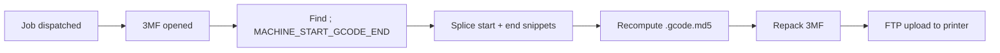

# G-code injection

BamDude can inject **operator-defined G-code snippets** into a print's plate gcode at dispatch time — start snippet at the very beginning of the print, end snippet at the very end. The snippet survives even if BamDude crashes mid-print, runs at exactly the right point in the printer's own gcode sequence (before/after the firmware's reset routines), and is per-printer-model so the same project file can produce a different snippet on an X1C than on a P1S.

This is **not** the same as a [macro](macros.md). Macros are server-driven MQTT pushes at lifecycle events; G-code injection is bytes spliced into the actual file. See the comparison table on the macros page if you're picking between the two.

---

## :material-cog-outline: How it works

1. **Configure** — drop start / end snippets per printer model in **Settings → Printing → G-code Injection**.
2. **Toggle on the print** — when you start a print (PrintModal, queue item, dispatch), tick **Inject G-code**.
3. **Dispatch path** — the dispatcher opens the 3MF, locates the marker `; MACHINE_START_GCODE_END` in each `plate_*.gcode`, splices the resolved start snippet immediately after it (and the end snippet at the file's tail), recomputes per-plate `.gcode.md5` sidecars, repacks the 3MF, and uploads to the printer via FTP.
4. **Audit trail** — the resulting archive's `applied_patches` JSON records `{name: "gcode_injection", model, plate_id}` so you can see at a glance which prints had what injected.



---

## :material-pen: Configuring snippets

**Settings → Printing → G-code Injection** auto-discovers every distinct printer model from your linked printers and renders one collapsible `<details>` block per model.

Each model carries two textareas:

| Snippet | Where it splices | Typical use |
|---|---|---|
| **Start G-code** | Right after `; MACHINE_START_GCODE_END` — i.e. once the firmware's heat-up + auto-home + bed-mesh phases finished, but before the slicer's own start sequence. | Park to a custom origin, set custom acceleration, log start-of-print to a serial probe. |
| **End G-code** | At the file's tail, after the slicer's end sequence. | Park to back-left for easy retrieval, purge tower clean-cut, post-cool-down nozzle wipe, pause for a manual swap. |

Save on blur — the form auto-prunes empty entries. A "**Configured**" badge on the model summary row appears as soon as at least one of the two textareas has content.

### Placeholder substitution

Snippets support `{placeholder}` substitution sourced from the slicer's gcode-header `; key = value` lines (e.g. `{first_layer_temperature}`, `{filament_type}`, `{nozzle_diameter}`). Prusa-style aliases (`{nozzle_temperature}` → Bambu's `{nozzle_temperature_initial_layer}`) are mapped automatically so existing community snippets work without rewriting.

Example:

```gcode
; Park to back-left, then drop bed for cool-down view
G1 X10 Y210 F6000
G1 Z{first_layer_print_height + 30}
M104 S0  ; nozzle off
M140 S{bed_temperature_other_layer / 2}  ; bed half-down — quick cool, gentle on the part
```

---

## :material-toggle-switch: Per-job toggle

The PrintModal's **Inject G-code** checkbox is the per-job control. It defaults off — turn it on for a specific dispatch when the configured snippet matches what you want for that file. Stays per-`PrintQueueItem` so a queue full of mixed jobs can pick-and-choose.

Off + no configured snippet = the dispatcher takes a fast path that doesn't even open/repack the 3MF. Repacking is only done when there's something to inject — preserves the existing `mesh_mode_fast_check` no-op fast path.

When both **Mesh-mode fast check** and **Inject G-code** are toggled on the same job, the dispatcher does **one** open / patch / repack cycle covering both transforms — large multi-plate 3MFs aren't unzipped twice.

---

## :material-shield-key: Permissions

| Permission | Grants |
|---|---|
| `settings:update` | Edit the per-model snippet library. |
| `queue:create` / `printers:control` | Toggle Inject G-code on a job (whichever you'd already need to dispatch). |

There's no separate `printers:edit_gcode_snippets` permission — admin gate via `settings:update` is sufficient given the operational nature of this feature (it's writing gcode, not changing auth).

---

## :material-alert-circle-outline: Caveats

!!! warning "Test on a calibration print first"
    Bad start-gcode at the beginning of every print is a recipe for ruined builds. Validate a new snippet on a small calibration cube before letting it apply to your production farm.

- **Marker missing** — if a 3MF doesn't carry `; MACHINE_START_GCODE_END` (rare; some old slicers, custom files), the start snippet falls through to the file head as a best-effort. End snippet always lands cleanly.
- **Multi-plate** — every plate gets the same snippets applied independently. Per-plate snippets aren't supported (would need a UI per plate × model and clutters the editor for negligible gain).
- **Reprint of an injected archive** — the archive stores the injected output, so reprinting from `Archives → Reprint` reuses the injected file as-is (no re-injection). To re-inject with a fresh snippet, dispatch from the source library file instead.

---

## :material-link-variant: Related

- [Macros](macros.md) — server-side MQTT counterpart with a comparison table.
- [Settings reference](../reference/settings.md) — `gcode_snippets` setting JSON shape.
