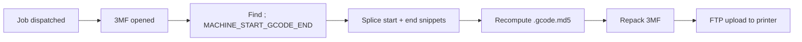

# Інжекція G-code

BamDude вміє вставляти **операторські G-code сніпети** в gcode плити при dispatch'і — start-сніпет на самий початок друку, end-сніпет на самий кінець. Сніпет переживає падіння BamDude мід-принт, виконується точно в потрібній точці gcode-послідовності принтера (до/після його reset-рутин), і живе на модель принтера — той самий проєкт-файл породить різний сніпет на X1C і P1S.

Це **не те саме**, що [макрос](macros.md). Макроси — server-driven MQTT-пуш на lifecycle-події; G-code injection — байти, вставлені у власне файл. Подивись таблицю порівняння на сторінці макросів, якщо обираєш між ними.

---

## :material-cog-outline: Як це працює

1. **Сконфігуруй** — вкини start / end сніпети на модель в **Settings → Printing → G-code Injection**.
2. **Увімкни на завдання** — при старті друку (PrintModal, queue item, dispatch) постав галочку **Inject G-code**.
3. **Dispatch-шлях** — диспатчер відкриває 3MF, знаходить маркер `; MACHINE_START_GCODE_END` у кожному `plate_*.gcode`, вставляє resolved start-сніпет одразу після нього (а end-сніпет у хвіст файлу), перераховує per-plate `.gcode.md5` сайдкари, перепаковує 3MF, і завантажує на принтер по FTP.
4. **Аудит** — `applied_patches` JSON архіву записує `{name: "gcode_injection", model, plate_id}`, тож по табличці видно, які друки що мали вставлено.



---

## :material-pen: Конфігурація сніпетів

**Settings → Printing → G-code Injection** автоматично знаходить кожну унікальну модель принтера зі списку лінкнутих, і малює один collapsible `<details>` блок на модель.

Кожна модель несе дві текстові області:

| Сніпет | Куди вставляється | Типове застосування |
|---|---|---|
| **Start G-code** | Одразу після `; MACHINE_START_GCODE_END` — тобто коли firmware-фази нагріву + auto-home + bed-mesh завершились, але до власної start-послідовності слайсера. | Park у власну точку, виставити кастомну acceleration, лог start-of-print на serial probe. |
| **End G-code** | У хвіст файлу, після end-послідовності слайсера. | Park у back-left для зручного забору, чистий рез purge tower, post-cool-down nozzle wipe, пауза для ручного swap'у. |

Збереження на blur — форма автоматично прибирає порожні entries. Бейдж **Configured** на summary-рядку моделі з'являється, як тільки хоча б одна з двох текстових областей має вміст.

### Підстановка плейсхолдерів

Сніпети підтримують `{placeholder}` підстановку зі slicer'івських gcode-header `; key = value` рядків (наприклад, `{first_layer_temperature}`, `{filament_type}`, `{nozzle_diameter}`). Prusa-style алреси (`{nozzle_temperature}` → Bambu'шне `{nozzle_temperature_initial_layer}`) мапляться автоматично, тож existing community-сніпети працюють без перепису.

Приклад:

```gcode
; Park у back-left, потім опусти стіл для cool-down view
G1 X10 Y210 F6000
G1 Z{first_layer_print_height + 30}
M104 S0  ; nozzle off
M140 S{bed_temperature_other_layer / 2}  ; стіл наполовину — швидкий cool, ніжний до деталі
```

---

## :material-toggle-switch: Тоглер на завдання

Чекбокс **Inject G-code** в PrintModal — це per-job контроль. За замовчуванням off — вмикаєш для конкретного dispatch'у, коли налаштований сніпет підходить файлу. Зберігається на `PrintQueueItem`, тож черга з мікс-jobs може pick-and-choose.

Off + ніяких сніпетів = диспатчер бере fast-path, що навіть не відкриває / не перепаковує 3MF. Repack робиться лише коли є що інжектити — зберігає існуючий `mesh_mode_fast_check` no-op fast-path.

Коли і **Mesh-mode fast check**, і **Inject G-code** увімкнені на тому ж job'і — диспатчер робить **один** open / patch / repack цикл, що покриває обидві трансформації — великі multi-plate 3MF не розпаковуються двічі.

---

## :material-shield-key: Дозволи

| Permission | Що дозволяє |
|---|---|
| `settings:update` | Редагувати бібліотеку сніпетів на моделі. |
| `queue:create` / `printers:control` | Тогглити Inject G-code на job'і (те, що тобі вже потрібно для dispatch'у). |

Окремого `printers:edit_gcode_snippets` permission немає — admin-gate через `settings:update` достатній з огляду на operations-природу фічі (це пишемо gcode, а не міняємо auth).

---

## :material-alert-circle-outline: Підводні камені

!!! warning "Спершу тестуй на калібровці"
    Поганий start-gcode на початку кожного друку — рецепт зіпсованих білдів. Прогон новий сніпет на маленькій калібровці перед тим, як пускати в продакшн ферму.

- **Маркера немає** — якщо 3MF не несе `; MACHINE_START_GCODE_END` (рідкість; деякі старі слайсери, кастомні файли) — start-сніпет валиться у голову файлу як best-effort. End-сніпет завжди лягає чисто.
- **Multi-plate** — кожна плита отримує ті самі сніпети окремо. Per-plate сніпетів немає (потребувало б UI на плиту × модель і клатало б редактор без значного зиску).
- **Реприн інжектованого архіву** — архів зберігає інжектований output, тож reprint з `Archives → Reprint` повторно використовує інжектований файл як є (без re-injection). Щоб реінжектити зі свіжим сніпетом — диспатч з джерельного library-file.

---

## :material-link-variant: Дивись також

- [Macros](macros.md) — server-side MQTT-counterpart з таблицею порівняння.
- [Settings reference](../reference/settings.md) — JSON-форма налаштування `gcode_snippets`.
