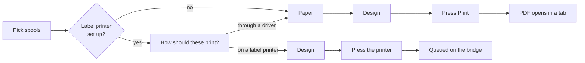

# Spool labels

A spool with a label on it is a spool you can identify from across the room, and one a phone can scan back into BamDude. The layouts are **data, not code** — a label is a list of boxes with millimetre positions, drawn in the browser, stored in the database, and rendered by the server as either a PDF or a one-bit raster for a thermal head.

The editor lives in **Settings → Filament → Marking**. There is no separate page and no menu entry, deliberately: labels belong to the filament you are labelling.

---

## :material-cursor-default-click: Printing a batch

Select spools in the filament manager and press **Print labels**. The dialog asks three things, in order.



**How should these print?** — only asked when the [label-printer integration](#a-printer-on-your-desk) is switched on *and* a printer has been adopted. With nothing to choose between, the question is not asked at all.

**Paper** — one label per page, or laid out across a sheet of stock. Driver side only: a desk label printer feeds a roll, and there is no page to tile.

**Design** — every design drawn for that output, with its description and its size. Press **Print** and the PDF opens in a new tab, where you decide whether to print it or save it.

!!! tip "A design that does not fit is greyed out, not hidden"
    Pick Avery 5160 and a 40 × 30 mm design stops being selectable, with both measurements in the reason. Labels print at their own size or not at all — shrinking one to fit destroys the bar widths a scanner reads by, and it fails silently: the label looks fine and simply will not scan.

On the label-printer side there is no **Print** button and no PDF. You pick the design, then press the printer — that *is* the print. A printer whose loaded stock is smaller than the design says so on its own row, because two printers on two desks can have different rolls in them.

---

## :material-pencil-ruler: Drawing a label

**Settings → Filament → Marking** lists your designs on the left and opens one in the editor.

The picture in the middle is **not a drawing of your label — it is your label**. It comes from the same renderer that produces the printed file, filled with example data, so what you are looking at is what comes out.

Each design carries:

| Field | What it does |
|---|---|
| **Name** | Shown in the print dialog and in the editor list. |
| **Description** | One line saying what the label is for, shown under the name wherever the design is offered. |
| **Size** | Width and height in millimetres. This is the label, not the printable area. |
| **Printer type** | `Through a driver` or `Label printer` — see [below](#two-kinds-of-label). |

Boxes snap to each other and to the label's own edges and centre, with a red guide showing what they caught on. `Ctrl`/`Cmd` + `Z` undoes, and nothing is written until you press **Save**.

### The four kinds of box

| Element | Notes |
|---|---|
| **Text** | Size in mm, bold, italic, horizontal and vertical alignment, and a **fit** rule: `shrink` reduces the size until it fits, `clip` cuts it off. |
| **QR** | Usually `{deeplink}` — scanning it opens that spool's row in BamDude on your phone. |
| **Barcode** | EAN-13, Code 128, Code 39, EAN-8, UPC-A or ITF. EAN-13 takes exactly twelve digits; anything else is reported rather than printed unscannable. |
| **Colour swatch** | A block of the spool's colour, as a rectangle, a circle or a rounded rectangle. One band per colour on a multi-colour spool. |

!!! warning "`shrink` inverts the hierarchy on real data"
    The designs BamDude ships use `clip`, not `shrink`. Shrinking makes a long brand name smaller than the short material line beneath it, which reads as the wrong thing being important. That is visible on a render and invisible in a test.

### Placeholders

Text and barcode content is written with placeholders in braces — the same vocabulary as the spool-name setting on the Inventory page. The editor lists every one it knows with an example; a few of the common ones:

`{id}` · `{brand}` · `{material}` · `{subtype}` · `{color_name}` · `{color_hex}` · `{remaining_g}` · `{remaining_pct}` · `{note}` · `{deeplink}` · `{ean}`

!!! note "An unknown placeholder survives verbatim"
    Type `{lot}` when no such key exists and the label prints the characters `{lot}`. That is deliberate — a typo is visible in the preview rather than silently blank.

### Test print

**Test print** puts the design on real stock through a desk label printer, with the same example data the preview is showing. It is checked against the loaded cassette exactly as a real print is, so a test cannot succeed where the print would refuse.

---

## :material-file-document-multiple: Sheets of stock

A **sheet** is paper: page size, how many cells across and down, the margins and the gaps. It says how big a cell is and **nothing about what goes in one** — printing takes a sheet plus a design that fits the cell. That separation is what lets any label print on any stock.

**Settings → Filament → Marking → Sheets of stickers** holds them. Two Avery layouts ship with BamDude; you can correct those or draw your own, on A4, A5 or US Letter.

**Preview the page** lays a design you already have into every cell, so *does the grid fit the paper* and *does the label fit a cell* are both answered before anything reaches adhesive stock. A grid that runs off its page is refused when you save it, and flagged in the list — a geometry can stop fitting without anyone editing it, if the paper under it changes.

---

## :material-printer-outline: Two kinds of label

Every design declares where it is going.

| | Through a driver | Label printer |
|---|---|---|
| Output | PDF, printed by your computer | One-bit raster, sent to the device |
| Colour | Yes — it may be landing on an inkjet or a laser | No |
| Colour swatch | Offered | Not offered |
| Sheets | Yes | No — it is a roll |

The split exists because colour cannot survive a one-bit head. A label built around a filled block of the spool's colour does not degrade gracefully on a thermal printer; it arrives missing its subject. So the swatch is simply not offered on a design marked for a label printer, rather than accepted and dropped at print time.

Designs already in your database are all marked `Through a driver`, because that is what every one of them was doing.

---

## :material-printer-eye: A printer on your desk

BamDude renders labels on the server, and a server in a container cannot reach a USB printer on somebody's machine. So it does not try: it renders the label, puts it in a queue, and the **BamDude Bridge** app running on that desktop comes and takes it.

**Settings → Filament → Label printers** holds the switch and the list.

1. **Switch on** *Print labels on printers attached to a desktop*. Nothing is listed until you do.
2. **Start BamDude Bridge** on the computer the printer is plugged into, and switch on its label support. It introduces itself and appears under **Waiting for approval**.
3. **Check the id** shown there against the one the bridge displays in its own window, then enable it. Until you do, that machine cannot take any work.
4. **Give the bridge an API key** with the **Print labels** scope.

Each row shows whether the bridge is answering, whether the *printer* is answering, when it was last seen, and how many labels are queued for it. A cassette barcode teaches BamDude the loaded stock size — until it has, the size gate has nothing to rule on and does not judge.

---

## :material-shield-key: Permissions

| Permission | Covers |
|---|---|
| `label_templates:read` | Seeing designs, sheets and the placeholder list |
| `label_templates:write` | Creating, editing, duplicating and deleting them |
| `label_devices:read` | Seeing desk label printers |
| `label_devices:manage` | Adopting and configuring them |
| `label_devices:poll` | What the bridge itself uses — the **Print labels** API-key scope |

---

## :material-api: API

```http
POST /api/v1/inventory/labels
POST /api/v1/spoolman/labels
```

```json
{
  "spools": [{ "id": 12, "display_name": "Polymaker PLA Basic Red" }],
  "template_id": 4,
  "sheet_id": 2,
  "monochrome": false
}
```

Returns a PDF stream. Up to 500 labels per request, printed in the order the IDs are sent.

| Field | Meaning |
|---|---|
| `template_id` | A design from the catalogue. |
| `sheet_id` | Paper to lay it out on. On its own — with no `template_id` — it builds a design to fit the cell. |
| `template` | One of six names this endpoint has always accepted, resolved against the designs that ship with BamDude. Cannot be combined with `sheet_id`: two of those names *are* sheets, so that would answer "which paper" twice. |
| `monochrome` | Drops the colour swatch. The hex line still carries the colour. |
| `display_name` | Optional per spool. Omit it and the server composes the same name the Inventory page shows — a label printed by an API key must read like one printed from the browser. |

The designs that ship with BamDude can be redrawn, and an edit reaches these calls too: `{"template": "box_40x30"}` prints the box label as *you* draw it. Deleting the row puts the shipped one back.
