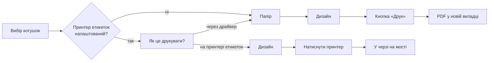

# Наліпки на котушки

Котушка з наліпкою — це котушка, яку впізнаєш через усю кімнату і яку телефон сканує назад у BamDude. Макети тут — це **дані, а не код**: наліпка є списком коробок із координатами в міліметрах, малюється в браузері, лежить у базі, а сервер віддає її або як PDF, або як однобітний растр для термоголовки.

Редактор живе в **Налаштування → Філамент → Маркування**. Окремої сторінки й пункту меню свідомо немає: наліпки належать тому філаменту, який ними маркують.

---

## :material-cursor-default-click: Друк партії

Виберіть котушки в менеджері філаменту й натисніть **Друк наліпок**. Діалог питає три речі, по черзі.



**Як це друкувати?** — питається тільки тоді, коли [підтримка принтерів етикеток](#a-printer-on-your-desk) увімкнена **і** принтер прийнято. Коли вибирати нема з чого, питання не ставиться взагалі.

**Папір** — по одній наліпці на сторінку або розкладкою на аркуші. Тільки на драйверному шляху: настільний принтер їсть рулон, там немає сторінки, яку можна замостити.

**Дизайн** — усі дизайни, намальовані для цього способу друку, з описом і розміром. Натискаєте **Друк** — PDF відкривається в новій вкладці, де ви самі вирішуєте: друкувати чи зберегти.

!!! tip "Дизайн, що не влазить, показується неактивним, а не ховається"
    Виберіть Avery 5160 — і дизайн 40 × 30 мм перестає бути доступним, із обома розмірами в поясненні. Наліпка друкується у своєму розмірі або ніяк: стиснути її означає зіпсувати ширину смуг, за якими читає сканер, і збій буде тихим — наліпка виглядає нормально й просто не сканується.

На боці принтера етикеток немає ані кнопки **Друк**, ані PDF. Вибираєте дизайн і натискаєте принтер — це і **є** друк. Принтер, у якому заряджена стрічка менша за дизайн, каже про це у своєму ж рядку: у двох принтерів на двох столах може бути різна стрічка.

---

## :material-pencil-ruler: Малювання наліпки

**Налаштування → Філамент → Маркування** тримає список дизайнів ліворуч і відкриває обраний у редакторі.

Картинка посередині — це **не малюнок вашої наліпки, це ваша наліпка**. Її віддає той самий рендерер, що робить файл на друк, заповнений прикладовими даними, — тож ви дивитесь саме на те, що вийде.

Кожен дизайн має:

| Поле | Що робить |
|---|---|
| **Назва** | Показується в діалозі друку і в списку редактора. |
| **Опис** | Рядок про те, для чого ця наліпка; показується під назвою скрізь, де дизайн пропонується. |
| **Розмір** | Ширина й висота в міліметрах. Це наліпка, а не зона друку. |
| **Тип принтера** | `Через драйвер` або `Принтер етикеток` — див. [нижче](#two-kinds-of-label). |

Коробки прилипають одна до одної та до країв і центру самої наліпки, червона лінія показує, за що зачепилось. `Ctrl`/`Cmd` + `Z` скасовує, і нічого не записується, поки не натиснете **Зберегти**.

### Чотири види коробок

| Елемент | Примітки |
|---|---|
| **Текст** | Розмір у мм, жирний, курсив, вирівнювання по горизонталі й вертикалі, і правило **вміщення**: `shrink` зменшує розмір, поки не влізе, `clip` обрізає. |
| **QR** | Зазвичай `{deeplink}` — сканування відкриває рядок цієї котушки в BamDude на телефоні. |
| **Штрихкод** | EAN-13, Code 128, Code 39, EAN-8, UPC-A або ITF. EAN-13 бере рівно дванадцять цифр; про решту вам скажуть, а не надрукують те, що не читається. |
| **Зразок кольору** | Блок кольору котушки — прямокутник, коло або скруглений прямокутник. На багатоколірній котушці — смуга на кожен колір. |

!!! warning "`shrink` перевертає ієрархію на реальних даних"
    Дизайни, що йдуть із BamDude, використовують `clip`, а не `shrink`. Зменшення робить довгу назву бренду дрібнішою за короткий рядок матеріалу під нею — і читається це так, ніби важливе не те. Таке видно оком на рендері й невидиме тесту.

### Плейсхолдери

Текст і вміст штрихкоду пишуться плейсхолдерами у фігурних дужках — тим самим словником, яким користується налаштування назви котушки на сторінці Інвентарю. Редактор показує кожен відомий ключ із прикладом; ось найуживаніші:

`{id}` · `{brand}` · `{material}` · `{subtype}` · `{color_name}` · `{color_hex}` · `{remaining_g}` · `{remaining_pct}` · `{note}` · `{deeplink}` · `{ean}`

!!! note "Невідомий плейсхолдер виживає дослівно"
    Напишіть `{lot}`, коли такого ключа немає, — і наліпка надрукує символи `{lot}`. Це навмисно: друкарську помилку видно в прев'ю, а не як порожнє місце.

### Тестовий друк

**Тестовий друк** кладе дизайн на реальну стрічку через настільний принтер, із тими самими прикладовими даними, що показує прев'ю. Він перевіряється проти зарядженої касети так само, як справжній друк, — тож тест не може пройти там, де друк відмовить.

---

## :material-file-document-multiple: Аркуші наліпок

**Аркуш** — це папір: розмір сторінки, скільки комірок упоперек і вниз, поля й проміжки. Він каже, якого розміру комірка, і **нічого про те, що в ній буде** — друк бере аркуш плюс дизайн, який у комірку влазить. Саме цей поділ дозволяє друкувати будь-яку наліпку на будь-якому папері.

**Налаштування → Філамент → Маркування → Аркуші наліпок** тримає їх. Два макети Avery йдуть із BamDude; їх можна поправити або намалювати свої — на A4, A5 чи US Letter.

**Прев'ю сторінки** розкладає наявний дизайн по всіх комірках, тож і *чи влазить сітка в папір*, і *чи влазить наліпка в комірку* мають відповідь до того, як щось потрапить на клейку основу. Сітку, що виходить за межі сторінки, не дадуть зберегти, і вона позначається в списку — геометрія може перестати влазити без жодного редагування, якщо змінити папір під нею.

---

## :material-printer-outline: Два типи наліпок { #two-kinds-of-label }

Кожен дизайн заявляє, куди він іде.

| | Через драйвер | Принтер етикеток |
|---|---|---|
| Вихід | PDF, який друкує ваш комп'ютер | Однобітний растр, що йде на пристрій |
| Колір | Так — це цілком може бути струменевий чи лазерний | Ні |
| Зразок кольору | Пропонується | Не пропонується |
| Аркуші | Так | Ні — це рулон |

Поділ існує тому, що колір не переживає однобітну голову. Наліпка, побудована навколо залитого кольором блоку, не деградує на термопринтері акуратно — вона приїжджає **без свого предмета**. Тому зразок кольору просто не пропонується на дизайні, позначеному для принтера етикеток, а не приймається й відкидається при друці.

Дизайни, які вже є у вашій базі, усі позначені `Через драйвер`, бо саме це кожен із них і робив.

---

## :material-printer-eye: Принтер на вашому столі { #a-printer-on-your-desk }

BamDude малює наліпки на сервері, а сервер у контейнері не дістане до USB-принтера на чиємусь комп'ютері. Тож він і не пробує: малює наліпку, кладе її в чергу, а застосунок **BamDude Bridge**, що працює на тому комп'ютері, приходить і забирає.

**Налаштування → Філамент → Принтери етикеток** тримає перемикач і список.

1. **Увімкніть** *Друк наліпок на принтерах, підключених до комп'ютера*. Поки цього не зробите, у списку нічого не буде.
2. **Запустіть BamDude Bridge** на комп'ютері, куди підключений принтер, і ввімкніть у ньому підтримку етикеток. Він відрекомендується й з'явиться в розділі **Очікує підтвердження**.
3. **Звірте ідентифікатор** із тим, що міст показує у своєму вікні, і ввімкніть його. Доти ця машина не може взяти жодної роботи.
4. **Видайте мосту API-ключ** із правом **Друк етикеток**.

У кожному рядку видно, чи відповідає міст, чи відповідає **принтер**, коли його бачили востаннє і скільки наліпок для нього в черзі. Штрихкод касети навчає BamDude розміру зарядженої стрічки — доки цього не сталося, розмірному гейту нема про що судити, і він не судить.

---

## :material-shield-key: Дозволи

| Дозвіл | Що покриває |
|---|---|
| `label_templates:read` | Перегляд дизайнів, аркушів і списку плейсхолдерів |
| `label_templates:write` | Створення, редагування, копіювання й видалення |
| `label_devices:read` | Перегляд настільних принтерів етикеток |
| `label_devices:manage` | Прийняття й налаштування |
| `label_devices:poll` | Те, чим користується сам міст — право API-ключа **Друк етикеток** |

---

## :material-api: API

```http
POST /api/v1/inventory/labels
POST /api/v1/spoolman/labels
```

```json
{
  "spools": [{ "id": 12, "display_name": "Polymaker PLA Basic Red" }],
  "template_id": 4,
  "sheet_id": 2,
  "monochrome": false
}
```

Повертає потік PDF. До 500 наліпок за запит, у тому порядку, в якому надіслані ID.

| Поле | Значення |
|---|---|
| `template_id` | Дизайн із каталогу. |
| `sheet_id` | Папір, на якому його розкласти. Сам по собі — без `template_id` — будує дизайн під комірку. |
| `template` | Одне з шести імен, які цей ендпоінт приймав завжди; резолвиться у дизайни, що йдуть із BamDude. Не можна поєднувати з `sheet_id`: два з тих імен **самі є аркушами**, тож це була б відповідь на «який папір» двічі. |
| `monochrome` | Прибирає зразок кольору. Рядок з hex усе одно несе колір. |
| `display_name` | Необов'язково, на кожну котушку. Якщо не передати — сервер складе ту саму назву, яку показує сторінка Інвентарю: наліпка, надрукована по API-ключу, має читатись як надрукована з браузера. |

Дизайни, що йдуть із BamDude, можна перемалювати, і правка доходить і до цих викликів: `{"template": "box_40x30"}` надрукує коробкову наліпку такою, як **ви** її намалювали. Видалення рядка повертає вшитий варіант.
