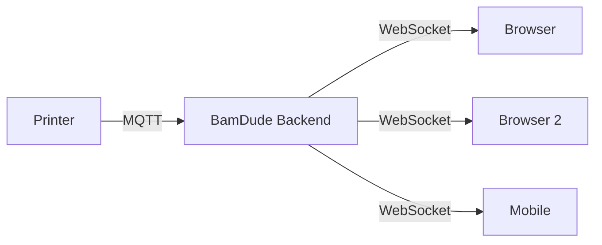

# Real-time Monitoring

BamDude provides live monitoring of all your connected Bambu Lab printers through WebSocket-based real-time updates.

---

## :material-resize: Resizable Printer Cards

Adjust the size of printer cards to fit your screen:

| Size | Description |
|:----:|-------------|
| **S** | Compact view, more cards per row |
| **M** | Default balanced view |
| **L** | More detail, fewer cards per row |
| **XL** | Maximum detail, single column |

Use the **+** and **-** buttons in the toolbar to adjust. Size preference is saved automatically.

---

## :material-chart-bar: Status Summary Bar

The status bar at the top provides an at-a-glance overview of your fleet:

- :material-circle:{ style="color: #4caf50" } **X available** -- Idle printers ready for a job
- :material-circle:{ style="color: #4caf50" } **X printing** -- Printers currently running (pulsing dot)
- :material-circle:{ style="color: #9e9e9e" } **X offline** -- Disconnected printers
- :material-circle:{ style="color: #f44336" } **X problem** -- Printers with active HMS errors

When printers are active, the bar shows which printer will finish soonest with a progress indicator and time remaining.

---

## :material-monitor-dashboard: Printer Status

Each printer card displays real-time information:

### Temperature Readouts

| Sensor | Description |
|--------|-------------|
| :material-printer-3d-nozzle: **Nozzle** | Current hotend temperature |
| :material-radiator: **Bed** | Heated bed temperature |
| :material-home-thermometer: **Chamber** | Enclosure temperature (if available) |

### Print Progress

When a print is active:

- **Progress bar** -- Visual completion percentage
- **Current layer** -- Layer X of Y
- **Time remaining** -- Estimated time to completion
- **Filament used** -- Grams consumed so far

### Fan Status

Real-time fan speed monitoring:

| Fan | Description |
|-----|-------------|
| :material-fan: **Part Cooling** | Cools the printed layers |
| :material-weather-windy: **Auxiliary** | Controls airflow in chamber |
| :material-air-filter: **Chamber** | Exhausts hot air from enclosure |

### Door / lid sensor (X1 Series only)

X1 / X1 Carbon / X1E expose a door-open MQTT signal (printer status bit 23). When the printer reports the door open mid-print the card flags it; on other models BamDude doesn't fake the indicator — A1, P1, P2 and H2 series don't ship the sensor.

### Group printers by location

Above the grid, group printers by **location** (the free-form string set on each printer card). Useful when the farm spans rooms / floors — collapse the room you're not watching.

### Per-permission live state

WebSocket subscriptions are filtered server-side by the connected user's permissions. A Viewer connection sees the same live temperatures + state as an Operator, but doesn't receive macro-execution acks, dispatch progress for jobs they didn't queue, or any `printers:control`-gated signals.

---

## :material-alert-decagram: HMS Error Monitoring

The Health Management System monitors printer health in real-time.

| Status | Meaning |
|:------:|---------|
| :material-check-circle:{ style="color: #4caf50" } **OK** | No issues detected |
| :material-alert:{ style="color: #ff9800" } **Warning** | Minor issues |
| :material-alert-circle:{ style="color: #ff5722" } **Error** | Serious errors |
| :material-close-circle:{ style="color: #f44336" } **Fatal** | Immediate attention needed |

Click the HMS indicator to see error descriptions, codes, and recommended actions.

A **Clear Errors** button sends a `clean_print_error` command to dismiss stale errors without power-cycling.

---

## :material-web: WebSocket Architecture

- **Auto-reconnect** on disconnect (3 s back-off)
- **Delta updates** — only changed data is sent
- **Multi-tab** support
- **< 1 second** typical latency
- **Visibility-sync recovery** — when a backgrounded tab returns to focus, BamDude pings the WS + invalidates React-Query so stale data refreshes immediately. A "Reconnecting…" toast only appears after a >2 s outage to suppress flicker on quick blips.

## :material-key-variant: Camera-stream tokens

Live MJPEG, snapshots, archive thumbnails, and the cover image all come back as ``/`<video>` GETs that can't carry an `Authorization` header. BamDude issues a short-lived (60 minute) query-param token from `POST /printers/camera/stream-token`; the frontend threads it through every camera URL automatically. Tokens are scoped to the logged-in user — login / logout invalidates the cache, and the `useStreamTokenSync` hook walks the DOM to retrofit any `` source rendered before a token landed. See [Camera Streaming](camera.md) for the gory details.

---

## :material-bug: MQTT Debug Logging

Built-in debugging for printer communication:

1. Click the settings icon on a printer card
2. Click **Start MQTT Debug**
3. View incoming/outgoing MQTT messages with JSON payloads
4. Filter by type, search content, and auto-refresh

---

## :material-lightbulb: Tips

!!! tip "Print Farm View"
    Use Small card size for monitoring many printers at once on a large screen or dedicated tablet.

!!! tip "Early Error Detection"
    Enable HMS error notifications to catch problems before they ruin a print.

> Originally based on [Bambuddy](https://github.com/maziggy/bambuddy) documentation.
