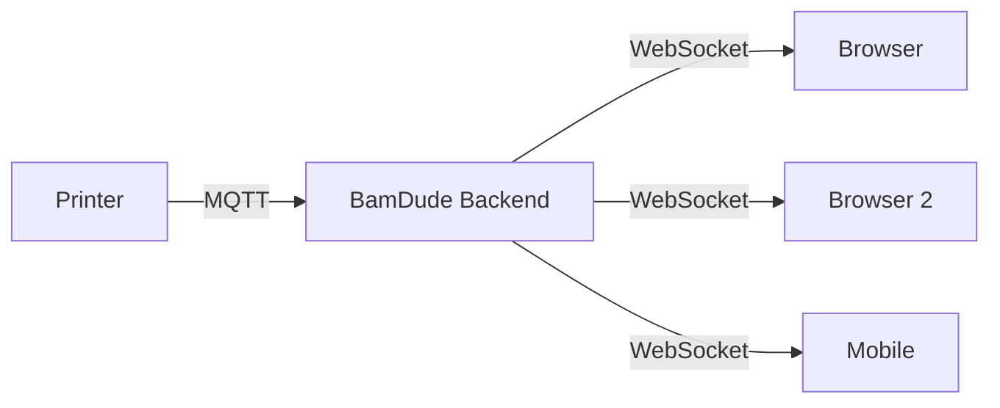

# Real-time Monitoring

BamDude provides live monitoring of all your connected Bambu Lab printers through WebSocket-based real-time updates.

---

## :material-resize: Resizable Printer Cards

Adjust the size of printer cards to fit your screen:

| Size | Description |
|:----:|-------------|
| **S** | Compact view, more cards per row |
| **M** | Default balanced view |
| **L** | More detail, fewer cards per row |
| **XL** | Maximum detail, single column |

Use the **+** and **-** buttons in the toolbar to adjust. Size preference is saved automatically.

---

## :material-chart-bar: Status Summary Bar

The status bar at the top provides an at-a-glance overview of your fleet:

- :material-circle:{ style="color: #4caf50" } **X available** -- Idle printers ready for a job
- :material-circle:{ style="color: #4caf50" } **X printing** -- Printers currently running (pulsing dot)
- :material-circle:{ style="color: #9e9e9e" } **X offline** -- Disconnected printers
- :material-circle:{ style="color: #f44336" } **X problem** -- Printers with active HMS errors

When printers are active, the bar shows which printer will finish soonest with a progress indicator and time remaining.

---

## :material-monitor-dashboard: Printer Status

Each printer card displays real-time information:

### Temperature Readouts

| Sensor | Description |
|--------|-------------|
| :material-printer-3d-nozzle: **Nozzle** | Current hotend temperature |
| :material-radiator: **Bed** | Heated bed temperature |
| :material-home-thermometer: **Chamber** | Enclosure temperature (if available) |

### Print Progress

When a print is active:

- **Progress bar** -- Visual completion percentage
- **Current layer** -- Layer X of Y
- **Time remaining** -- Estimated time to completion
- **Filament used** -- Grams consumed so far

### Connection Status

| Indicator | Status |
|:---------:|--------|
| :material-circle:{ style="color: #4caf50" } | Connected and communicating |
| :material-circle:{ style="color: #ff9800" } | Connecting / reconnecting |
| :material-circle:{ style="color: #f44336" } | Disconnected or error |

### Nozzle details (H2 series)

H2 printers expose extended nozzle metadata on hover:

| Printer | Card | What you see |
|---------|------|--------------|
| **H2D / H2D Pro** | L/R nozzle hover card | Side-by-side detail for both nozzles — diameter, type, flow, wear, max temp, serial. The active nozzle is highlighted **Active** vs **Idle**. |
| **H2S** | Single-nozzle hover card | Wear, serial, max temp on hover over the nozzle temp tile. |
| **H2C** | Nozzle rack card | 6-position tool-changer dock — every slot with diameter + filament colour. Empty slots are placeholder tiles; hover for full detail. |

!!! info "L/R semantics — Active vs mounted"
    The L/R card flags the nozzle the printer is **currently using**, not just which one is mounted. On dual-extruder jobs that swap mid-print the highlighting follows the live state.

### Fan Status

Real-time fan speeds in the Controls section:

| Fan | Icon | Colour | Description |
|-----|:----:|:------:|-------------|
| **Part Cooling** | :material-fan: | Cyan | Cools the printed layers |
| **Auxiliary** | :material-weather-windy: | Blue | Chamber airflow |
| **Chamber** | :material-air-filter: | Green | Exhausts hot air from the enclosure |

Active fans show their current speed %; inactive ones grey out at 0 %. A **print speed badge** (:material-gauge:) sits in the same row showing the live speed-preset percentage.

### Door / lid sensor (X1 Series only)

X1 / X1 Carbon / X1E expose a door-open MQTT signal (printer status bit 23). When the printer reports the door open mid-print the card flags it; on other models BamDude doesn't fake the indicator — A1, P1, P2 and H2 series don't ship the sensor.

### Compact-mode status pip

In **Small** card size each card shows a single coloured pip instead of the full status bar:

| Colour | Meaning |
|:------:|---------|
| :material-circle:{ style="color: #4caf50" } Green | Connected, no issues |
| :material-circle:{ style="color: #f44336" } Red | Offline, or HMS fatal / serious (severity ≤ 2) |
| :material-circle:{ style="color: #ff9800" } Amber | HMS warning (info / common severity) |

Hover the pip for the count of active HMS errors.

### Status sorting + collapsible groups

When you sort by **Status**, **Model**, or **Location**, cards render inside collapsible section headers — click a header to fold / unfold the group. **Name** sort stays as a flat grid.

- Group collapsed-state persists per browser in `localStorage`.
- In selection mode each header gets a **Select All** button — selects every card in that group.
- Status groups order by priority: **Error → Printing → Paused → Finished → Idle → Offline**. The sort-direction toggle inverts the order.

Sorting **by status** in flat mode follows the same priority — printers needing attention float to the top:

1. HMS errors
2. Printing
3. Idle
4. Offline

### Group printers by location

Above the grid, group printers by **location** (the free-form string set on each printer card). Useful when the farm spans rooms / floors — collapse the room you're not watching.

### Search + filters

The toolbar on the Printers page has:

- **Search** — substring match on name, model, location, and serial number. Live (no Enter required).
- **Status filter** — `All`, `Online`, `Printing`, `Idle`, `Offline`, `Error`.
- **Location filter** — dropdown of all distinct location strings currently in use.

Filters AND together; an empty result-set shows a "No printers match" placeholder instead of an empty grid.

### Per-permission live state

WebSocket subscriptions are filtered server-side by the connected user's permissions. A Viewer connection sees the same live temperatures + state as an Operator, but doesn't receive macro-execution acks, dispatch progress for jobs they didn't queue, or any `printers:control`-gated signals.

---

## :material-alert-decagram: HMS Error Monitoring

The Health Management System monitors printer health in real-time.

| Status | Meaning |
|:------:|---------|
| :material-check-circle:{ style="color: #4caf50" } **OK** | No issues detected |
| :material-alert:{ style="color: #ff9800" } **Warning** | Minor issues |
| :material-alert-circle:{ style="color: #ff5722" } **Error** | Serious errors |
| :material-close-circle:{ style="color: #f44336" } **Fatal** | Immediate attention needed |

Click the HMS indicator to see error descriptions, codes, and recommended actions.

A **Clear Errors** button sends a `clean_print_error` command to dismiss stale errors without power-cycling.

---

## :material-web: WebSocket Architecture

```mermaid
graph LR
    A[Printer] -->|MQTT| B[BamDude Backend]
    B -->|WebSocket| C[Browser]
    B -->|WebSocket| D[Browser 2]
    B -->|WebSocket| E[Mobile]
```

- **Auto-reconnect** on disconnect (3 s back-off)
- **Delta updates** — only changed data is sent
- **Multi-tab** support
- **< 1 second** typical latency
- **Visibility-sync recovery** — when a backgrounded tab returns to focus, BamDude pings the WS + invalidates React-Query so stale data refreshes immediately. A "Reconnecting…" toast only appears after a >2 s outage to suppress flicker on quick blips.

## :material-key-variant: Camera-stream tokens

Live MJPEG, snapshots, archive thumbnails, and the cover image all come back as ``/`<video>` GETs that can't carry an `Authorization` header. BamDude issues a short-lived (60 minute) query-param token from `POST /printers/camera/stream-token`; the frontend threads it through every camera URL automatically. Tokens are scoped to the logged-in user — login / logout invalidates the cache, and the `useStreamTokenSync` hook walks the DOM to retrofit any `` source rendered before a token landed. See [Camera Streaming](camera.md) for the gory details.

---

## :material-access-point: WiFi signal strength

Each card surfaces a WiFi-strength glyph from the printer's MQTT report:

| Glyph | Signal |
|:-----:|--------|
| :material-wifi-strength-4: | Excellent |
| :material-wifi-strength-3: | Good |
| :material-wifi-strength-2: | Fair |
| :material-wifi-strength-1: | Weak |

Weak signal is the most common cause of "printer drops mid-print" + intermittent FTP errors — fix the WiFi before chasing dispatch bugs.

---

## :material-timer-sand: Total print hours

The card carries a cumulative print-time counter (sourced from `print_archives` rows for that printer). Useful for:

- maintenance scheduling — pair with the [Maintenance](maintenance.md) feature to flag rod / nozzle / belt jobs at the right hour mark
- spotting heavily-used machines when you're load-balancing the farm
- post-mortem on early-failure printers — high accumulated hours often correlates with bed wear / belt slack

---

## :material-folder: Printer file browser

Browse and manage files on the printer's internal SD card right from the printer card.

### Opening it

Click the **folder icon** (:material-folder:) on any printer card → modal opens against the live FTPS session.

### Navigation

- **Quick-access buttons** for `Root`, `Cache`, `Models`, `Timelapse` — jumps to the typical Bambu paths.
- **Breadcrumb path** with back-step navigation.
- Click folders to descend.

### Selection + bulk operations

| Action | Single | Multiple |
|--------|--------|----------|
| **Download** | Direct download | ZIP archive of selection |
| **Save to Library** | Lands the 3MF as a Library file (BamDude-only) — folder picker prompts for destination | Same, batched |
| **Delete** | Confirm + delete | Bulk-delete with confirm |

The **Save to Library** path also auto-promotes bare `.3mf` filenames to `.gcode.3mf` when the bytes are sliced (probes the zip for `Metadata/plate_*.gcode`), so the Library's tag/parser pipeline classifies it correctly.

### Sort + filter

| Control | Options |
|---------|---------|
| **Sort** | Name (A–Z / Z–A), Size, Date |
| **Filter** | Live substring match against the filename |

### Storage info

When the printer reports it, used / free space appears in the modal header.

---

## :material-image-multiple: Printer images

Customise the card by uploading a printer image:

1. Click the settings cog on a card.
2. Upload an image (~300×200 works best).
3. The image replaces the default card hero.

Per-printer; backed up with the rest of the install.

---

## :material-bell-ring: Status-change notifications

Wire any of these state changes to your notification channels:

| Event | Fires when |
|-------|------------|
| **Printer offline** | MQTT connection drops past the offline threshold |
| **Printer error** | New HMS entry, severity ≥ Error |
| **Print complete** | Job finishes (printed-percentage = 100) |
| **Print failed** | Job ends with a non-success status |
| **First layer complete** | First layer finishes (early-fail catch) |

Configure under **Settings → Notifications** — see [Notifications](notifications.md).

---

## :material-bug: MQTT Debug Logging

Built-in debugging for printer communication:

1. Click the settings icon on a printer card
2. Click **Start MQTT Debug**
3. View incoming/outgoing MQTT messages with JSON payloads
4. Filter by type, search content, and auto-refresh

---

## :material-lightbulb: Tips

!!! tip "Print Farm View"
    Use Small card size for monitoring many printers at once on a large screen or dedicated tablet.

!!! tip "Early Error Detection"
    Enable HMS error notifications to catch problems before they ruin a print.

> Originally based on [Bambuddy](https://github.com/maziggy/bambuddy) documentation.
