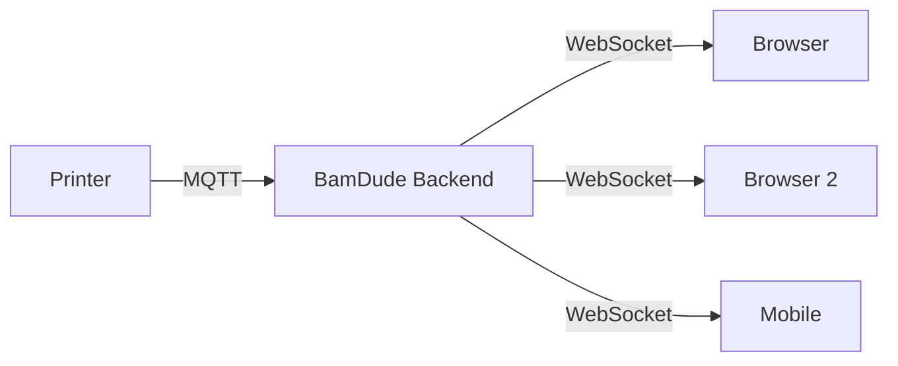

# Real-time Monitoring

BamDude provides live monitoring of all your connected Bambu Lab printers through WebSocket-based real-time updates.

---

## :material-resize: Resizable Printer Cards

Adjust the size of printer cards to fit your screen:

| Size | Description |
|:----:|-------------|
| **S** | Compact view, more cards per row |
| **M** | Default balanced view |
| **L** | More detail, fewer cards per row |
| **XL** | Maximum detail, single column |

Use the **+** and **-** buttons in the toolbar to adjust. Size preference is saved automatically.

**The S card still answers "which one finishes first".** Under its progress bar it carries a single line of metrics while a print is running — **remaining time, ETA and layers** — in the same formatting the M card uses, so the two read alike. Each value is left out individually if the printer doesn't report it, and the row keeps its height when nothing is printing, so cards don't jump as prints start and finish.

---

## :material-chart-bar: Status Summary Bar

The status bar at the top provides an at-a-glance overview of your fleet:

- :material-circle:{ style="color: #4caf50" } **X available** -- Idle printers ready for a job
- :material-circle:{ style="color: #4caf50" } **X printing** -- Printers currently running (pulsing dot)
- :material-circle:{ style="color: #9e9e9e" } **X offline** -- Disconnected printers
- :material-circle:{ style="color: #f44336" } **X problem** -- Printers with active HMS errors

When printers are active, the bar shows which printer will finish soonest with a progress indicator and time remaining.

---

## :material-monitor-dashboard: Printer Status

Each printer card displays real-time information:

### Temperature Readouts

| Sensor | Description |
|--------|-------------|
| :material-printer-3d-nozzle: **Nozzle** | Current hotend temperature |
| :material-radiator: **Bed** | Heated bed temperature |
| :material-home-thermometer: **Chamber** | Enclosure temperature (if available) |

!!! tip "Heater History"
    Each temperature row carries a small chart icon — click it to open the **Heater History** window. It plots nozzle, bed, and chamber traces (plus a second-nozzle trace on dual-nozzle **H2D**) against their target overlays, with current / average / min / max readouts and **6h / 24h / 48h / 7d** ranges. Samples are recorded once a minute and retained for **30 days** (configurable via the `printer_sensor_history_retention_days` setting), then auto-pruned. Readable by Operators and Viewers.

### Print Progress

When a print is active:

- **Progress bar** -- Visual completion percentage
- **Current layer** -- Layer X of Y
- **Time remaining** -- Estimated time to completion
- **Filament used** -- Grams consumed so far

### Connection Status

| Indicator | Status |
|:---------:|--------|
| :material-circle:{ style="color: #4caf50" } | Connected and communicating |
| :material-circle:{ style="color: #ff9800" } | Connecting / reconnecting |
| :material-circle:{ style="color: #f44336" } | Disconnected or error |

### Nozzle details (H2 series)

H2 printers expose extended nozzle metadata on hover:

| Printer | Card | What you see |
|---------|------|--------------|
| **H2D / H2D Pro** | L/R nozzle hover card | Side-by-side detail for both nozzles — diameter, type, flow, wear, max temp, serial. The active nozzle is highlighted **Active** vs **Idle**. |
| **H2S** | Single-nozzle hover card | Wear, serial, max temp on hover over the nozzle temp tile. |
| **H2C** | Nozzle rack card | 6-position tool-changer dock — every slot with diameter + filament colour. Empty slots are placeholder tiles; hover for full detail. |

!!! info "L/R semantics — Active vs mounted"
    The L/R card flags the nozzle the printer is **currently using**, not just which one is mounted. On dual-extruder jobs that swap mid-print the highlighting follows the live state.

### Fan Status

Real-time fan speeds in the Controls section:

| Fan | Icon | Colour | Description |
|-----|:----:|:------:|-------------|
| **Part Cooling** | :material-fan: | Cyan | Cools the printed layers |
| **Auxiliary** | :material-weather-windy: | Blue | Chamber airflow |
| **Chamber** | :material-air-filter: | Green | Exhausts hot air from the enclosure |

Active fans show their current speed %; inactive ones grey out at 0 %. A **print speed badge** (:material-gauge:) sits in the same row showing the live speed-preset percentage.

#### The second auxiliary fan (P2S / X2D)

The **P2S** (add-on kit) and **X2D** (fitted from the factory) carry a second auxiliary fan that is never reported as a plain speed field — it exists only inside the printer's air-duct data. It appears as its own badge, with its speed, and **you can set that speed from the badge**.

Nothing appears on a machine that doesn't have it: the printer lists only the parts actually fitted, so the badge is driven by the hardware, not by a list of model names.

!!! info "The fans are named the way your printer names them"
    The same fan position is not the same fan on every model — on the P2S the
    second auxiliary fan is the **left** one, on the X2D the **right** one, and on
    the X2D it is even called something different in cooling and in heating mode.
    BamDude reads those names from the Bambu Studio printer definitions it already
    ships, so a P2S says **Right Auxiliary Fan** rather than just "Auxiliary".

A fan that the current air-duct mode holds off — the P2S's left fan in heating mode, for instance — is **shown but not offered as a control**, because the printer accepts the command and ignores it.

### Door / lid sensor (X1 Series only)

X1 / X1 Carbon / X1E expose a door-open MQTT signal (printer status bit 23). When the printer reports the door open mid-print the card flags it; on other models BamDude doesn't fake the indicator — A1, P1, P2 and H2 series don't ship the sensor.

### AI failure-detection badge

When [Obico AI failure detection](obico.md) is enabled, each printer card carries an **AI** badge alongside the other health badges, so you can watch how detection is tracking an ongoing print without leaving the Printers page.

| Badge | Meaning |
|---|---|
| Grey | Detection is configured, but nothing is being watched right now |
| Green | The monitored print is classified **safe** |
| Amber | **Warning** — the score is rising |
| Red | **Failure** — the configured action has fired |

The tooltip carries the current score; clicking it goes to the full status and history. **A printer detection is not watching shows no badge at all**, rather than one implying it is covered.

The badge is readable by anyone who can see printers — it does **not** require permission to read settings, and it deliberately carries no configuration: the ML server address and the detection history stay where they were.

### Compact-mode status pip

In **Small** card size each card shows a single coloured pip instead of the full status bar:

| Colour | Meaning |
|:------:|---------|
| :material-circle:{ style="color: #4caf50" } Green | Connected, no issues |
| :material-circle:{ style="color: #f44336" } Red | Offline, or HMS fatal / serious (severity ≤ 2) |
| :material-circle:{ style="color: #ff9800" } Amber | HMS warning (info / common severity) **OR** print is currently paused |

Hover the pip for the count of active HMS errors, or the resolved pause cause when paused.

### Pause chip + live elapsed counter

When a printer is in the **PAUSE** state, an inline pill appears next to the printer name in the card header:

```
Bambu X1C  [⏸ Filament runout · 14m]
```

- **Reason text** (`pause_reason_label`) — resolved server-side from the printer's HMS error stack via `hms_errors.classify_pause_reason()`. Maps door-open codes / filament-runout codes / AI-detection codes / presence-check / file-pause-command into one normalised label. Internal pause triggers (e.g. plate-detect auto-pause) plant a hint that wins over HMS, since Bambu firmware always reports HMS `0300_8001` ("paused by user") for any pause command BamDude sends.
- **Live elapsed counter** — ticks every second client-side against `pause_started_at` (epoch float in the snapshot, stamped server-side on the RUNNING→PAUSE edge). Format: `Ns` under 1 min → `Nm` under 1 hour → `Nh Mm` afterwards.
- **F5-resilient** — the timestamp lives on the snapshot, not just in-memory, so the counter resumes from the correct value after page refresh.

The chip renders in both compact (xs) and expanded (sm) view modes.

### Pause / resume toast notifications

When a printer transitions RUNNING→PAUSE or PAUSE→RUNNING, the WebSocket connection delivers an immediate browser toast independent of the regular printer-status polling:

| Edge | Toast type | Body |
|---|---|---|
| **RUNNING→PAUSE** | warning (yellow) | `{printer} paused: {reason}` — e.g. `Bambu X1C paused: Filament ran out. Please load new filament.` |
| **PAUSE→RUNNING** | success (green) | `{printer} resumed (paused for Nm Ms)` |

These are local UI notifications — separate from the configured notification providers (Telegram / email / Discord / etc.) which fire the matching `print_paused` / `print_resumed` events. See [Notifications](notifications.md) for provider-side configuration.

### Status sorting + collapsible groups

When you sort by **Status**, **Model**, or **Location**, cards render inside collapsible section headers — click a header to fold / unfold the group. **Name** sort stays as a flat grid.

- Group collapsed-state persists per browser in `localStorage`.
- In selection mode each header gets a **Select All** button — selects every card in that group.
- Status groups order by priority: **Error → Printing → Paused → Finished → Idle → Offline**. The sort-direction toggle inverts the order.

Sorting **by status** in flat mode follows the same priority — printers needing attention float to the top:

1. HMS errors
2. Printing
3. Idle
4. Offline

### Sort by ETA

A fifth sort option — **ETA** — orders printers by how soon they finish: printing with a known time-remaining first (soonest on top, so you can stage the next job's filament), then prints that have just started without an ETA yet, then idle, then offline. It reads the same cached `remaining_time` the per-card ETA label already shows — no extra backend round-trip.

### Group printers by location

Above the grid, group printers by **location** — the place picked on each printer card. Useful when the farm spans rooms / floors — collapse the room you're not watching.

A location is a real entity, not text typed per printer: you pick it from a list, and printers, sensors and auto-queue targets all point at the same row. That is what stops `Shelf 2` and `shelf 2` from becoming two different places — which used to send auto-queue items to a location no printer had, silently and permanently.

The list itself lives under **Settings → Printing → Locations** — its own card, under the permission that governs locations rather than the one for permanently deleting a printer. (It used to be nested inside the archived-printers card, which meant anyone who could manage places but not delete printers never saw it at all.)

!!! note "Location lists are in alphabetical order"
    Everywhere: the filters on the printers, queues and maintenance pages, the
    picker in the printer and auto-queue dialogs, and the list under Settings.

    They used to be ordered by character code, which is not the alphabet — Ґ, Є, І
    and Ї sort before А, and anything typed in lower case fell to the very end, so
    a farm with places called *Ірпінь* and *Ангар* saw what looked like no order at
    all. Numbered halls also count properly now: **Цех 2** comes before **Цех 10**,
    not after it.

### Search + filters

The toolbar on the Printers page has:

- **Search** — substring match on name, model, location, and serial number. Live (no Enter required).
- **Status filter** — `All`, `Online`, `Printing`, `Idle`, `Offline`, `Error`.
- **Location filter** — dropdown of the locations currently in use.

Filters AND together; an empty result-set shows a "No printers match" placeholder instead of an empty grid.

### Per-permission live state

WebSocket subscriptions are filtered server-side by the connected user's permissions. A Viewer connection sees the same live temperatures + state as an Operator, but doesn't receive macro-execution acks, dispatch progress for jobs they didn't queue, or any `printers:control`-gated signals.

---

## :material-alert-decagram: HMS Error Monitoring

The Health Management System monitors printer health in real-time.

| Status | Meaning |
|:------:|---------|
| :material-check-circle:{ style="color: #4caf50" } **OK** | No issues detected |
| :material-alert:{ style="color: #ff9800" } **Warning** | Minor issues |
| :material-alert-circle:{ style="color: #ff5722" } **Error** | Serious errors |
| :material-close-circle:{ style="color: #f44336" } **Fatal** | Immediate attention needed |

Click the HMS indicator to see error descriptions, codes, and recommended actions.

A **Clear Errors** button sends a `clean_print_error` command to dismiss stale errors without power-cycling.

### Remediation actions

The HMS error dialog surfaces the same remediation buttons the printer's own screen offers — **Resume**, **Stop**, **Ignore & Resume**, "**Filament extruded, continue**", **Stop Drying**, **Turn off Fire Alarm**, and so on. Which buttons appear is driven per model and per error code from Bambu's catalog, so a filament-runout fault offers different choices than a chamber-temperature fault.

Click a button and BamDude sends the matching MQTT command, then waits for the printer to actually act on it before confirming — a QoS-1 publish is acked by the broker even when the firmware silently drops a malformed HMS command, so BamDude samples the printer state after ~2.5 s and reports a failure if nothing changed. Needs `printers:control`; a Viewer sees the errors but not the buttons.

!!! note "Refreshing the catalog"
    The action catalog ships bundled as JSON (`data/hms_actions.json`). When Bambu adds codes in a firmware update, regenerate it with `python scripts/update_hms_actions.py`.

---

## :material-web: WebSocket Architecture


```mermaid
graph LR
    A[Printer] -->|MQTT| B[BamDude Backend]
    B -->|WebSocket| C[Browser]
    B -->|WebSocket| D[Browser 2]
    B -->|WebSocket| E[Mobile]
```

- **Auto-reconnect** on disconnect (3 s back-off)
- **Delta updates** — only changed data is sent
- **Multi-tab** support
- **< 1 second** typical latency
- **Visibility-sync recovery** — when a backgrounded tab returns to focus, BamDude pings the WS + invalidates React-Query so stale data refreshes immediately. A "Reconnecting…" toast only appears after a >2 s outage to suppress flicker on quick blips.

## :material-key-variant: Camera-stream tokens

Live MJPEG, snapshots, archive thumbnails, and the cover image all come back as ``/`<video>` GETs that can't carry an `Authorization` header. BamDude issues a short-lived (60 minute) query-param token from `POST /printers/camera/stream-token`; the frontend threads it through every camera URL automatically. Tokens are scoped to the logged-in user — login / logout invalidates the cache, and the `useStreamTokenSync` hook walks the DOM to retrofit any `` source rendered before a token landed. See [Camera Streaming](camera.md) for the gory details.

---

## :material-access-point: WiFi signal strength

Each card surfaces a WiFi-strength glyph from the printer's MQTT report:

| Glyph | Signal |
|:-----:|--------|
| :material-wifi-strength-4: | Excellent |
| :material-wifi-strength-3: | Good |
| :material-wifi-strength-2: | Fair |
| :material-wifi-strength-1: | Weak |

Weak signal is the most common cause of "printer drops mid-print" + intermittent FTP errors — fix the WiFi before chasing dispatch bugs.

---

## :material-timer-sand: Total print hours

The card carries a cumulative print-time counter (sourced from `print_archives` rows for that printer). Useful for:

- maintenance scheduling — pair with the [Maintenance](maintenance.md) feature to flag rod / nozzle / belt jobs at the right hour mark
- spotting heavily-used machines when you're load-balancing the farm
- post-mortem on early-failure printers — high accumulated hours often correlates with bed wear / belt slack

---

## :material-folder: Printer file browser

Browse and manage the files on a printer's storage right from the printer card — on the SD card, and on the built-in storage of printers that have it.

### Opening it

Click the **folder icon** (:material-folder:) on any printer card → modal opens against the live FTPS session.

### Which storage you are looking at

**X2D, P2S and the H2 family (H2C, H2D, H2D Pro, H2S)** keep files in built-in storage as well as on a card. On those printers the modal shows a **SD card / Internal storage** switch, and everything below works on both: listing, download, plate previews, Save to Library and delete.

- A printer with **no card inserted** opens on its internal storage rather than on an empty list.
- Printers with only a card — every A1 and P1 — show **no switch** and behave exactly as before.

!!! note "Why the switch is not on every printer"
    Internal storage is reached over a second, printer-native file channel that only the newer generation speaks. BamDude decides by what the printer reports about itself, not by model name.

### Navigation

- **Quick-access buttons** for `Root`, `Cache`, `Models`, `Timelapse` — jumps to the typical Bambu paths.
- **Breadcrumb path** with back-step navigation.
- Click folders to descend.

**On internal storage the shape is different**, and the modal reflects it:

| | SD card | Internal storage |
|---|---|---|
| Structure | folder tree | flat list |
| Path bar / breadcrumbs | yes | not shown — there is nothing to descend into |
| Quick-access | folder shortcuts | **Models** and **Timelapses** — two separate catalogues, not two directories |
| **Clear SD card** | yes | not offered |
| Free space | when the printer reports it | not shown — the printer does not report it on this channel |

The **Timelapses** button appears only on printers that actually keep recordings internally. That is a separate capability from keeping models: a machine can do one and not the other.

### Selection + bulk operations

| Action | Single | Multiple |
|--------|--------|----------|
| **Download** | Direct download | ZIP archive of selection |
| **Save to Library** | Lands the 3MF as a Library file (BamDude-only) — folder picker prompts for destination | Same, batched |
| **Delete** | Confirm + delete | Bulk-delete with confirm |

The **Save to Library** path also auto-promotes bare `.3mf` filenames to `.gcode.3mf` when the bytes are sliced (probes the zip for `Metadata/plate_*.gcode`), so the Library's tag/parser pipeline classifies it correctly.

### Sort + filter

| Control | Options |
|---------|---------|
| **Sort** | Name (A–Z / Z–A), Size, Date |
| **Filter** | Live substring match against the filename |

### Storage info

When the printer reports it, used / free space appears in the modal header. It is reported for the SD card only — see the table above.

---

## :material-image-multiple: Printer images

Customise the card by uploading a printer image:

1. Click the settings cog on a card.
2. Upload an image (~300×200 works best).
3. The image replaces the default card hero.

Per-printer; backed up with the rest of the install.

---

## :material-bell-ring: Status-change notifications

Wire any of these state changes to your notification channels:

| Event | Fires when |
|-------|------------|
| **Printer offline** | MQTT connection drops past the offline threshold |
| **Printer error** | New HMS entry, severity ≥ Error |
| **Print complete** | Job finishes (printed-percentage = 100) |
| **Print failed** | Job ends with a non-success status |
| **First layer complete** | First layer finishes (early-fail catch) |

Configure under **Settings → Notifications** — see [Notifications](notifications.md).

---

## :material-bug: MQTT Debug Logging

Built-in debugging for printer communication:

1. Click the settings icon on a printer card
2. Click **Start MQTT Debug**
3. View incoming/outgoing MQTT messages with JSON payloads
4. Filter by type, search content, and auto-refresh

---

## :material-lightbulb: Tips

!!! tip "Print Farm View"
    Use Small card size for monitoring many printers at once on a large screen or dedicated tablet.

!!! tip "Early Error Detection"
    Enable HMS error notifications to catch problems before they ruin a print.

> Originally based on [Bambuddy](https://github.com/maziggy/bambuddy) documentation.
