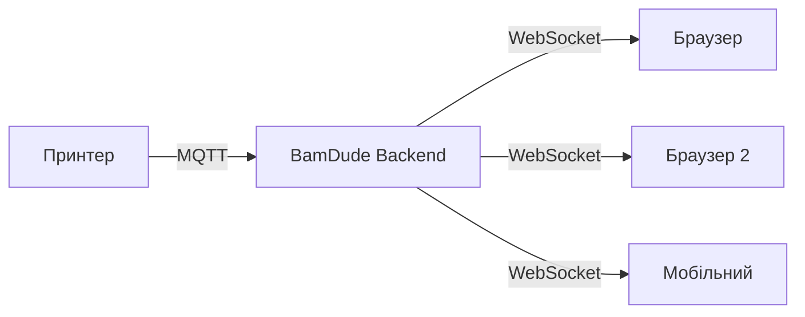

# Моніторинг у реальному часі

BamDude забезпечує живий моніторинг усіх підключених принтерів Bambu Lab через оновлення в реальному часі на базі WebSocket.

---

## :material-resize: Масштабовані картки принтерів

Налаштуйте розмір карток принтерів під ваш екран:

| Розмір | Опис |
|:------:|------|
| **S** | Компактний вигляд, більше карток у рядку |
| **M** | Збалансований вигляд за замовчуванням |
| **L** | Більше деталей, менше карток у рядку |
| **XL** | Максимум деталей, один стовпець |

Використовуйте кнопки **+** і **-** на панелі інструментів для зміни розміру. Вибір зберігається автоматично.

---

## :material-chart-bar: Панель статусу

Панель статусу вгорі дає швидкий огляд вашого парку:

- :material-circle:{ style="color: #4caf50" } **X доступно** -- Вільні принтери, готові до роботи
- :material-circle:{ style="color: #4caf50" } **X друкують** -- Принтери, що зараз працюють (пульсуюча точка)
- :material-circle:{ style="color: #9e9e9e" } **X офлайн** -- Відключені принтери
- :material-circle:{ style="color: #f44336" } **X проблема** -- Принтери з активними помилками HMS

Коли принтери активні, панель показує, який принтер завершить першим, з індикатором прогресу та часом, що залишився.

---

## :material-monitor-dashboard: Статус принтера

Кожна картка принтера відображає інформацію в реальному часі:

### Показники температури

| Сенсор | Опис |
|--------|------|
| :material-printer-3d-nozzle: **Сопло** | Поточна температура хотенда |
| :material-radiator: **Стіл** | Температура нагрівального столу |
| :material-home-thermometer: **Камера** | Температура корпусу (якщо доступно) |

### Прогрес друку

Під час активного друку:

- **Індикатор прогресу** -- Візуальний відсоток завершення
- **Поточний шар** -- Шар X з Y
- **Час, що залишився** -- Розрахунковий час до завершення
- **Використано філаменту** -- Витрачено грамів

### Статус вентиляторів

Моніторинг швидкості вентиляторів у реальному часі:

| Вентилятор | Опис |
|-----------|------|
| :material-fan: **Охолодження деталі** | Охолоджує надруковані шари |
| :material-weather-windy: **Допоміжний** | Керує потоком повітря в камері |
| :material-air-filter: **Камерний** | Відводить гаряче повітря з корпусу |

### Сенсор дверцят / кришки (тільки X1 Series)

X1 / X1 Carbon / X1E експортують MQTT-сигнал відкритих дверцят (біт 23 у статусі принтера). Коли під час друку принтер репортить, що дверцята відкриті — картка це підсвічує. На інших моделях BamDude не вдає, що сенсор є — у A1, P1, P2 та H2 його просто немає.

### Групування принтерів за локацією

Над сіткою — групування за **локацією** (вільний рядок, що задається на картці принтера). Зручно, коли ферма розкидана по кімнатах / поверхах — згорни ту, на яку зараз не дивишся.

### Live-стан з фільтрацією за дозволами

WebSocket-підписки фільтруються на бекенді за дозволами підключеного користувача. Viewer-сесія бачить ті самі live-температури + стан, що й Operator, але не отримує ack-ів виконання макросів, прогресу диспатчу для чужих завдань, чи будь-яких сигналів, прикритих `printers:control`.

---

## :material-alert-decagram: Моніторинг помилок HMS

Система управління здоров'ям (HMS) стежить за станом принтера в реальному часі.

| Статус | Значення |
|:------:|----------|
| :material-check-circle:{ style="color: #4caf50" } **OK** | Проблем не виявлено |
| :material-alert:{ style="color: #ff9800" } **Попередження** | Незначні проблеми |
| :material-alert-circle:{ style="color: #ff5722" } **Помилка** | Серйозні помилки |
| :material-close-circle:{ style="color: #f44336" } **Критично** | Потрібна негайна увага |

Натисніть на індикатор HMS, щоб побачити описи помилок, коди та рекомендовані дії.

Кнопка **Очистити помилки** надсилає команду `clean_print_error` для скидання застарілих помилок без перезавантаження.

---

## :material-web: Архітектура WebSocket

- **Автоперепідключення** при розриві з'єднання (back-off 3 с)
- **Дельта-оновлення** — надсилаються лише змінені дані
- **Мульти-вкладки** — підтримка кількох вкладок
- **< 1 секунди** — типова затримка
- **Visibility-sync recovery** — коли вкладка повертається з фону, BamDude пінгує WS + інвалідує React-Query, тож stale-дані одразу оновлюються. Тост "Reconnecting…" з'являється тільки після >2 с offline — це гасить мерехтіння на коротких блипах.

## :material-key-variant: Токени для камери

Live MJPEG, знімки, мініатюри архіву та cover-картинки приходять у вигляді ``/`<video>` GET-ів, які не можуть нести `Authorization`-хедер. BamDude видає короткоживучий (60 хв) query-param токен з `POST /printers/camera/stream-token`; фронтенд автоматично прошиває його в кожен camera-URL. Токени scoped на залогіненого юзера — login / logout інвалідує кеш, а хук `useStreamTokenSync` обходить DOM і ретрофітить будь-які `` source, рендеренi до того, як токен прийшов. Деталі — на [Сторінці камери](camera.uk.md).

---

## :material-bug: Налагоджувальне логування MQTT

Вбудоване налагодження для комунікації з принтером:

1. Натисніть іконку налаштувань на картці принтера
2. Натисніть **Запустити налагодження MQTT**
3. Перегляньте вхідні/вихідні MQTT-повідомлення з JSON-даними
4. Фільтруйте за типом, шукайте в змісті та автооновлюйте

---

## :material-lightbulb: Поради

!!! tip "Вигляд для ферми"
    Використовуйте маленький розмір карток для моніторингу багатьох принтерів одночасно на великому екрані або планшеті.

!!! tip "Раннє виявлення помилок"
    Увімкніть сповіщення про помилки HMS, щоб виявляти проблеми до того, як вони зіпсують друк.

> Базується на документації [Bambuddy](https://github.com/maziggy/bambuddy).
