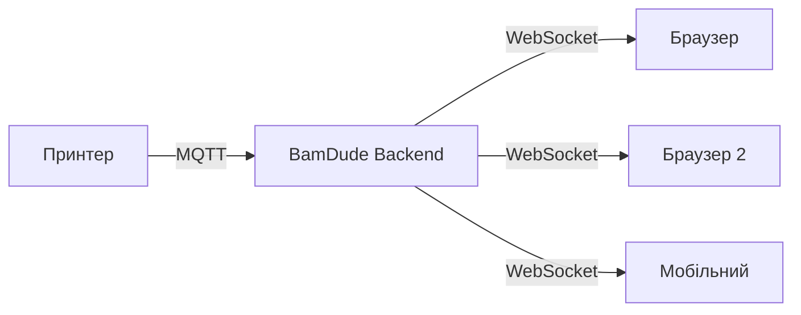

# Моніторинг у реальному часі

BamDude забезпечує живий моніторинг усіх підключених принтерів Bambu Lab через оновлення в реальному часі на базі WebSocket.

---

## :material-resize: Масштабовані картки принтерів

Налаштуйте розмір карток принтерів під ваш екран:

| Розмір | Опис |
|:------:|------|
| **S** | Компактний вигляд, більше карток у рядку |
| **M** | Збалансований вигляд за замовчуванням |
| **L** | Більше деталей, менше карток у рядку |
| **XL** | Максимум деталей, один стовпець |

Використовуйте кнопки **+** і **-** на панелі інструментів для зміни розміру. Вибір зберігається автоматично.

---

## :material-chart-bar: Панель статусу

Панель статусу вгорі дає швидкий огляд вашого парку:

- :material-circle:{ style="color: #4caf50" } **X доступно** -- Вільні принтери, готові до роботи
- :material-circle:{ style="color: #4caf50" } **X друкують** -- Принтери, що зараз працюють (пульсуюча точка)
- :material-circle:{ style="color: #9e9e9e" } **X офлайн** -- Відключені принтери
- :material-circle:{ style="color: #f44336" } **X проблема** -- Принтери з активними помилками HMS

Коли принтери активні, панель показує, який принтер завершить першим, з індикатором прогресу та часом, що залишився.

---

## :material-monitor-dashboard: Статус принтера

Кожна картка принтера відображає інформацію в реальному часі:

### Показники температури

| Сенсор | Опис |
|--------|------|
| :material-printer-3d-nozzle: **Сопло** | Поточна температура хотенда |
| :material-radiator: **Стіл** | Температура нагрівального столу |
| :material-home-thermometer: **Камера** | Температура корпусу (якщо доступно) |

### Прогрес друку

Під час активного друку:

- **Індикатор прогресу** -- Візуальний відсоток завершення
- **Поточний шар** -- Шар X з Y
- **Час, що залишився** -- Розрахунковий час до завершення
- **Використано філаменту** -- Витрачено грамів

### Статус підключення

| Індикатор | Значення |
|:---------:|----------|
| :material-circle:{ style="color: #4caf50" } | Зʼєднано і живе |
| :material-circle:{ style="color: #ff9800" } | Підключається / переконнект |
| :material-circle:{ style="color: #f44336" } | Disconnect або помилка |

### Деталі сопла (H2 series)

H2-принтери відкривають розширені дані сопла на ховері:

| Принтер | Картка | Що бачимо |
|---------|--------|-----------|
| **H2D / H2D Pro** | Hover L/R | Поряд деталі обох сопел — діаметр, тип, flow, знос, max-temp, серійник. Активне сопло підсвічується **Active** vs **Idle**. |
| **H2S** | Single-nozzle hover | Знос, серійник, max-temp на ховері над температурною плиткою сопла. |
| **H2C** | Nozzle rack | 6-позиційний док tool-changer-а — кожен слот з діаметром і кольором філаменту. Порожні — placeholder; на ховері — повна інформація. |

!!! info "L/R семантика — Active vs mounted"
    L/R-картка показує сопло, яким принтер **зараз працює**, а не яке змонтоване. У dual-extruder-друках, де swap відбувається посеред друку, підсвітка йде за live-станом.

### Статус вентиляторів

Live-швидкість вентиляторів у секції Controls:

| Вентилятор | Іконка | Колір | Опис |
|------------|:------:|:-----:|------|
| **Part Cooling** | :material-fan: | Cyan | Охолоджує надруковані шари |
| **Auxiliary** | :material-weather-windy: | Blue | Циркуляція в камері |
| **Chamber** | :material-air-filter: | Green | Відводить гаряче повітря з корпусу |

Активні вентилятори показують поточну швидкість %; неактивні сіріють на 0%. У тому ж рядку є **бейдж швидкості друку** (:material-gauge:) з поточним speed-пресетом.

### Сенсор дверцят / кришки (тільки X1 Series)

X1 / X1 Carbon / X1E експортують MQTT-сигнал відкритих дверцят (біт 23 у статусі принтера). Коли під час друку принтер репортить, що дверцята відкриті — картка це підсвічує. На інших моделях BamDude не вдає, що сенсор є — у A1, P1, P2 та H2 його просто немає.

### Status pip у компактному режимі

У **Small** розмірі картки замість повного бару — один кольоровий pip:

| Колір | Значення |
|:-----:|----------|
| :material-circle:{ style="color: #4caf50" } Зелений | Підключено, без проблем |
| :material-circle:{ style="color: #f44336" } Червоний | Offline, або HMS fatal / serious (severity ≤ 2) |
| :material-circle:{ style="color: #ff9800" } Бурштин | HMS warning (info / common severity) **АБО** друк зараз на паузі |

На ховері — кількість активних HMS-помилок, або resolved причина паузи коли друк на паузі.

### Чіп паузи + live-лічильник тривалості

Коли принтер у стані **PAUSE**, поряд з ім'ям у заголовку картки з'являється inline-pill:

```
Bambu X1C  [⏸ Філамент скінчився · 14m]
```

- **Текст причини** (`pause_reason_label`) — резолвиться сервер-сайд з HMS-стеку принтера через `hms_errors.classify_pause_reason()`. Мапить door-open / filament-runout / AI-detection / presence-check / file-pause-command коди в одну нормалізовану категорію. Внутрішні pause-тригери (наприклад plate-detect auto-pause) плантують hint що бьє HMS, бо Bambu firmware завжди репортить HMS `0300_8001` ("paused by user") на будь-яку pause-команду від BamDude.
- **Live-лічильник тривалості** — тікає щосекунди клієнтсайд проти `pause_started_at` (epoch float у snapshot'і, штампується сервер-сайд на RUNNING→PAUSE edge). Формат: `Ns` до 1 хв → `Nm` до 1 год → `Nh Mm` далі.
- **F5-resilient** — timestamp живе у snapshot'і, не в in-memory state, тож лічильник продовжується з правильної точки після refresh сторінки.

Chip рендериться і в compact (xs), і в expanded (sm) режимах.

### Toast-сповіщення pause / resume

Коли принтер переходить RUNNING→PAUSE або PAUSE→RUNNING, WebSocket доставляє миттєвий browser-toast незалежно від regular polling:

| Edge | Тип toast | Body |
|---|---|---|
| **RUNNING→PAUSE** | warning (жовтий) | `{printer} на паузі: {reason}` — наприклад `Bambu X1C на паузі: Філамент скінчився. Завантаж новий.` |
| **PAUSE→RUNNING** | success (зелений) | `{printer} відновлено (стояв на паузі Nm Ms)` |

Це локальні UI-сповіщення — окремі від налаштованих notification-провайдерів (Telegram / email / Discord / etc.) що шлють відповідні `print_paused` / `print_resumed` події. Дивись [Сповіщення](notifications.uk.md) для конфігурації провайдер-сайду.

### Сортування по статусу + згортувані групи

Якщо сортуєш по **Status**, **Model** або **Location**, картки рендеряться всередині згортуваних секцій — клік на хедер згортає / розгортає групу. Сортування по **Name** залишається плоскою сіткою.

- Стан згорнутості зберігається per-browser у `localStorage`.
- У режимі вибору на хедері кожної секції є **Select All** — виділяє всі картки в групі.
- Status-групи йдуть за пріоритетом: **Error → Printing → Paused → Finished → Idle → Offline**. Перемикач напрямку сортування інвертує порядок.

Сортування **по статусу** в плоскому режимі йде з тим же пріоритетом — все, що потребує уваги, спливає вгору:

1. HMS errors
2. Printing
3. Idle
4. Offline

### Групування принтерів за локацією

Над сіткою — групування за **локацією** (вільний рядок, що задається на картці принтера). Зручно, коли ферма розкидана по кімнатах / поверхах — згорни ту, на яку зараз не дивишся.

### Пошук + фільтри

У тулбарі сторінки Printers:

- **Пошук** — substring-match по імені, моделі, локації, серійнику. Live (Enter не треба).
- **Фільтр статусу** — `All`, `Online`, `Printing`, `Idle`, `Offline`, `Error`.
- **Фільтр локації** — випадайка з усіх unique-локацій, що зараз використовуються.

Фільтри AND-яться; порожній результат показує "Принтерів не знайдено" замість пустої сітки.

### Live-стан з фільтрацією за дозволами

WebSocket-підписки фільтруються на бекенді за дозволами підключеного користувача. Viewer-сесія бачить ті самі live-температури + стан, що й Operator, але не отримує ack-ів виконання макросів, прогресу диспатчу для чужих завдань, чи будь-яких сигналів, прикритих `printers:control`.

---

## :material-alert-decagram: Моніторинг помилок HMS

Система управління здоров'ям (HMS) стежить за станом принтера в реальному часі.

| Статус | Значення |
|:------:|----------|
| :material-check-circle:{ style="color: #4caf50" } **OK** | Проблем не виявлено |
| :material-alert:{ style="color: #ff9800" } **Попередження** | Незначні проблеми |
| :material-alert-circle:{ style="color: #ff5722" } **Помилка** | Серйозні помилки |
| :material-close-circle:{ style="color: #f44336" } **Критично** | Потрібна негайна увага |

Натисніть на індикатор HMS, щоб побачити описи помилок, коди та рекомендовані дії.

Кнопка **Очистити помилки** надсилає команду `clean_print_error` для скидання застарілих помилок без перезавантаження.

---

## :material-web: Архітектура WebSocket


```mermaid
graph LR
    A[Принтер] -->|MQTT| B[BamDude Backend]
    B -->|WebSocket| C[Браузер]
    B -->|WebSocket| D[Браузер 2]
    B -->|WebSocket| E[Мобільний]
```

- **Автоперепідключення** при розриві з'єднання (back-off 3 с)
- **Дельта-оновлення** — надсилаються лише змінені дані
- **Мульти-вкладки** — підтримка кількох вкладок
- **< 1 секунди** — типова затримка
- **Visibility-sync recovery** — коли вкладка повертається з фону, BamDude пінгує WS + інвалідує React-Query, тож stale-дані одразу оновлюються. Тост "Reconnecting…" з'являється тільки після >2 с offline — це гасить мерехтіння на коротких блипах.

## :material-key-variant: Токени для камери

Live MJPEG, знімки, мініатюри архіву та cover-картинки приходять у вигляді ``/`<video>` GET-ів, які не можуть нести `Authorization`-хедер. BamDude видає короткоживучий (60 хв) query-param токен з `POST /printers/camera/stream-token`; фронтенд автоматично прошиває його в кожен camera-URL. Токени scoped на залогіненого юзера — login / logout інвалідує кеш, а хук `useStreamTokenSync` обходить DOM і ретрофітить будь-які `` source, рендеренi до того, як токен прийшов. Деталі — на [Сторінці камери](camera.uk.md).

---

## :material-access-point: Сила сигналу WiFi

На картці є гліф WiFi-сили з MQTT-репорта принтера:

| Гліф | Сигнал |
|:----:|--------|
| :material-wifi-strength-4: | Excellent |
| :material-wifi-strength-3: | Good |
| :material-wifi-strength-2: | Fair |
| :material-wifi-strength-1: | Weak |

Слабкий сигнал — найчастіша причина "принтер відвалюється посеред друку" + інтермітентних FTP-помилок. Спочатку чини WiFi, потім полюй на баги диспатчу.

---

## :material-timer-sand: Загальні години друку

На картці — кумулятивний лічильник годин друку (рахується з рядків `print_archives` для цього принтера). Корисно:

- планування обслуговування — у парі з [Maintenance](maintenance.uk.md) ставити роботи (стрижні / сопло / ремінь) на правильні години
- ловити перегружені машини при балансуванні ферми
- post-mortem рано-полеглих принтерів — багато годин зазвичай корелюють з зносом столу / провисом ременя

---

## :material-folder: Файловий браузер принтера

Переглядай і керуй файлами на внутрішньому SD принтера прямо з картки.

### Як відкрити

Іконка папки (:material-folder:) на картці → модалка проти live-FTPS-сесії.

### Навігація

- **Quick-access кнопки** для `Root`, `Cache`, `Models`, `Timelapse` — стрибок на типові шляхи Bambu.
- **Хлібні крихти** з back-step.
- Клік по папці — заглиблення.

### Виділення + bulk-операції

| Дія | Один файл | Кілька |
|-----|-----------|--------|
| **Завантажити** | Прямо | ZIP-архів виділення |
| **Save to Library** | Кладе 3MF як Library-файл (тільки BamDude) — picker папки призначення | Те саме, batch |
| **Видалити** | Confirm + delete | Bulk-delete з confirm |

Шлях **Save to Library** автоматично промоутить голий `.3mf` у `.gcode.3mf`, якщо байти зрізані (probe zip на `Metadata/plate_*.gcode`), щоб теги/парсер Library класифікували коректно.

### Сортування + фільтр

| Контрол | Опції |
|---------|-------|
| **Sort** | Name (A–Z / Z–A), Size, Date |
| **Filter** | Live substring-match по імені |

### Storage info

Якщо принтер репортить — у хедері модалки видно used / free.

---

## :material-image-multiple: Зображення принтерів

Кастомізуй картку завантаженням свого фото:

1. Cog на картці.
2. Залий зображення (~300×200 — оптимум).
3. Воно замінить дефолтний hero.

Per-printer; зберігається у бекапах.

---

## :material-bell-ring: Сповіщення про зміну статусу

Підключай будь-яку зі змін стану до notification-каналів:

| Подія | Спрацьовує коли |
|-------|------------------|
| **Printer offline** | MQTT-зʼєднання відвалилось довше за поріг offline |
| **Printer error** | Новий HMS-запис, severity ≥ Error |
| **Print complete** | Прінт завершився (printed-percentage = 100) |
| **Print failed** | Прінт скінчився non-success-статусом |
| **First layer complete** | Перший шар закінчений (early-fail catch) |

Налаштовується у **Settings → Notifications** — див. [Notifications](notifications.uk.md).

---

## :material-bug: Налагоджувальне логування MQTT

Вбудоване налагодження для комунікації з принтером:

1. Натисніть іконку налаштувань на картці принтера
2. Натисніть **Запустити налагодження MQTT**
3. Перегляньте вхідні/вихідні MQTT-повідомлення з JSON-даними
4. Фільтруйте за типом, шукайте в змісті та автооновлюйте

---

## :material-lightbulb: Поради

!!! tip "Вигляд для ферми"
    Використовуйте маленький розмір карток для моніторингу багатьох принтерів одночасно на великому екрані або планшеті.

!!! tip "Раннє виявлення помилок"
    Увімкніть сповіщення про помилки HMS, щоб виявляти проблеми до того, як вони зіпсують друк.

> Базується на документації [Bambuddy](https://github.com/maziggy/bambuddy).
