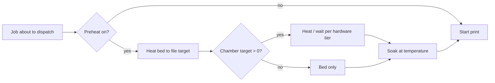

# Preheat & heat-soak

Engineering filaments — ABS, ASA, PA (nylon), PC — want a warm bed **and** a warm chamber before the first layer goes down, or they lift, warp, and crack. Bambu firmware has a wait-for-chamber G-code (`M191`), but it **silently ignores it** on the models BamDude drives, so there's nothing on the printer side that holds the job back until the enclosure is up to temperature.

BamDude's preheat stage fills that gap. When enabled, the scheduler heats the bed (and, on chamber-equipped printers, the chamber) and **holds at temperature before the queued print starts** — running the soak while the printer is otherwise idle, in the window between the file uploading over FTP and the print actually starting.

It's **off by default** — existing installs see no change until you turn it on.

---

## :material-cog-outline: How it works

The stage runs on the idle printer, right before dispatch, and resolves everything per print:

1. **Should it run?** The per-print override decides — `off` skips, `on` forces it on, `inherit` (the default) follows the global **Preheat & Heat Soak** toggle.
2. **Bed target** is read from the print file's own metadata. If the file carries no bed temperature, preheat is skipped for that print.
3. **Chamber target** is worked out from the loaded AMS filament types: BamDude looks up each loaded slot's type in the [chamber-target map](#per-filament-chamber-target-map) and takes the **hottest** across all loaded slots — so a mixed PA + PLA job soaks for the PA. A target of `0` skips the chamber phase but still runs the bed phase and the soak.
4. **Hardware tier** decides how the chamber phase behaves (see below).
5. **Wait, then soak.** BamDude waits for the bed (and, where possible, the chamber) to reach target — up to the max-wait cap — then holds at temperature for the soak duration. Both loops abort cleanly if you cancel the queued print mid-soak.

---

## :material-thermometer: Per-filament chamber-target map

The chamber target for a print is derived from the loaded filament types. The built-in map ships these defaults (°C), fully editable under **Settings → Printing → Preheat & Heat Soak**:

| Filament | Chamber target |
|---|---|
| PLA | 0 °C |
| PETG | 0 °C |
| PETG-CF | 40 °C |
| ABS | 45 °C |
| ASA | 45 °C |
| PA | 50 °C |
| PC | 50 °C |
| PC-FR | 50 °C |
| PA-CF | 55 °C |
| TPU | 0 °C |
| PVA | 0 °C |
| **Other / unmapped** (`default`) | 0 °C |

- **`0` means "no chamber phase"** — commodity filaments (PLA, PETG, TPU, PVA) derive `0`, so a PLA-only print skips the chamber wait entirely and just does the bed + soak.
- **The highest target across loaded slots wins.** Load PA in slot 1 and PLA in slot 2 and the print soaks to PA's 50 °C — the engineering filament's requirement is binding.
- Each value is capped at 60 °C in the editor. Reset the whole map to the shipped defaults with one click.

!!! note "Where the defaults come from"
    These are the chamber-temperature recommendations Bambu Studio ships for the matching filament profile. They're a sensible starting point, not a hard rule — tune them for your enclosure, ambient temperature, and part geometry.

---

## :material-fan: Three hardware tiers

The chamber phase behaves differently depending on what the printer physically has. BamDude picks the right tier automatically from the model:

| Tier | Models | What happens |
|---|---|---|
| **Active chamber heater** | X1E, X2D, H2C, H2D, H2D Pro, H2S | Sends `M141` to drive the chamber heater to target, then waits for the chamber sensor to reach it (or the max-wait cap). |
| **Chamber sensor only** | X1, X1C, P2S | No active heater — the bed warms the chamber by radiation. BamDude waits for the chamber sensor to rise toward target, falling through on the max-wait timeout (radiant warm-up can take 15–30 minutes). |
| **No chamber sensor** | P1S, P1P, A1, A1 Mini | No chamber reading at all — BamDude heats the bed and holds on the **soak timer** alone. |

!!! tip "The bed phase runs on every model"
    Only the *chamber* phase is model-gated. The bed always preheats and the soak always runs, so even a sensorless P1S gets a properly heat-soaked bed before an ABS print — the enclosure warms passively while the timer counts down.

### Airduct flap

On models with a cooling/heating airduct flap — **P2S, X2D, H2C, H2D, H2D Pro, H2S** — BamDude flips the flap to match the target before energising the chamber: **heating mode** (closing the exhaust) when there's a chamber target, **cooling** otherwise. Bambu firmware won't switch the flap for you, and the default cooling position actively vents the chamber and fights the heater. The flip is idempotent — it's skipped when the flap is already where it needs to be.

---

## :material-tune: Settings

**Settings → Printing → Preheat & Heat Soak.**

| Setting | Default | Range | What it does |
|---|---|---|---|
| **Enable preheat & soak** | Off | — | Master toggle. When off, queued prints dispatch immediately. Each queue item can still override per print. |
| **Per-filament chamber target** | (bundled map above) | 0–60 °C per row | The editable filament → chamber-target map. |
| **Max wait (seconds)** | 900 (15 min) | 60–3600 | Cap on the warm-up phase before falling through to the soak — stops a slow radiant warm-up from stalling the queue forever. |
| **Soak (seconds)** | 300 (5 min) | 0–1800 | Hold time at temperature after the target is reached (or after max-wait elapses). `0` disables the soak. |

---

## :material-toggle-switch: Per-print override

The Print dialog's options carry a **Preheat** control so you can flip the decision for one print without touching the global setting:

| Option | Effect |
|---|---|
| **Inherit** (default) | Follow the global Settings → Printing toggle. |
| **On** | Force the stage on for this print even if the global toggle is off. |
| **Off** | Skip the stage for this print even if the global toggle is on. |

When it isn't set to **Off**, an optional **Chamber target override** field lets you type an explicit chamber temperature (°C) for this print. Leave it blank to use the filament-derived default; an explicit `0` means "bed and soak, but no chamber phase" even if the loaded filament would otherwise want one.

---

## :material-shield-key: Permissions

| Action | Permission |
|---|---|
| Configure the global preheat map + timings | `settings:update` (Administrators) |
| Set the per-print override on a job | `queue:create` / `printers:control` — whatever you'd already need to dispatch that print |

---

## :material-alert-circle-outline: Caveats

- **No bed temperature, no preheat.** The bed target comes from the print file's metadata. A file with no bed temperature (rare) skips the stage entirely.
- **Best-effort throughout.** A dropped printer, a refused `M141`, or a missing sensor reading logs and continues — the normal upload + start path always runs afterward. Preheat never blocks a print from starting; it only delays it.
- **The soak eats into throughput.** A 15-minute radiant warm-up plus a 5-minute soak is 20 minutes the printer isn't printing. That's the point for engineering filaments, but keep the max-wait sane on a busy farm.
- **External-spool prints derive no chamber target.** If a print runs off an external spool with no AMS filament data, the chamber phase short-circuits (target `0`) and only the bed + soak run — use the per-print chamber override if you need a chamber soak there.

---

## :material-link-variant: Related

- [Per-Printer Queues](print-queue.md) — where preheated jobs are dispatched from.
- [Staggered Start](staggered-start.md) — the companion throughput control that caps concurrent farm-wide heating.
- [AMS & Humidity](ams.md) — the loaded filament types that drive the chamber-target derivation.
- [Settings reference](../reference/settings.md) — the `preheat_*` setting keys.
