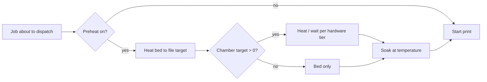

# Прогрів і heat-soak

Інженерні філаменти — ABS, ASA, PA (нейлон), PC — хочуть теплий стіл **і** теплу камеру ще до першого шару, інакше вони відриваються, викривлюються й тріскають. У firmware Bambu є G-code очікування камери (`M191`), але на моделях, якими керує BamDude, він **тихо ігнорується**, тож з боку принтера немає нічого, що притримало б завдання, поки enclosure не набере температуру.

Стадія прогріву BamDude закриває цю прогалину. Коли ввімкнено, планувальник нагріває стіл (а на принтерах з камерою — і камеру) та **тримає температуру перед стартом друку з черги** — виконуючи soak, поки принтер усе одно простоює, у вікні між завантаженням файлу по FTP і власне стартом друку.

За замовчуванням **вимкнено** — наявні інсталяції не бачать змін, доки ти не ввімкнеш.

---

## :material-cog-outline: Як це працює

Стадія виконується на простоюючому принтері, прямо перед dispatch'ем, і резолвить усе per-print:

1. **Чи запускати?** Вирішує per-print override — `off` пропускає, `on` форсує, `inherit` (за замовчуванням) слідує глобальному тоглеру **Preheat & Heat Soak**.
2. **Ціль столу** читається з метаданих самого файлу друку. Якщо файл не несе температуру столу — прогрів для цього друку пропускається.
3. **Ціль камери** обчислюється з типів завантажених філаментів AMS: BamDude шукає тип кожного завантаженого слота в [мапі цілей камери](#мапа-цілей-камери-на-філамент) і бере **найгарячішу** серед усіх завантажених слотів — тож змішане завдання PA + PLA soak-ається під PA. Ціль `0` пропускає фазу камери, але все одно виконує фазу столу й soak.
4. **Апаратний tier** визначає, як поводиться фаза камери (див. нижче).
5. **Чекай, потім soak.** BamDude чекає, поки стіл (і, де можливо, камера) досягнуть цілі — до ліміту max-wait — потім тримає температуру протягом тривалості soak. Обидва цикли чисто перериваються, якщо ти скасуєш друк з черги посеред soak'у.

---

## :material-thermometer: Мапа цілей камери на філамент

Ціль камери для друку виводиться з типів завантажених філаментів. Вбудована мапа несе такі дефолти (°C), повністю редаговані під **Settings → Printing → Preheat & Heat Soak**:

| Філамент | Ціль камери |
|---|---|
| PLA | 0 °C |
| PETG | 0 °C |
| PETG-CF | 40 °C |
| ABS | 45 °C |
| ASA | 45 °C |
| PA | 50 °C |
| PC | 50 °C |
| PC-FR | 50 °C |
| PA-CF | 55 °C |
| TPU | 0 °C |
| PVA | 0 °C |
| **Інше / не в мапі** (`default`) | 0 °C |

- **`0` означає «без фази камери»** — commodity-філаменти (PLA, PETG, TPU, PVA) виводять `0`, тож друк лише з PLA повністю пропускає очікування камери й робить тільки стіл + soak.
- **Найвища ціль серед завантажених слотів перемагає.** Заряди PA у слот 1 і PLA у слот 2 — і друк soak-ається під 50 °C PA: вимога інженерного філаменту є зв'язуючою.
- Кожне значення обмежене 60 °C у редакторі. Скинути всю мапу до дефолтів — одним кліком.

!!! note "Звідки дефолти"
    Це рекомендації температури камери, які Bambu Studio постачає для відповідного профілю філаменту. Це притомна стартова точка, а не жорстке правило — підлаштуй їх під свій enclosure, температуру довкілля й геометрію деталі.

---

## :material-fan: Три апаратні tier'и

Фаза камери поводиться по-різному залежно від того, що принтер фізично має. BamDude обирає правильний tier автоматично за моделлю:

| Tier | Моделі | Що відбувається |
|---|---|---|
| **Активний нагрівач камери** | X1E, X2D, H2C, H2D, H2D Pro, H2S | Шле `M141`, щоб догнати нагрівач камери до цілі, потім чекає, поки сенсор камери її досягне (або ліміт max-wait). |
| **Лише сенсор камери** | X1, X1C, P2S | Активного нагрівача немає — стіл гріє камеру радіацією. BamDude чекає, поки сенсор камери підніметься до цілі, падаючи на таймауті max-wait (радіантний прогрів може займати 15–30 хвилин). |
| **Без сенсора камери** | P1S, P1P, A1, A1 Mini | Показника камери немає взагалі — BamDude гріє стіл і тримає лише на **таймері soak**. |

!!! tip "Фаза столу виконується на кожній моделі"
    Модель-gated лише *фаза камери*. Стіл завжди прогрівається, і soak завжди виконується, тож навіть безсенсорний P1S отримує належно heat-soak'нутий стіл перед друком ABS — enclosure гріється пасивно, поки цокає таймер.

### Airduct-заслінка

На моделях із заслінкою cooling/heating airduct — **P2S, X2D, H2C, H2D, H2D Pro, H2S** — BamDude перемикає заслінку відповідно до цілі перед енергізацією камери: **режим heating** (закриваючи вихлоп), коли є ціль камери, **cooling** інакше. Firmware Bambu не перемкне заслінку за тебе, а дефолтна позиція cooling активно вентилює камеру й бореться з нагрівачем. Перемикання ідемпотентне — пропускається, коли заслінка вже там, де треба.

---

## :material-tune: Налаштування

**Settings → Printing → Preheat & Heat Soak.**

| Налаштування | Дефолт | Діапазон | Що робить |
|---|---|---|---|
| **Enable preheat & soak** | Off | — | Головний тоглер. Коли off, друки з черги диспатчаться одразу. Кожен елемент черги все одно може перевизначити per-print. |
| **Per-filament chamber target** | (мапа вище) | 0–60 °C на рядок | Редагована мапа філамент → ціль камери. |
| **Max wait (seconds)** | 900 (15 хв) | 60–3600 | Ліміт на фазу прогріву перед падінням у soak — не дає повільному радіантному прогріву стопорити чергу назавжди. |
| **Soak (seconds)** | 300 (5 хв) | 0–1800 | Час утримання температури після досягнення цілі (або після спливу max-wait). `0` вимикає soak. |

---

## :material-toggle-switch: Per-print override

Опції діалогу друку несуть контрол **Preheat**, тож можна змінити рішення для одного друку, не чіпаючи глобальне налаштування:

| Опція | Ефект |
|---|---|
| **Inherit** (за замовчуванням) | Слідувати глобальному тоглеру Settings → Printing. |
| **On** | Форсувати стадію для цього друку, навіть якщо глобальний тоглер off. |
| **Off** | Пропустити стадію для цього друку, навіть якщо глобальний тоглер on. |

Коли не виставлено **Off**, опційне поле **Chamber target override** дозволяє ввести явну температуру камери (°C) для цього друку. Лиши порожнім, щоб використати дефолт, виведений з філаменту; явний `0` означає «стіл і soak, але без фази камери», навіть якщо завантажений філамент інакше хотів би її.

---

## :material-shield-key: Дозволи

| Дія | Дозвіл |
|---|---|
| Конфігурувати глобальну мапу прогріву + таймінги | `settings:update` (Administrators) |
| Виставити per-print override на завдання | `queue:create` / `printers:control` — те, що тобі вже потрібне, щоб диспатчити цей друк |

---

## :material-alert-circle-outline: Застереження

- **Немає температури столу — немає прогріву.** Ціль столу береться з метаданих файлу друку. Файл без температури столу (рідкість) повністю пропускає стадію.
- **Best-effort наскрізь.** Відвалений принтер, відхилений `M141` чи відсутнє показання сенсора логуються й продовжують — нормальний шлях upload + start завжди виконується опісля. Прогрів ніколи не блокує старт друку; він лише затримує його.
- **Soak з'їдає throughput.** 15-хвилинний радіантний прогрів плюс 5-хвилинний soak — це 20 хвилин, які принтер не друкує. У цьому й сенс для інженерних філаментів, але тримай max-wait притомним на завантаженій фермі.
- **Друки з зовнішньої котушки не виводять ціль камери.** Якщо друк іде з зовнішньої котушки без AMS-даних про філамент, фаза камери короткозамикається (ціль `0`) і виконуються лише стіл + soak — застосуй per-print chamber override, якщо там потрібен soak камери.

---

## :material-link-variant: Пов'язане

- [Черги друку](print-queue.md) — звідки диспатчаться прогріті завдання.
- [Поетапний запуск](staggered-start.md) — супутній контрол throughput, що обмежує паралельне нагрівання по всій фермі.
- [AMS та вологість](ams.md) — типи завантажених філаментів, що керують виведенням цілі камери.
- [Reference налаштувань](../reference/settings.md) — ключі налаштувань `preheat_*`.
