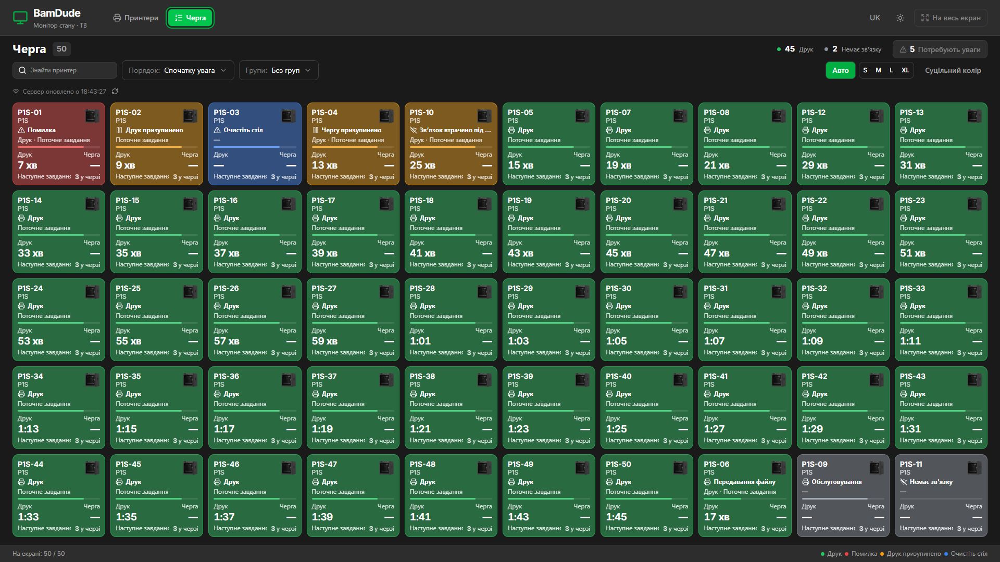

# Монітор стану

Монітор стану — окремий екран оператора: видно, який принтер потребує уваги зараз і який завершить друк наступним. **Принтери** та **Черга** використовують однакову розмітку плиток. Зі станом змінюються колір, іконка й напис, а розмір плитки залишається сталим.

!!! info "Наступний реліз"
    Монітор реалізовано в збірці для розробки; він входить до наступного релізу. Якщо у встановленій версії немає кнопки **Відкрити монітор**, звіртеся з [примітками до релізів BamDude](https://github.com/kainpl/bamdude/releases), перш ніж виконувати цей посібник.

## Відкрийте на другому дисплеї

1. На сторінці **Принтери** або **Черга** натисніть **Відкрити монітор**.
2. Перетягніть нове вікно на другий дисплей і натисніть **На весь екран**.
3. Продовжуйте роботу в початковому вікні. Монітор оновлюється незалежно.

Якщо браузер заблокував вікно, натисніть **Відкрити в новій вкладці**. Якщо повноекранний режим недоступний, розгорніть вікно. У браузері з активною сесією також можна відкрити `/monitor?view=printers` або `/monitor?view=queues` на своєму сервері BamDude.

Монітор лише показує інформацію. Натисніть плитку для деталей; авторизований користувач може перейти до відповідного принтера чи черги для роботи. **Показати всі** на робочій сторінці прибирає тимчасовий фільтр за принтером і повертає збережені фільтри. Деталі завдань підкоряються звичайним правам: приховане завдання залишається на своєму місці в черзі, але без назви.

## Оберіть подання

| Подання | Що допомагає побачити |
|---|---|
| **Принтери** | Стан принтера, прогрес поточного друку, час до завершення й температури. |
| **Черга** | Поточну роботу, наступне завдання, кількість у черзі, паузу чи причину очікування та прогноз звільнення принтера. |

**Призупинена черга може продовжувати друк.** Її пауза забороняє запуск наступного завдання, а не зупиняє поточний друк. Порожня черга також не означає, що принтер вільний. Подання черги показує ці факти окремо.

*Приклад ферми. Відкрийте зображення, щоб побачити його в повному розмірі.*

## Поставте наступне втручання першим

Типовий порядок **Спочатку увага** піднімає серйозні активні помилки, паузи, очищення столу та інші потрібні втручання. Далі йдуть поточні друки за часом до завершення: 5 хвилин, 7 хвилин, 14 хвилин. Вільні принтери, обслуговування й відключені пристрої йдуть після активної роботи.

| Порядок | Значення |
|---|---|
| **Спочатку увага** | Спочатку потрібна дія, далі друки, які завершаться найшвидше. |
| **ETA (друк)** | Завершення лише поточного друку. |
| **ETA (черга)** | Серверний прогноз усієї запланованої роботи на принтері. |
| **Назва** | Сталий алфавітний порядок. |

Групування за **Локацією** чи **Тегом** не залежить від порядку. Принтер із двома тегами видно в обох групах; лічильники все одно рахують його один раз. **Потребують уваги** тимчасово залишає тільки плитки з потрібним втручанням; повторне натискання повертає попередні пошук і групування.

Порядок періодично оновлюється. Поки плитка чи її елементи мають клавіатурний фокус або ви взаємодієте із сіткою, плитки тримають свої місця, а їхній стан продовжує оновлюватися.

## Читайте кольори й час

| Колір | Типові стани |
|---|---|
| Зелений | Друк, підготовка, нагрівання чи передавання файлу. |
| Червоний | Серйозна активна помилка принтера. |
| Жовтий | Пауза друку чи черги, потрібен матеріал або ручна дія, зв’язок втрачено під час відомої роботи. |
| Синій | Очищення столу, запуск за розкладом чи інше автоматичне очікування. |
| Нейтральний | Вільний принтер, обслуговування, немає зв’язку чи очікування даних. |

Читайте також напис та іконку. Зупинений друк без серйозної помилки принтера не стає автоматично червоною аварією. **Суцільний колір** і **М’який колір** зберігають значення станів у світлій та темній темах.

Час друку й час черги показані окремо. До години — хвилини, довший компактний час — у форматі `год:хв`. Прогноз черги має позначку **≈**. **≥** означає нижню межу, бо тривалість частини завдань невідома; **—** — придатної оцінки немає. Нуль на лічильнику чекає наступного оновлення від принтера й сам не оголошує завершення.

## Вмістіть ферму на екрані

**Авто** вміщує 50 плиток на дисплеї 1920×1080 за звичайного масштабу браузера, зі шрифтом щонайменше 12 px, без заголовків груп. Оберіть **S / M / L / XL**, якщо потрібні більші плитки. На меншому екрані, з групуванням, більшими плитками чи більшою кількістю принтерів решта доступна прокручуванням. Унизу видно, скільки унікальних принтерів повністю вміщується на екрані із загальної кількості після фільтрації.

## Залиште ТВ без сесії користувача

1. Відкрийте **Налаштування → API-ключі → Токени камер і монітора → Створити новий токен**.
2. Оберіть **Монітор стану**, назвіть дисплей і задайте строк дії. Для створення потрібні права створення API-ключів, читання принтерів і читання черги.
3. Одразу скопіюйте ТВ-посилання. Секрет показується лише один раз.
4. Відкрийте посилання у браузері телевізора, оберіть **Принтери** чи **Черга** й увімкніть повноекранний режим.

Типовий строк — 90 днів, найбільший — 365. Відкликати токен можна в тій самій панелі; ТВ очиститься після наступного запиту. Завершення строку, деактивація власника чи втрата ним прав читання також припиняють доступ. Окремий токен на кожен дисплей дозволяє відкликати їх незалежно.

!!! warning "ТВ-посилання дає доступ до всієї ферми"
    Кожен, хто має повне посилання, може бачити операційні дані **всіх неархівних принтерів** в обох поданнях. Він не може керувати принтерами, дивитися камери чи читати назви файлів і завдань, ID завдань, власників або мережеві облікові дані. Зберігайте повне посилання приватно.

Секрет міститься після `#token=`, а не в query-параметрі. Копіюйте згенероване посилання цілком: монітор передає секрет у заголовку запиту й не зберігає його в local storage. ТВ-режим не має переходів до керування й не підміняє свій доступ сесією користувача в браузері.

Для операційних плиток потрібен **Монітор стану**. **Стіна камер** — інший токен для [перегляду камер](camera.md); вони не замінюють один одного.

## Розрізняйте свіжі й застарілі дані

Знімок сервера оновлюється кожні п’ять секунд, прогноз черги — кожні тридцять секунд, коли потрібен. При втраті мережі залишається останній знімок. Через п’ятнадцять секунд без успішного оновлення плитки позначають дані застарілими, а локальні лічильники часу зупиняються. Після відновлення зв’язку оновлення продовжуються.

Телеметрія принтера має окрему свіжість. Успішне з’єднання з BamDude не робить старий звіт принтера свіжим. Втрата принтера під час відомої активної роботи потребує уваги; вимкнений вільний принтер нейтральний. Після перезапуску сервера відсутня історія показується як невідома.

## Пов’язані посібники

- [Живий моніторинг і робочі картки принтерів](monitoring.md)
- [Черги принтерів](print-queue.md)
- [Камери й області дії токенів](camera.md)
- [Стіна камер на телевізорі в цеху](../scenarios/camera-wall-tv.md)
